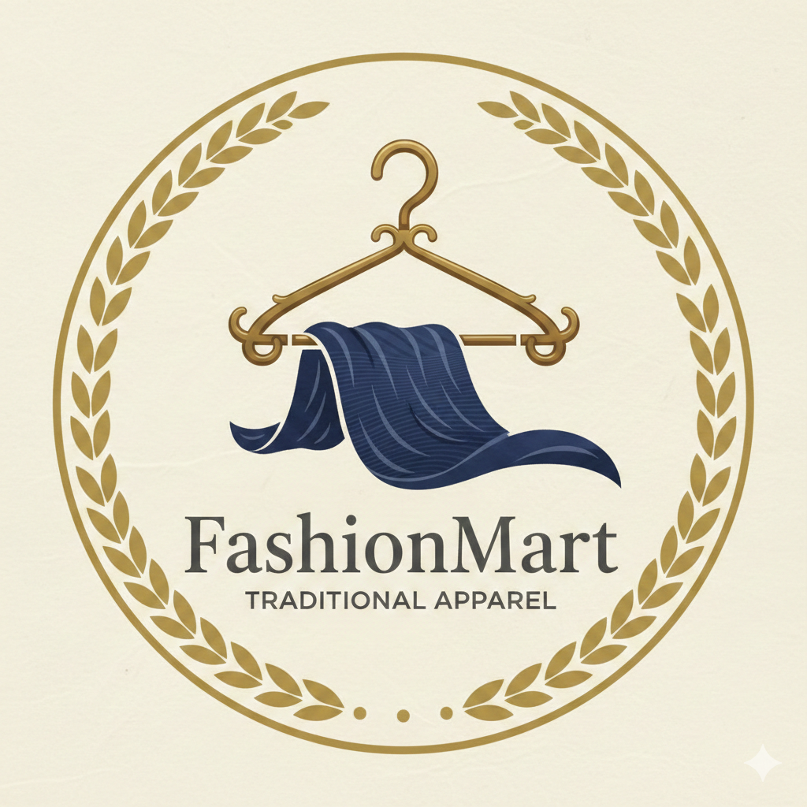

<p float="left">
    
    
</p>

# Capstone Project Case Study: Merging Data Architectures of FashionMart and TrendyThreads

## Estimated time: 6 minutes

---

## Project Overview

In this capstone project, you will act as an enterprise data architect at **TrendyThreads**, a rapidly growing digital apparel e-tailer. **FashionMart**, a traditional brick-and-mortar apparel retailer, has recently acquired your company. The acquisition creates a new combined entity, **FutureMart**, integrating FashionMart's streamlined data architecture with TrendyThreads' dynamic online infrastructure.

---

## Your Mission

As the enterprise data architect, you are entrusted with ensuring the success of this integration. Your mission is to:

| Mission Objective              | Description                                                                                                                         |
| ------------------------------ | ----------------------------------------------------------------------------------------------------------------------------------- |
| **Evaluate and analyze** | Examine the existing data architectures of both companies                                                                           |
| **Design**               | Create a cohesive and efficient data architecture for FutureMart that meets the needs of both online and physical retail operations |
| **Oversee**              | Manage data migration to the new unified architecture, ensuring minimal disruption                                                  |
| **Integrate**            | Facilitate seamless data flow across the newly combined entity                                                                      |
| **Draft**                | Develop a comprehensive data governance plan ensuring consistency, accuracy, and security                                           |
| **Improve**              | Leverage the acquisition to enhance overall operational efficiency                                                                  |

---

## Background: FashionMart & TrendyThreads

### FashionMart: The Traditional Retailer

| Aspect                      | Description                                                                                     |
| --------------------------- | ----------------------------------------------------------------------------------------------- |
| **Business Model**    | Well-established brick-and-mortar apparel retailer with strong presence in multiple cities      |
| **Experience**        | Decades of retail experience and physical store operations                                      |
| **Strengths**         | Established brand, physical store network, supply chain expertise                               |
| **Weaknesses**        | Underdeveloped digital operations, struggles to integrate physical and online sales effectively |
| **Data Architecture** | Traditional, siloed systems; legacy databases; limited real-time capabilities                   |

### TrendyThreads: The Digital Native

| Aspect                      | Description                                                                                                            |
| --------------------------- | ---------------------------------------------------------------------------------------------------------------------- |
| **Business Model**    | Fast-growing online apparel e-tailer with strong digital presence                                                      |
| **Experience**        | Startup origins with modern technology stack                                                                           |
| **Strengths**         | Personalized shopping experiences, AI-driven recommendations, real-time inventory tracking, seamless online operations |
| **Weaknesses**        | Immature policies and governance; limited physical retail experience                                                   |
| **Data Architecture** | Modern, cloud-based systems; NoSQL databases; real-time data pipelines                                                 |

---

## The Acquisition Strategy

FashionMart acquired TrendyThreads to modernize its operations and strengthen its digital presence. The goal is to merge TrendyThreads' advanced technology with FashionMart's retail expertise, creating a unified, state-of-the-art enterprise architecture for the merged entity called **FutureMart**.

```
┌─────────────────────────────────────────────────────────────────────────────────┐
│                          FUTUREMART: THE MERGED ENTITY                            │
├─────────────────────────────────────────────────────────────────────────────────┤
│                                                                                   │
│  ┌─────────────────────────┐        ┌─────────────────────────┐                 │
│  │      FASHIONMART        │        │      TRENDYTHREADS       │                 │
│  │   (Traditional Retail)  │        │     (Digital E-tailer)   │                 │
│  ├─────────────────────────┤        ├─────────────────────────┤                 │
│  │ • Physical stores       │        │ • Online platform       │                 │
│  │ • Legacy systems        │        │ • Modern cloud stack    │                 │
│  │ • Batch processing      │        │ • Real-time data        │                 │
│  │ • Mature governance     │        │ • AI/ML capabilities    │                 │
│  │ • Siloed data           │        │ • Immature governance   │                 │
│  └───────────┬─────────────┘        └───────────┬─────────────┘                 │
│              │                                   │                               │
│              └───────────────┬───────────────────┘                               │
│                              ▼                                                   │
│              ┌─────────────────────────────────┐                                │
│              │           FUTUREMART             │                                │
│              │     (Integrated Enterprise)      │                                │
│              ├─────────────────────────────────┤                                │
│              │ • Unified data architecture     │                                │
│              │ • Omnichannel operations        │                                │
│              │ • Real-time + batch processing  │                                │
│              │ • Comprehensive governance      │                                │
│              │ • AI-driven insights             │                                │
│              └─────────────────────────────────┘                                │
│                                                                                   │
└─────────────────────────────────────────────────────────────────────────────────┘
```

---

## Capstone Project: Phases and Tasks

This project aims to modernize FashionMart's operations by leveraging TrendyThreads' digital infrastructure, ensuring seamless integration with FashionMart's physical retail operations. This will be accomplished through a structured, phased migration approach, covering data architecture evaluation, system integration, and governance.

---

### Phase 1: Evaluate the Data Architecture of FashionMart & TrendyThreads

**Objective:** Understand the current state of both organizations' data architectures to identify strengths, weaknesses, and integration points.

#### Tasks to be Completed

| Task                                            | Description                                                                             | Deliverables                   |
| ----------------------------------------------- | --------------------------------------------------------------------------------------- | ------------------------------ |
| **1.1 Assess Data Storage & Management**  | Examine how each company stores and manages data (databases, data lakes, file systems)  | Storage inventory document     |
| **1.2 Assess Data Integration**           | Review existing ETL/ELT processes, APIs, and data pipelines                             | Integration mapping document   |
| **1.3 Assess Data Quality & Consistency** | Evaluate data quality metrics, validation rules, and consistency checks                 | Data quality assessment report |
| **1.4 Assess Security & Compliance**      | Review security protocols, access controls, encryption, and compliance with regulations | Security audit summary         |
| **1.5 Assess Data Governance & Metadata** | Examine governance frameworks, data ownership, and metadata management                  | Governance maturity assessment |
| **1.6 Identify Inefficiencies**           | Identify bottlenecks, data silos, and redundant systems                                 | Gap analysis report            |

#### Assessment Framework

| Aspect                   | FashionMart          | TrendyThreads           | Integration Challenge               |
| ------------------------ | -------------------- | ----------------------- | ----------------------------------- |
| **Database Types** | Relational (SQL)     | Document (NoSQL), Graph | Schema mapping, data transformation |
| **Processing**     | Batch (nightly)      | Real-time streams       | Latency reconciliation              |
| **Data Volume**    | Moderate, structured | High, semi-structured   | Scalability requirements            |
| **Governance**     | Mature, rigid        | Immature, flexible      | Finding middle ground               |
| **Security**       | On-premise controls  | Cloud-native security   | Hybrid security model               |

---

### Phase 2: Design the Data Architecture of FutureMart

**Objective:** Create an optimized, integrated data architecture that leverages the best of both organizations.

#### Tasks to be Completed

| Task                                        | Description                                                           | Deliverables                    |
| ------------------------------------------- | --------------------------------------------------------------------- | ------------------------------- |
| **2.1 Develop Architectural Vision**  | Use insights from Phase 1 to design the target architecture           | Architecture vision document    |
| **2.2 Create Architectural Diagrams** | Develop visual representations of the combined data ecosystem         | Architecture diagrams           |
| **2.3 Define Database Schema**        | Create new entity-relationship diagrams (ERDs) and table structures   | Integrated ERDs                 |
| **2.4 Select Technologies**           | Choose appropriate databases and tools for the unified architecture   | Technology stack recommendation |
| **2.5 Create Initial Schemas**        | Implement initial database schemas in a development environment       | Schema SQL scripts              |
| **2.6 Document Improvements**         | Document how the new architecture addresses identified inefficiencies | Architecture improvement report |

#### Target Architecture Vision

```
┌─────────────────────────────────────────────────────────────────────────────────┐
│                        FUTUREMART TARGET ARCHITECTURE                            │
├─────────────────────────────────────────────────────────────────────────────────┤
│                                                                                   │
│  ┌─────────────────────────────────────────────────────────────────────────┐   │
│  │                         DATA SOURCES LAYER                                 │   │
│  │  ┌──────────┐ ┌──────────┐ ┌──────────┐ ┌──────────┐ ┌──────────┐       │   │
│  │  │ POS      │ │ E-commerce│ │ Mobile   │ │ Inventory│ │ Customer │       │   │
│  │  │ Systems  │ │ Platform  │ │ App      │ │ System   │ │ Database │       │   │
│  │  └──────────┘ └──────────┘ └──────────┘ └──────────┘ └──────────┘       │   │
│  └─────────────────────────────────────────────────────────────────────────┘   │
│                                          │                                       │
│                                          ▼                                       │
│  ┌─────────────────────────────────────────────────────────────────────────┐   │
│  │                      DATA INGESTION LAYER                                  │   │
│  │  ┌─────────────────────┐          ┌─────────────────────┐               │   │
│  │  │   Batch Ingestion   │          │  Real-time Ingestion │               │   │
│  │  │   (Apache NiFi)     │          │    (Apache Kafka)    │               │   │
│  │  └─────────────────────┘          └─────────────────────┘               │   │
│  └─────────────────────────────────────────────────────────────────────────┘   │
│                                          │                                       │
│                                          ▼                                       │
│  ┌─────────────────────────────────────────────────────────────────────────┐   │
│  │                      DATA STORAGE LAYER                                   │   │
│  │  ┌──────────┐ ┌──────────┐ ┌──────────┐ ┌──────────┐ ┌──────────┐       │   │
│  │  │  OLTP    │ │  NoSQL   │ │ Data Lake│ │ Data     │ │  Graph   │       │   │
│  │  │ (MySQL)  │ │(MongoDB) │ │  (S3)    │ │ Warehouse│ │(Neo4j)   │       │   │
│  │  └──────────┘ └──────────┘ └──────────┘ └──────────┘ └──────────┘       │   │
│  └─────────────────────────────────────────────────────────────────────────┘   │
│                                          │                                       │
│                                          ▼                                       │
│  ┌─────────────────────────────────────────────────────────────────────────┐   │
│  │                      DATA PROCESSING LAYER                                 │   │
│  │  ┌─────────────────────┐          ┌─────────────────────┐               │   │
│  │  │   Batch Processing  │          │   Stream Processing  │               │   │
│  │  │   (Apache Spark)    │          │    (Apache Flink)    │               │   │
│  │  └─────────────────────┘          └─────────────────────┘               │   │
│  └─────────────────────────────────────────────────────────────────────────┘   │
│                                          │                                       │
│                                          ▼                                       │
│  ┌─────────────────────────────────────────────────────────────────────────┐   │
│  │                      ANALYTICS & CONSUMPTION                              │   │
│  │  ┌──────────┐ ┌──────────┐ ┌──────────┐ ┌──────────┐ ┌──────────┐       │   │
│  │  │  BI      │ │  ML/AI   │ │  Reports │ │  Dash-   │ │  Mobile  │       │   │
│  │  │  Tools   │ │  Models  │ │          │ │  boards  │ │  Apps    │       │   │
│  │  └──────────┘ └──────────┘ └──────────┘ └──────────┘ └──────────┘       │   │
│  └─────────────────────────────────────────────────────────────────────────┘   │
│                                                                                   │
│  ┌─────────────────────────────────────────────────────────────────────────┐   │
│  │                      GOVERNANCE & SECURITY LAYER                           │   │
│  │  ┌──────────┐ ┌──────────┐ ┌──────────┐ ┌──────────┐ ┌──────────┐       │   │
│  │  │ Access   │ │  Data    │ │  Metadata│ │  Audit   │ │Compliance│       │   │
│  │  │ Control  │ │ Quality  │ │Management│ │  Logs    │ │ (GDPR)   │       │   │
│  │  └──────────┘ └──────────┘ └──────────┘ └──────────┘ └──────────┘       │   │
│  └─────────────────────────────────────────────────────────────────────────┘   │
│                                                                                   │
└─────────────────────────────────────────────────────────────────────────────────┘
```

---

### Phase 3: Develop and Implement a Data Migration Strategy

**Objective:** Safely and efficiently migrate data from both legacy systems to the new unified architecture.

#### Tasks to be Completed

| Task                                       | Description                                                     | Deliverables                                  |
| ------------------------------------------ | --------------------------------------------------------------- | --------------------------------------------- |
| **3.1 Set Up Staging Environment**   | Create isolated environment for migration testing               | Staging environment documentation             |
| **3.2 Migrate RDBMS to NoSQL**       | Move unstructured/semi-structured data from relational to NoSQL | Migration scripts, validation reports         |
| **3.3 Migrate NoSQL to RDBMS**       | Move structured data from NoSQL to relational where appropriate | Migration scripts, validation reports         |
| **3.4 Ensure Data Consistency**      | Verify data integrity and transformation compatibility          | Data validation report                        |
| **3.5 Execute Production Migration** | Perform final migration with minimal disruption                 | Migration execution plan, rollback procedures |

#### Migration Strategy Matrix

| Data Type                     | Source System       | Target System             | Migration Approach             |
| ----------------------------- | ------------------- | ------------------------- | ------------------------------ |
| **Customer Profiles**   | FashionMart RDBMS   | FutureMart MongoDB        | ETL with schema transformation |
| **Transaction History** | Both systems        | FutureMart Data Warehouse | Batch ETL, deduplication       |
| **Product Catalog**     | Both systems        | FutureMart PostgreSQL     | Master data management         |
| **Real-time Inventory** | TrendyThreads NoSQL | FutureMart Redis Cache    | Streaming replication          |
| **Store Locations**     | FashionMart RDBMS   | FutureMart PostgreSQL     | Direct copy with enrichment    |

---

### Phase 4: Integrate Data Systems for Seamless Data Flow

**Objective:** Create unified data pipelines that enable real-time and batch processing across the combined organization.

#### Tasks to be Completed

| Task                                           | Description                                                   | Deliverables                    |
| ---------------------------------------------- | ------------------------------------------------------------- | ------------------------------- |
| **4.1 Develop ETL/ELT Scripts**          | Create automated data extraction and transformation processes | ETL scripts, documentation      |
| **4.2 Create Data Pipelines**            | Build real-time data movement pipelines                       | Pipeline architecture, code     |
| **4.3 Design Data Warehouse**            | Optimize warehouse schema for reporting and analytics         | Star schema design, DDL scripts |
| **4.4 Develop Fraud Detection Pipeline** | Create pipeline for real-time fraud detection models          | Fraud detection pipeline        |

#### Unified Data Flow Architecture

```
┌─────────────────────────────────────────────────────────────────────────────────┐
│                         UNIFIED DATA FLOW ARCHITECTURE                            │
├─────────────────────────────────────────────────────────────────────────────────┤
│                                                                                   │
│  ┌─────────────────┐    ┌─────────────────┐    ┌─────────────────┐              │
│  │  Online Sales   │    │  Store Sales    │    │  Mobile App     │              │
│  │  (TrendyThreads)│    │  (FashionMart)  │    │  (Both)         │              │
│  └────────┬────────┘    └────────┬────────┘    └────────┬────────┘              │
│           │                      │                      │                        │
│           └──────────────────────┼──────────────────────┘                        │
│                                  ▼                                               │
│  ┌─────────────────────────────────────────────────────────────────────────┐   │
│  │                         EVENT HUB (Kafka)                                 │   │
│  │  ┌──────────────┐ ┌──────────────┐ ┌──────────────┐ ┌──────────────┐   │   │
│  │  │ Order Events │ │ Inventory    │ │ Customer     │ │ Payment      │   │   │
│  │  │              │ │ Events       │ │ Events       │ │ Events       │   │   │
│  │  └──────────────┘ └──────────────┘ └──────────────┘ └──────────────┘   │   │
│  └─────────────────────────────────────────────────────────────────────────┘   │
│                                  │                                               │
│           ┌──────────────────────┼──────────────────────┐                       │
│           │                      │                      │                       │
│           ▼                      ▼                      ▼                       │
│  ┌─────────────────┐    ┌─────────────────┐    ┌─────────────────┐              │
│  │  Real-time      │    │  Batch          │    │  Machine        │              │
│  │  Processing     │    │  Processing     │    │  Learning       │              │
│  │  (Dashboard)    │    │  (Reports)      │    │  (Recommend)    │              │
│  └─────────────────┘    └─────────────────┘    └─────────────────┘              │
│           │                      │                      │                        │
│           └──────────────────────┼──────────────────────┘                        │
│                                  ▼                                               │
│  ┌─────────────────────────────────────────────────────────────────────────┐   │
│  │                      OPERATIONAL DATABASES                                 │   │
│  │  ┌──────────────┐ ┌──────────────┐ ┌──────────────┐ ┌──────────────┐   │   │
│  │  │ Customer 360 │ │ Inventory    │ │ Order Mgmt   │ │ Fraud        │   │   │
│  │  │ (MongoDB)    │ │ (Redis)      │ │ (PostgreSQL) │ │ (Cassandra)  │   │   │
│  │  └──────────────┘ └──────────────┘ └──────────────┘ └──────────────┘   │   │
│  └─────────────────────────────────────────────────────────────────────────┘   │
│                                  │                                               │
│                                  ▼                                               │
│  ┌─────────────────────────────────────────────────────────────────────────┐   │
│  │                      DATA WAREHOUSE (Snowflake)                           │   │
│  │  ┌──────────────┐ ┌──────────────┐ ┌──────────────┐ ┌──────────────┐   │   │
│  │  │ Fact Sales   │ │ Dim Customer │ │ Dim Product  │ │ Dim Store    │   │   │
│  │  └──────────────┘ └──────────────┘ └──────────────┘ └──────────────┘   │   │
│  └─────────────────────────────────────────────────────────────────────────┘   │
│                                  │                                               │
│                                  ▼                                               │
│  ┌─────────────────┐    ┌─────────────────┐    ┌─────────────────┐              │
│  │  BI Dashboards  │    │  Executive      │    │  Data Science   │              │
│  │  (Tableau)      │    │  Reports        │    │  (Python/R)     │              │
│  └─────────────────┘    └─────────────────┘    └─────────────────┘              │
│                                                                                   │
└─────────────────────────────────────────────────────────────────────────────────┘
```

---

### Phase 5: Draft the Data Governance Plan for FutureMart

**Objective:** Establish comprehensive data governance policies that balance FashionMart's mature practices with TrendyThreads' agile culture.

#### Tasks to be Completed

| Task                                          | Description                                                    | Deliverables                   |
| --------------------------------------------- | -------------------------------------------------------------- | ------------------------------ |
| **5.1 Define Governance Objectives**    | Align goals with business strategy                             | Governance objectives document |
| **5.2 Establish Governance Framework**  | Choose centralized, decentralized, or federated model          | Framework selection rationale  |
| **5.3 Define Roles & Responsibilities** | Assign data owners, stewards, and custodians                   | RACI matrix                    |
| **5.4 Create Data Policies**            | Develop policies for quality, security, retention, and privacy | Policy documents               |
| **5.5 Implement Metadata Management**   | Establish data catalog and lineage tracking                    | Metadata strategy              |

#### Governance Framework Comparison

| Framework               | Description                        | Pros                           | Cons                  | Recommendation  |
| ----------------------- | ---------------------------------- | ------------------------------ | --------------------- | --------------- |
| **Centralized**   | Single team governs all data       | Consistent, controlled         | Slow, bottleneck      | Not recommended |
| **Decentralized** | Each domain governs its own data   | Agile, domain expertise        | Inconsistent, siloed  | Not recommended |
| **Federated**     | Central policies, domain execution | Balance of control and agility | Requires coordination | ✅ RECOMMENDED  |

#### Recommended Governance Structure

```
┌─────────────────────────────────────────────────────────────────────────────────┐
│                      FUTUREMART FEDERATED GOVERNANCE MODEL                        │
├─────────────────────────────────────────────────────────────────────────────────┤
│                                                                                   │
│  ┌─────────────────────────────────────────────────────────────────────────┐   │
│  │                    CENTRAL GOVERNANCE COUNCIL                             │   │
│  │  • Sets enterprise-wide policies                                         │   │
│  │  • Defines standards and frameworks                                      │   │
│  │  • Provides tools and platforms                                          │   │
│  │  • Monitors compliance                                                   │   │
│  │  • Resolves cross-domain issues                                          │   │
│  └─────────────────────────────────────────────────────────────────────────┘   │
│                                    │                                             │
│        ┌───────────────────────────┼───────────────────────────┐               │
│        │                           │                           │               │
│        ▼                           ▼                           ▼               │
│  ┌───────────────┐          ┌───────────────┐          ┌───────────────┐       │
│  │  DOMAIN A     │          │  DOMAIN B     │          │  DOMAIN C     │       │
│  │  Customer     │          │  Product      │          │  Sales        │       │
│  │  Data         │          │  Data         │          │  Data         │       │
│  ├───────────────┤          ├───────────────┤          ├───────────────┤       │
│  │ • Data Owner  │          │ • Data Owner  │          │ • Data Owner  │       │
│  │ • Data Steward│          │ • Data Steward│          │ • Data Steward│       │
│  │ • Domain      │          │ • Domain      │          │ • Domain      │       │
│  │   Policies    │          │   Policies    │          │   Policies    │       │
│  └───────────────┘          └───────────────┘          └───────────────┘       │
│        │                           │                           │               │
│        └───────────────────────────┼───────────────────────────┘               │
│                                    │                                             │
│                                    ▼                                             │
│  ┌─────────────────────────────────────────────────────────────────────────┐   │
│  │                    ENABLING FUNCTIONS                                     │   │
│  │  ┌──────────────┐ ┌──────────────┐ ┌──────────────┐ ┌──────────────┐   │   │
│  │  │ Data Quality │ │ Metadata     │ │ Security &   │ │ Compliance   │   │   │
│  │  │ Management   │ │ Management   │ │ Access       │ │ Reporting    │   │   │
│  │  └──────────────┘ └──────────────┘ └──────────────┘ └──────────────┘   │   │
│  └─────────────────────────────────────────────────────────────────────────┘   │
│                                                                                   │
└─────────────────────────────────────────────────────────────────────────────────┘
```

#### Key Governance Policies

| Policy Area              | Key Elements                               | FashionMart Input      | TrendyThreads Input   |
| ------------------------ | ------------------------------------------ | ---------------------- | --------------------- |
| **Data Quality**   | Standards, metrics, remediation            | Mature processes       | Automated monitoring  |
| **Data Security**  | Access control, encryption, classification | Strict controls        | Cloud-native security |
| **Data Privacy**   | GDPR, CCPA compliance                      | Established procedures | Customer-centric view |
| **Data Retention** | Lifecycle management, archiving            | Conservative approach  | Agile data management |
| **Metadata**       | Catalog, lineage, business glossary        | Manual documentation   | Automated tools       |

---

## Project Timeline Overview

```
┌─────────────────────────────────────────────────────────────────────────────────┐
│                      FUTUREMART INTEGRATION TIMELINE                              │
├─────────────────────────────────────────────────────────────────────────────────┤
│                                                                                   │
│  Phase 1: Evaluation (Weeks 1-3)                                                │
│  └── Assess current architectures, identify gaps                                │
│                                                                                   │
│  Phase 2: Design (Weeks 4-6)                                                    │
│  └── Create target architecture, develop ERDs, select technologies              │
│                                                                                   │
│  Phase 3: Migration (Weeks 7-12)                                                │
│  └── Set up staging, migrate data, validate consistency                         │
│                                                                                   │
│  Phase 4: Integration (Weeks 13-16)                                             │
│  └── Develop ETL pipelines, build data warehouse, create fraud detection        │
│                                                                                   │
│  Phase 5: Governance (Weeks 17-20)                                              │
│  └── Define policies, establish framework, train stakeholders                   │
│                                                                                   │
│  Go-Live & Optimization (Week 21+)                                              │
│  └── Launch FutureMart, monitor, iterate                                        │
│                                                                                   │
└─────────────────────────────────────────────────────────────────────────────────┘
```

---

## Success Metrics

| Metric                                  | Target                                      | Measurement Method             |
| --------------------------------------- | ------------------------------------------- | ------------------------------ |
| **Data Integration Completeness** | 100% of critical data sources integrated    | Source-to-target mapping audit |
| **Data Quality Score**            | >95% accuracy, completeness, consistency    | Data quality dashboard         |
| **Query Performance**             | <2 seconds for 90% of analytical queries    | Performance monitoring         |
| **Migration Downtime**            | <4 hours total                              | Migration log                  |
| **Governance Adoption**           | 100% of data domains have assigned stewards | Governance roster              |
| **Fraud Detection Rate**          | 20% improvement over previous systems       | A/B testing                    |

---

## Conclusion

This capstone project provides a comprehensive, real-world scenario for enterprise data architecture integration. As the data architect for FutureMart, you will navigate the complexities of merging a traditional retail company with a modern digital e-tailer, creating a unified, efficient, and innovative data ecosystem.

### Key Success Factors

1. **Thorough Assessment**: Understanding both existing architectures is crucial for effective design
2. **Balanced Design**: Leverage strengths from both organizations while addressing weaknesses
3. **Careful Migration**: Minimize disruption while ensuring data integrity
4. **Seamless Integration**: Create pipelines that enable real-time decision-making
5. **Practical Governance**: Establish policies that protect data without stifling innovation

The successful integration will position FutureMart as a leader in omnichannel retail, combining the best of physical and digital shopping experiences.

---

*Project Start Date: _________________*
*Enterprise Data Architect: _________________*
*Expected Completion: _________________*
