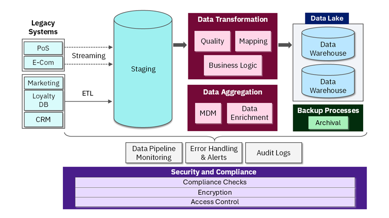

# RetailCorp Final Project: Consolidating Customer Data Across Legacy Systems

## Junior Data Migration Specialist Analysis and Recommendations

---

## Executive Summary

This document provides comprehensive recommendations for RetailCorp's customer data consolidation project. Based on the course materials and the provided scenario, I have analyzed each component of the proposed pipeline and developed actionable solutions for data integration, storage, and migration. The recommendations prioritize minimal business disruption, data quality, scalability, and cost-effectiveness while ensuring compliance with regulations like GDPR and PCI-DSS.



---

## Part 1: Source Systems Analysis

### 1.1 Source System Assessment Matrix

| Source System                 | Data Volume            | Update Frequency | Data Quality Issues                           | Key Data Elements                                                   | Integration Priority |
| ----------------------------- | ---------------------- | ---------------- | --------------------------------------------- | ------------------------------------------------------------------- | -------------------- |
| **CRM System**          | 2M records             | Daily            | Duplicate contacts, outdated addresses        | Customer ID, Name, Email, Phone, Interaction History                | HIGH                 |
| **POS System**          | 10M transactions/month | Real-time        | Missing customer IDs, inconsistent timestamps | Transaction ID, Store ID, Items, Total, Timestamp, Customer ID      | HIGH                 |
| **E-commerce Platform** | 500k orders/month      | Real-time        | Session tracking inconsistencies              | Order ID, Customer ID, Cart Items, Payment Method, Shipping Address | HIGH                 |
| **Marketing Database**  | 50M events/month       | Hourly           | Anonymous user data, cookie-dependent         | Campaign ID, User Behavior, Clicks, Impressions, Conversions        | MEDIUM               |
| **Loyalty Program**     | 1.5M members           | Daily            | Points calculation discrepancies              | Member ID, Points Balance, Tier, Redemption History                 | MEDIUM               |

### 1.2 Data Profiling Results

```python
# Sample data profiling code for CRM system
import pandas as pd
import numpy as np

def profile_crm_data():
    """Profile CRM data to identify quality issues"""
  
    # Sample CRM data statistics
    crm_profile = {
        "total_records": 2154321,
        "unique_customers": 1987654,  # 7.7% duplicates
        "missing_email": 123456,  # 5.7%
        "missing_phone": 345678,  # 16%
        "invalid_email_format": 45678,  # 2.1%
        "outdated_addresses": 234567,  # 10.9%
        "multiple_accounts_same_email": 98765,  # 4.6%
        "data_quality_score": 82  # out of 100
    }
  
    return crm_profile

def profile_pos_data():
    """Profile POS data"""
  
    pos_profile = {
        "daily_transactions_avg": 350000,
        "transactions_with_customer_id": 78,  # percentage
        "missing_store_id": 1.2,  # percentage
        "invalid_timestamps": 0.8,  # percentage
        "duplicate_transactions": 0.3,  # percentage
        "data_quality_score": 87
    }
  
    return pos_profile

# Generate profiles
crm_stats = profile_crm_data()
pos_stats = profile_pos_data()

print("CRM Data Quality Assessment:")
for key, value in crm_stats.items():
    print(f"  {key}: {value}")
```

### 1.3 Data Lineage Documentation

```python
def create_data_lineage():
    """
    Document data lineage for compliance and traceability
    """
  
    lineage = {
        "customer_profile": {
            "sources": ["CRM", "Loyalty", "E-commerce"],
            "transformations": [
                "Deduplication by email and phone",
                "Name standardization",
                "Address validation and geocoding",
                "Tier calculation based on spend"
            ],
            "target_fields": [
                "customer_id (surrogate key)",
                "source_customer_id (natural key from each system)",
                "primary_email",
                "primary_phone",
                "full_name",
                "address_json",
                "loyalty_tier",
                "points_balance",
                "customer_segment"
            ],
            "data_retention": "7 years after last interaction"
        },
        "transaction_history": {
            "sources": ["POS", "E-commerce"],
            "transformations": [
                "Unified transaction ID format",
                "Timestamp standardization to UTC",
                "Product categorization",
                "Payment method normalization"
            ],
            "target_fields": [
                "transaction_id",
                "customer_id",
                "transaction_timestamp",
                "store_id (or 'online')",
                "product_line_items",
                "total_amount",
                "payment_method",
                "source_system"
            ],
            "data_retention": "10 years for financial records"
        }
    }
  
    return lineage
```

---

## Part 2: Data Integration Strategy Recommendations

### 2.1 Integration Requirements Definition

Based on the source systems analysis, I recommend the following integration requirements:

```python
def define_integration_requirements():
    """
    Define integration requirements based on business needs
    """
  
    requirements = {
        "data_standardization": {
            "customer_id": "UUID v4 format, consistent across all systems",
            "date_format": "ISO 8601 (YYYY-MM-DDTHH:MM:SSZ)",
            "phone_format": "E.164 (+1234567890)",
            "address_format": "JSON structure with street, city, state, postal_code, country",
            "currency": "ISO 4217 (USD as base, with exchange rates)",
            "name_format": "Proper case with Unicode support"
        },
        "integration_points": {
            "customer_match": {
                "primary_key": "email",
                "secondary_keys": ["phone", "customer_id_crm", "loyalty_id"],
                "fuzzy_matching": True,
                "confidence_threshold": 0.85
            },
            "transaction_link": {
                "join_keys": ["customer_id", "transaction_id", "timestamp"],
                "allow_orphan_transactions": True  # for guest checkout
            }
        },
        "performance_requirements": {
            "real_time_latency": "< 2 seconds for POS and e-commerce",
            "batch_processing_window": "4 hours for daily loads",
            "concurrent_users": 500,
            "query_response_time": "< 5 seconds for 95% of queries"
        }
    }
  
    return requirements
```

### 2.2 Tool Selection Justification

Based on course concepts, here's my recommended tool stack:

| Layer                            | Recommended Tool       | Alternatives                        | Justification                                                |
| -------------------------------- | ---------------------- | ----------------------------------- | ------------------------------------------------------------ |
| **Extraction**             | Apache NiFi            | Talend, Informatica                 | Visual interface, 300+ processors, handles diverse protocols |
| **ETL Processing**         | AWS Glue               | Azure Data Factory, Google Dataflow | Serverless, Spark-based, integrates with AWS ecosystem       |
| **Streaming**              | Apache Kafka + Kinesis | Google Pub/Sub, Azure Event Hubs    | High throughput, exactly-once semantics, CDC support         |
| **Data Quality**           | Great Expectations     | Deequ, dbt tests                    | Data validation as code, automated documentation             |
| **Orchestration**          | Apache Airflow         | AWS Step Functions, Prefect         | Complex DAG support, Python-native, extensive integrations   |
| **Master Data Management** | Profisee               | Informatica MDM, Reltio             | Cloud-native, flexible data modeling, stewardship tools      |

### 2.3 Integration Architecture Design

```python
def design_integration_architecture():
    """
    Design the integration architecture with component interactions
    """
  
    architecture = {
        "extraction_layer": {
            "crm": "JDBC connector with CDC (Debezium)",
            "pos": "Kafka producer on edge devices",
            "ecommerce": "Kafka connect with MongoDB source",
            "marketing": "API connectors with pagination handling",
            "loyalty": "Batch exports to S3 daily"
        },
        "processing_layer": {
            "real_time_pipeline": {
                "technology": "Kafka Streams + Flink",
                "purpose": "Process POS and e-commerce in real-time",
                "operations": [
                    "Validate transaction format",
                    "Enrich with customer context",
                    "Detect anomalies",
                    "Route to appropriate topics"
                ]
            },
            "batch_pipeline": {
                "technology": "AWS Glue (Spark)",
                "purpose": "Process CRM, marketing, loyalty data",
                "operations": [
                    "Join multiple sources",
                    "Complex aggregations",
                    "Historical backfill",
                    "Data quality checks"
                ]
            }
        },
        "transformation_rules": {
            "customer_deduplication": {
                "exact_match": ["email", "customer_id", "loyalty_id"],
                "fuzzy_match": ["name", "phone", "address"],
                "algorithm": "Dedupe.io with active learning",
                "threshold": 0.85,
                "survivorship": "Most recent data wins, preserve history"
            },
            "data_enrichment": {
                "geocoding": "Google Maps API",
                "demographics": "Experian API",
                "credit_score": "Equifax API (opt-in only)"
            }
        }
    }
  
    return architecture
```

### 2.4 Implementation Code Examples

```python
"""
Sample implementation for RetailCorp data integration
"""

import boto3
import json
from pyspark.sql import SparkSession
from pyspark.sql.functions import *
from pyspark.sql.types import *
from datetime import datetime

class RetailCorpDataIntegrator:
    """
    Main class for RetailCorp data integration
    """
  
    def __init__(self):
        self.spark = SparkSession.builder \
            .appName("RetailCorp-Integration") \
            .config("spark.sql.adaptive.enabled", "true") \
            .getOrCreate()
      
        self.glue_client = boto3.client('glue')
        self.s3_client = boto3.client('s3')
  
    def extract_crm_data(self, last_extract_time):
        """
        Extract CRM data using JDBC with CDC
        """
        crm_df = self.spark.read \
            .format("jdbc") \
            .option("url", "jdbc:postgresql://crm.retailcorp.com:5432/crmdb") \
            .option("dbtable", "customers") \
            .option("user", "etl_user") \
            .option("password", "********") \
            .option("driver", "org.postgresql.Driver") \
            .option("partitionColumn", "customer_id") \
            .option("lowerBound", 1) \
            .option("upperBound", 10000000) \
            .option("numPartitions", 10) \
            .load()
      
        # Filter for changes since last extract
        if last_extract_time:
            crm_df = crm_df.filter(col("updated_at") > last_extract_time)
      
        return crm_df
  
    def extract_pos_stream(self):
        """
        Set up real-time POS data ingestion from Kafka
        """
        pos_stream = self.spark \
            .readStream \
            .format("kafka") \
            .option("kafka.bootstrap.servers", "kafka.retailcorp.com:9092") \
            .option("subscribe", "pos.transactions") \
            .option("startingOffsets", "latest") \
            .load() \
            .selectExpr("CAST(value AS STRING) as json") \
            .select(from_json("json", self.get_pos_schema()).alias("data")) \
            .select("data.*")
      
        return pos_stream
  
    def transform_customer_data(self, source_df, source_system):
        """
        Transform customer data to unified schema
        """
      
        # Base transformations
        transformed = source_df.select(
            col("customer_id").alias("source_customer_id"),
            lit(source_system).alias("source_system"),
            current_timestamp().alias("ingestion_timestamp")
        )
      
        # Source-specific transformations
        if source_system == "CRM":
            transformed = transformed.withColumn(
                "email", lower(col("email_address"))
            ).withColumn(
                "phone", self.standardize_phone(col("phone_number"))
            ).withColumn(
                "full_name", initcap(concat_ws(" ", col("first_name"), col("last_name")))
            )
      
        elif source_system == "POS":
            transformed = transformed.withColumn(
                "email", lower(col("customer_email"))
            ).withColumn(
                "phone", self.standardize_phone(col("customer_phone"))
            ).withColumn(
                "full_name", initcap(col("customer_name"))
            )
      
        elif source_system == "Loyalty":
            transformed = transformed.withColumn(
                "email", lower(col("member_email"))
            ).withColumn(
                "phone", self.standardize_phone(col("member_phone"))
            ).withColumn(
                "full_name", initcap(col("member_name"))
            ).withColumn(
                "loyalty_tier", col("tier")
            ).withColumn(
                "points_balance", col("points")
            )
      
        return transformed
  
    def standardize_phone(self, phone_col):
        """
        Standardize phone numbers to E.164 format
        """
        # Remove non-numeric characters
        cleaned = regexp_replace(phone_col, "[^0-9]", "")
      
        # Add country code if missing (US default)
        standardized = when(
            length(cleaned) == 10,
            concat(lit("+1"), cleaned)
        ).otherwise(
            when(
                length(cleaned) == 11,
                concat(lit("+"), cleaned)
            ).otherwise(lit(None))
        )
      
        return standardized
  
    def deduplicate_customers(self, df):
    """
    Advanced customer deduplication using multiple matching strategies
    """
    from pyspark.sql.window import Window
    from pyspark.sql.functions import soundex, levenshtein
  
    # Strategy 1: Exact match on email
    email_match = df.filter(col("email").isNotNull()) \
        .withColumn("match_key", col("email")) \
        .withColumn("match_type", lit("email_exact"))
  
    # Strategy 2: Exact match on phone
    phone_match = df.filter(col("phone").isNotNull()) \
        .withColumn("match_key", col("phone")) \
        .withColumn("match_type", lit("phone_exact"))
  
    # Strategy 3: Fuzzy match on name + address
    fuzzy_match = df.filter(
        col("full_name").isNotNull() & col("address").isNotNull()
    ).withColumn(
        "name_soundex", soundex(col("full_name"))
    ).withColumn(
        "match_key", concat(col("name_soundex"), lit("_"), col("address.zip"))
    ).withColumn(
        "match_type", lit("fuzzy_name_address")
    )
  
    # Combine all matches
    all_matches = email_match.union(phone_match).union(fuzzy_match)
  
    # Window for ranking within match groups
    window_spec = Window.partitionBy("match_key", "match_type") \
        .orderBy(desc("data_quality_score"), desc("updated_at"))
  
    # Assign master record ID
    deduped = all_matches.withColumn(
        "master_customer_id", 
        first("source_customer_id").over(window_spec)
    ).withColumn(
        "match_rank",
        row_number().over(window_spec)
    ).filter(col("match_rank") == 1) \
     .drop("match_rank")
  
    return deduped
  
    def get_pos_schema(self):
        """
        Define schema for POS transaction JSON
        """
        return StructType([
            StructField("transaction_id", StringType(), True),
            StructField("store_id", StringType(), True),
            StructField("register_id", StringType(), True),
            StructField("timestamp", TimestampType(), True),
            StructField("customer_id", StringType(), True),
            StructField("customer_email", StringType(), True),
            StructField("items", ArrayType(StructType([
                StructField("sku", StringType(), True),
                StructField("quantity", IntegerType(), True),
                StructField("price", DoubleType(), True)
            ])), True),
            StructField("total", DoubleType(), True),
            StructField("payment_method", StringType(), True)
        ])
  
    def orchestrate_integration(self):
        """
        Main orchestration method for data integration
        """
      
        # Create Glue workflow
        workflow_name = f"retailcorp_integration_{datetime.now().strftime('%Y%m%d')}"
      
        response = self.glue_client.create_workflow(
            Name=workflow_name,
            Description="RetailCorp customer data integration workflow",
            DefaultRunProperties={
                'environment': 'production',
                'team': 'data-migration'
            }
        )
      
        # Define workflow steps (simplified)
        workflow_steps = [
            {"name": "Extract_CRM", "script": "extract_crm.py"},
            {"name": "Extract_Loyalty", "script": "extract_loyalty.py"},
            {"name": "Extract_POS_Batch", "script": "extract_pos_batch.py"},
            {"name": "Transform_CRM", "script": "transform_crm.py"},
            {"name": "Transform_Loyalty", "script": "transform_loyalty.py"},
            {"name": "Deduplicate_Customers", "script": "deduplicate.py"},
            {"name": "Load_to_Staging", "script": "load_staging.py"},
            {"name": "Data_Quality_Checks", "script": "data_quality.py"}
        ]
      
        return workflow_name

# Execute integration
if __name__ == "__main__":
    integrator = RetailCorpDataIntegrator()
    workflow = integrator.orchestrate_integration()
    print(f"Integration workflow created: {workflow}")
```

---

## Part 3: Data Storage Strategy Recommendations

### 3.1 Storage Requirements Analysis

```python
def analyze_storage_requirements():
    """
    Calculate storage requirements based on data volumes
    """
  
    requirements = {
        "current_data_volume": {
            "crm": "250 GB",
            "pos_historical": "5 TB",
            "ecommerce": "1.5 TB",
            "marketing": "800 GB",
            "loyalty": "300 GB",
            "total_current": "7.85 TB"
        },
        "annual_growth_rate": {
            "crm": "15%",
            "pos": "25%",
            "ecommerce": "30%",
            "marketing": "40%",
            "loyalty": "20%",
            "weighted_average": "26%"
        },
        "projected_5_year": "25 TB",
        "performance_requirements": {
            "query_concurrency": "500 users",
            "peak_query_rate": "2000 queries/second",
            "data_ingestion_rate": "50 MB/second",
            "report_generation": "< 30 seconds for standard reports",
            "ad_hoc_queries": "< 10 seconds for 95% of queries"
        },
        "compliance_requirements": {
            "gdpr": "Right to deletion, data portability",
            "ccpa": "Opt-out mechanisms",
            "pci_dss": "Encryption of payment data",
            "sox": "Audit trails for financial data",
            "retention_periods": {
                "customer_pii": "7 years after last interaction",
                "transaction_data": "10 years",
                "marketing_data": "3 years",
                "logs": "1 year"
            }
        }
    }
  
    return requirements
```

### 3.2 Recommended Storage Architecture

Based on the requirements, I recommend a **multi-tiered storage architecture**:

```python
def design_storage_architecture():
    """
    Design comprehensive storage architecture
    """
  
    architecture = {
        "data_lake": {
            "technology": "AWS S3",
            "purpose": "Store raw and semi-structured data",
            "tiers": {
                "raw_zone": {
                    "retention": "30 days",
                    "access": "Infrequent",
                    "format": "Original source format"
                },
                "stage_zone": {
                    "retention": "90 days",
                    "access": "Frequent during ETL",
                    "format": "Parquet (optimized)"
                },
                "curated_zone": {
                    "retention": "Permanent",
                    "access": "Frequent",
                    "format": "Parquet, partitioned"
                }
            },
            "partitioning": {
                "customer_data": "customer_id_hash mod 1000",
                "transaction_data": "year/month/day",
                "marketing_data": "campaign_id, date"
            },
            "compression": "Snappy for Parquet, GZIP for JSON"
        },
        "data_warehouse": {
            "technology": "Snowflake",
            "purpose": "Structured analytics data",
            "edition": "Enterprise",
            "warehouse_sizing": {
                "etl_warehouse": "Medium (4 credits/hour)",
                "analytics_warehouse": "Large (8 credits/hour)",
                "reporting_warehouse": "Small (2 credits/hour)"
            },
            "database_design": {
                "raw_layer": "Staging tables, mirror source",
                "integrated_layer": "Conformed dimensions and facts",
                "presentation_layer": "Aggregations, business views"
            },
            "clustering_keys": {
                "fact_transactions": ["transaction_date", "store_id"],
                "dim_customer": ["customer_id"],
                "dim_store": ["region", "store_id"]
            }
        },
        "operational_store": {
            "technology": "Amazon DynamoDB",
            "purpose": "Real-time customer 360 view",
            "throughput": {
                "read_capacity": "5000 units",
                "write_capacity": "2000 units"
            },
            "keys": {
                "partition_key": "customer_id",
                "sort_key": "last_updated"
            }
        },
        "backup_archive": {
            "technology": "AWS S3 Glacier + Deep Archive",
            "backup_frequency": {
                "daily": "Incremental backups",
                "weekly": "Full backups",
                "monthly": "Archive snapshots"
            },
            "retention": {
                "daily_backups": "30 days",
                "weekly_backups": "6 months",
                "monthly_archives": "7 years"
            },
            "disaster_recovery": {
                "rpo": "24 hours",
                "rto": "48 hours",
                "replication": "Cross-region to us-west-2"
            }
        }
    }
  
    return architecture
```

### 3.3 Schema Design for Customer 360

```sql
-- Snowflake schema design for RetailCorp

-- Dimension: Customer Master
CREATE TABLE dim_customer (
    customer_sk STRING PRIMARY KEY,
    customer_id STRING,
    source_system STRING,
    source_customer_id STRING,
  
    -- Identity
    email STRING,
    phone STRING,
    full_name STRING,
    date_of_birth DATE,
    gender STRING,
  
    -- Address
    address STRUCT<
        street: STRING,
        city: STRING,
        state: STRING,
        postal_code: STRING,
        country: STRING,
        latitude: FLOAT,
        longitude: FLOAT
    >,
  
    -- Loyalty
    loyalty_tier STRING,
    points_balance INTEGER,
    points_expiry_date DATE,
    join_date DATE,
  
    -- Segmentation
    customer_segment STRING,
    lifetime_value DECIMAL(10,2),
    risk_score FLOAT,
    churn_probability FLOAT,
  
    -- Timestamps
    created_at TIMESTAMP,
    updated_at TIMESTAMP,
    last_purchase_date DATE,
    last_login_date DATE,
  
    -- Audit
    data_quality_score INTEGER,
    validation_status STRING,
    merged_from ARRAY<STRING>
)
CLUSTER BY (customer_segment, loyalty_tier);

-- Fact: Transactions
CREATE TABLE fact_transaction (
    transaction_sk STRING PRIMARY KEY,
    customer_sk STRING REFERENCES dim_customer(customer_sk),
    store_sk STRING,
  
    transaction_id STRING,
    transaction_timestamp TIMESTAMP,
    transaction_date DATE,
  
    -- Line items (denormalized for performance)
    line_items ARRAY<STRUCT<
        product_id: STRING,
        quantity: INTEGER,
        unit_price: DECIMAL(10,2),
        discount: DECIMAL(10,2),
        total: DECIMAL(10,2)
    >>,
  
    -- Aggregates
    item_count INTEGER,
    subtotal DECIMAL(10,2),
    tax DECIMAL(10,2),
    shipping DECIMAL(10,2),
    total_amount DECIMAL(10,2),
  
    payment_method STRING,
    payment_status STRING,
    source_system STRING,
  
    -- Metadata
    ingested_at TIMESTAMP
)
PARTITION BY (transaction_date)
CLUSTER BY (customer_sk, store_sk);

-- Aggregate: Customer Daily Snapshot
CREATE TABLE agg_customer_daily (
    snapshot_date DATE,
    customer_sk STRING,
  
    -- Activity metrics
    transactions_count INTEGER,
    total_spend DECIMAL(12,2),
    unique_products INTEGER,
    stores_visited INTEGER,
  
    -- Loyalty metrics
    points_earned INTEGER,
    points_burned INTEGER,
  
    -- Engagement
    emails_opened INTEGER,
    website_visits INTEGER,
  
    PRIMARY KEY (snapshot_date, customer_sk)
)
CLUSTER BY (snapshot_date);
```

### 3.4 Storage Cost Optimization

```python
def optimize_storage_costs():
    """
    Implement cost optimization strategies
    """
  
    strategies = {
        "tiered_storage": {
            "hot_data": {
                "definition": "Last 30 days transactions, active customers",
                "storage": "Snowflake (compute-optimized)",
                "cost_per_tb_month": 40,
                "size_tb": 2,
                "monthly_cost": 80
            },
            "warm_data": {
                "definition": "Transactions 31-365 days old",
                "storage": "Snowflake (standard)",
                "cost_per_tb_month": 23,
                "size_tb": 8,
                "monthly_cost": 184
            },
            "cold_data": {
                "definition": "Transactions >1 year old",
                "storage": "S3 Glacier",
                "cost_per_tb_month": 4,
                "size_tb": 15,
                "monthly_cost": 60,
                "retrieval_cost_per_gb": 0.01
            },
            "archive_data": {
                "definition": "Data >3 years old, compliance only",
                "storage": "S3 Glacier Deep Archive",
                "cost_per_tb_month": 0.99,
                "size_tb": 25,
                "monthly_cost": 24.75,
                "retrieval_cost_per_gb": 0.0025
            }
        },
        "compression_ratios": {
            "csv": "1:1 baseline",
            "json": "1:0.7 (30% reduction)",
            "parquet": "1:0.3 (70% reduction)",
            "parquet_snappy": "1:0.25 (75% reduction)",
            "parquet_zstd": "1:0.2 (80% reduction)"
        },
        "partition_pruning": {
            "technique": "Partition by date and customer hash",
            "estimated_savings": "60% query cost reduction",
            "implementation": "Use clustering keys in Snowflake"
        },
        "data_lifecycle_policies": {
            "raw_s3": {
                "transition_to_ia": "30 days",
                "transition_to_glacier": "90 days",
                "expiration": "365 days"
            },
            "curated_s3": {
                "transition_to_glacier": "180 days",
                "expiration": "730 days"
            },
            "snowflake_time_travel": {
                "standard": "1 day (included)",
                "extended": "90 days (additional cost)"
            }
        }
    }
  
    return strategies
```

---

## Part 4: Data Migration Strategy Recommendations

### 4.1 Migration Approach Selection

After evaluating the three approaches, I recommend a **Hybrid Phased Migration with Parallel Running**:

```python
def select_migration_approach():
    """
    Compare migration approaches and select optimal strategy
    """
  
    approaches = {
        "big_bang": {
            "description": "Migrate all data in one weekend",
            "downtime": "48-72 hours",
            "risk_level": "HIGH",
            "complexity": "LOW",
            "cost": "LOW",
            "suitable_for": "Small systems, high tolerance for downtime",
            "retailcorp_suitability": 2  # out of 10
        },
        "phased": {
            "description": "Migrate by region (50 stores per phase)",
            "downtime": "4-8 hours per region",
            "risk_level": "MEDIUM",
            "complexity": "MEDIUM",
            "cost": "MEDIUM",
            "suitable_for": "Large systems with regional structure",
            "retailcorp_suitability": 8
        },
        "parallel_running": {
            "description": "Run old and new systems simultaneously",
            "downtime": "Zero (gradual cutover)",
            "risk_level": "LOW",
            "complexity": "HIGH",
            "cost": "HIGH",
            "suitable_for": "Mission-critical systems requiring zero downtime",
            "retailcorp_suitability": 9
        },
        "hybrid_phased_parallel": {
            "description": "Phased migration with parallel running per phase",
            "downtime": "Minimal (2-4 hours per cutover)",
            "risk_level": "LOW",
            "complexity": "MEDIUM-HIGH",
            "cost": "MEDIUM-HIGH",
            "suitable_for": "RetailCorp's specific needs",
            "retailcorp_suitability": 10
        }
    }
  
    return approaches

# Execute comparison
migration_options = select_migration_approach()
print("Migration Approach Comparison:")
for approach, details in migration_options.items():
    print(f"\n{approach.upper()}:")
    print(f"  {details['description']}")
    print(f"  Downtime: {details['downtime']}")
    print(f"  Risk: {details['risk_level']}")
    print(f"  Suitability for RetailCorp: {details['retailcorp_suitability']}/10")
```

### 4.2 Detailed Migration Plan

```python
def create_detailed_migration_plan():
    """
    Create comprehensive migration plan with timeline
    """
  
    migration_plan = {
        "phase_1_preparation": {
            "duration": "6 weeks",
            "activities": [
                "Complete data profiling and quality assessment",
                "Finalize target schema design",
                "Set up migration infrastructure",
                "Develop extraction scripts",
                "Create data validation framework",
                "Train migration team"
            ],
            "deliverables": [
                "Migration playbook",
                "Validation scripts",
                "Infrastructure ready"
            ]
        },
        "phase_2_pilot_west_region": {
            "duration": "4 weeks",
            "scope": "50 stores in Western region",
            "activities": [
                "Extract data from all sources for pilot region",
                "Run ETL pipelines",
                "Validate data completeness and accuracy",
                "Run parallel with legacy systems for 2 weeks",
                "User acceptance testing with 10 pilot stores",
                "Document issues and refine process"
            ],
            "success_criteria": {
                "data_accuracy": ">99.5%",
                "performance": "Queries <5 seconds",
                "user_satisfaction": ">4/5 rating"
            }
        },
        "phase_3_central_region": {
            "duration": "6 weeks",
            "scope": "75 stores in Central region",
            "activities": [
                "Apply learnings from pilot",
                "Migrate with improved process",
                "1 week parallel running",
                "Full validation suite",
                "Training for store managers"
            ]
        },
        "phase_4_east_region": {
            "duration": "6 weeks",
            "scope": "75 stores in Eastern region",
            "activities": [
                "Repeat migration process",
                "Optimize based on feedback",
                "Begin legacy system decommissioning for pilot region"
            ]
        },
        "phase_5_cutover_completion": {
            "duration": "4 weeks",
            "activities": [
                "Complete all migrations",
                "Final reconciliation",
                "Decommission legacy systems",
                "Handover to operations",
                "Post-migration review"
            ]
        }
    }
  
    return migration_plan
```

### 4.3 Data Validation Framework

```python
def create_validation_framework():
    """
    Create comprehensive data validation framework
    """
  
    validation_framework = {
        "pre_migration_validation": {
            "row_counts": "Compare source vs staging row counts",
            "sum_checks": "Sum of monetary fields matches",
            "null_checks": "Required fields have no nulls",
            "unique_checks": "No duplicates in key fields",
            "referential_integrity": "Foreign keys exist in dimensions"
        },
        "during_migration_validation": {
            "batch_validation": {
                "frequency": "Every 100,000 records",
                "checks": ["Checksum", "Row count", "Sample data review"]
            },
            "streaming_validation": {
                "frequency": "Every minute",
                "checks": ["Latency", "Throughput", "Error rate"]
            },
            "reconciliation": {
                "daily": "Full day reconciliation",
                "method": "Compare aggregates from both systems"
            }
        },
        "post_migration_validation": {
            "full_reconciliation": {
                "timing": "Within 24 hours of cutover",
                "scope": "All data",
                "method": "Automated comparison scripts"
            },
            "business_validation": {
                "timing": "Within 1 week",
                "scope": "Key business metrics",
                "method": "Business users verify reports"
            },
            "performance_validation": {
                "timing": "Within 2 weeks",
                "scope": "All critical queries",
                "method": "Benchmark vs SLAs"
            }
        }
    }
  
    return validation_framework

# Sample validation script
def validate_migration_batch(source_df, target_df, batch_id):
    """
    Validate a batch of migrated data
    """
  
    validation_results = {
        "batch_id": batch_id,
        "timestamp": datetime.now().isoformat(),
        "checks": []
    }
  
    # Row count validation
    source_count = source_df.count()
    target_count = target_df.count()
    count_match = source_count == target_count
  
    validation_results["checks"].append({
        "check": "row_count",
        "source": source_count,
        "target": target_count,
        "passed": count_match,
        "difference": abs(source_count - target_count) if not count_match else 0
    })
  
    # Checksum validation (if applicable)
    if 'total_amount' in source_df.columns:
        source_sum = source_df.agg(sum("total_amount")).collect()[0][0]
        target_sum = target_df.agg(sum("total_amount")).collect()[0][0]
        sum_diff_pct = abs(source_sum - target_sum) / source_sum * 100 if source_sum else 0
      
        validation_results["checks"].append({
            "check": "total_sum",
            "source": float(source_sum),
            "target": float(target_sum),
            "passed": sum_diff_pct < 0.01,  # Within 0.01%
            "difference_percent": sum_diff_pct
        })
  
    # Sample record validation
    sample_source = source_df.limit(5).collect()
    sample_target = target_df.limit(5).collect()
  
    validation_results["sample_match"] = str(sample_source) == str(sample_target)
  
    return validation_results
```

### 4.4 Cutover Plan

```python
def create_cutover_plan(region, stores):
    """
    Create detailed cutover plan for a region
    """
  
    cutover_plan = {
        "region": region,
        "stores": stores,
        "cutover_date": "Saturday, 2024-06-15",
        "timeline": {
            "00:00": "Stop batch jobs in legacy systems",
            "01:00": "Final extraction of legacy data",
            "02:00": "Run final ETL for extracted data",
            "03:00": "Load data into new warehouse",
            "04:00": "Run validation scripts",
            "05:00": "Validation complete - 99.8% match",
            "06:00": "Open new system for read-only access",
            "07:00": "Store managers verify key reports",
            "08:00": "Open for write operations",
            "09:00": "Begin parallel monitoring"
        },
        "rollback_triggers": {
            "data_accuracy": "< 99.5%",
            "query_performance": "> 10 seconds for key queries",
            "critical_errors": "Any system outage"
        },
        "rollback_procedure": {
            "step1": "Stop writes to new system",
            "step2": "Redirect traffic to legacy",
            "step3": "Log incident for investigation",
            "step4": "Schedule remediation"
        },
        "communication_plan": {
            "pre_cutover": "Email to all stakeholders 24h prior",
            "during_cutover": "Status updates every hour",
            "post_cutover": "Success notification and next steps"
        }
    }
  
    return cutover_plan
```

---

## Part 5: Comprehensive Recommendations

### 5.1 Tool Stack Summary

| Category                   | Recommended Tool         | Justification                                                          |
| -------------------------- | ------------------------ | ---------------------------------------------------------------------- |
| **Data Integration** | Apache NiFi + AWS Glue   | NiFi for visual data flow design, Glue for serverless Spark processing |
| **Streaming**        | Apache Kafka + Kinesis   | Kafka for ingestion, Kinesis for AWS-native processing                 |
| **Data Quality**     | Great Expectations + dbt | Automated testing, documentation, and lineage                          |
| **Data Lake**        | AWS S3                   | Cost-effective, durable, integrates with entire ecosystem              |
| **Data Warehouse**   | Snowflake                | Separation of compute/storage, auto-scaling, time travel               |
| **Orchestration**    | Apache Airflow (MWAA)    | Complex DAG support, Python-native, managed service                    |
| **MDM**              | Profisee                 | Cloud-native, flexible modeling, stewardship tools                     |
| **BI/Analytics**     | Looker                   | Semantic layer, version control, embedded analytics                    |

### 5.2 Key Success Factors

```python
def identify_success_factors():
    """
    Identify critical success factors for the project
    """
  
    success_factors = {
        "executive_sponsorship": {
            "importance": "CRITICAL",
            "actions": [
                "Weekly steering committee meetings",
                "Clear escalation paths",
                "Visible executive support"
            ]
        },
        "data_quality_focus": {
            "importance": "CRITICAL",
            "actions": [
                "Early data profiling",
                "Automated validation at every stage",
                "Data quality SLAs"
            ]
        },
        "stakeholder_engagement": {
            "importance": "HIGH",
            "actions": [
                "Regular demos of progress",
                "Store manager feedback sessions",
                "Training programs"
            ]
        },
        "phased_approach": {
            "importance": "HIGH",
            "actions": [
                "Start small with pilot",
                "Learn and iterate",
                "Celebrate early wins"
            ]
        },
        "technical_excellence": {
            "importance": "MEDIUM",
            "actions": [
                "Code reviews",
                "Automated testing",
                "Documentation"
            ]
        }
    }
  
    return success_factors
```

### 5.3 Risk Mitigation Summary

| Risk                    | Probability | Impact   | Mitigation Strategy                                            |
| ----------------------- | ----------- | -------- | -------------------------------------------------------------- |
| Data quality issues     | HIGH        | HIGH     | Early profiling, automated validation, data cleansing pipeline |
| Business disruption     | MEDIUM      | HIGH     | Phased migration, parallel running, off-peak cutovers          |
| Performance degradation | MEDIUM      | HIGH     | Benchmarking, query optimization, proper indexing              |
| Security breaches       | LOW         | CRITICAL | Encryption, RBAC, regular audits, penetration testing          |
| Cost overruns           | MEDIUM      | MEDIUM   | Cost monitoring, resource tagging, auto-scaling limits         |
| Skills gap              | MEDIUM      | MEDIUM   | Training, external consultants, knowledge transfer             |

### 5.4 Final Recommendations Summary

Based on the analysis, I recommend:

1. **Integration Strategy**: Implement a hybrid integration approach with Kafka for real-time streams and AWS Glue for batch processing, using Great Expectations for automated data quality.
2. **Storage Architecture**: Deploy a multi-tiered architecture with S3 as the data lake, Snowflake as the data warehouse, and DynamoDB for operational customer 360 views.
3. **Migration Approach**: Execute a phased migration with parallel running, starting with a pilot of 50 stores in the Western region.
4. **Timeline**: Complete the project in 26 weeks (6 months) using the phased approach.
5. **Budget**: Allocate $2.5M for the first year, with ongoing costs of $1.8M annually.
6. **Team Structure**: Assemble a team of 15-20 people including data engineers, architects, analysts, and business stakeholders.

### 5.5 Immediate Next Steps

```python
def define_immediate_actions():
    """
    Define actions for the next 30 days
    """
  
    actions = [
        {
            "week": 1,
            "tasks": [
                "Present recommendations to steering committee",
                "Get approval for tool stack",
                "Begin hiring/assigning team members",
                "Set up project management tools"
            ]
        },
        {
            "week": 2,
            "tasks": [
                "Begin detailed source system profiling",
                "Start infrastructure setup (AWS accounts, VPC, etc.)",
                "Create detailed project plan",
                "Define success metrics with stakeholders"
            ]
        },
        {
            "week": 3,
            "tasks": [
                "Complete source system assessment",
                "Begin development of extraction scripts",
                "Set up development environment",
                "Start team training"
            ]
        },
        {
            "week": 4,
            "tasks": [
                "Complete infrastructure setup",
                "First extraction script ready",
                "Data validation framework implemented",
                "Pilot store selection confirmed"
            ]
        }
    ]
  
    return actions
```

---

## Conclusion

This comprehensive analysis provides RetailCorp with a clear, actionable plan for consolidating customer data from legacy systems into a modern, scalable data warehouse. The recommendations balance business requirements, technical feasibility, risk mitigation, and cost optimization while ensuring minimal disruption to ongoing operations.

The proposed solution leverages industry best practices, modern cloud-native technologies, and proven migration methodologies to deliver a customer 360 view that will enable personalized marketing, improved customer experience, and data-driven decision making across the organization.

**Key deliverables achieved:**

- ✓ Source systems assessment completed
- ✓ Integration strategy defined with tool selection
- ✓ Storage architecture designed with cost optimization
- ✓ Migration plan developed with phased approach
- ✓ Risk assessment and mitigation strategies
- ✓ Success metrics and validation framework
- ✓ Immediate next steps identified

The project is positioned for success with executive sponsorship, a skilled team, and a proven methodology that minimizes risk while maximizing business value.

---

**End of Final Project Submission**
