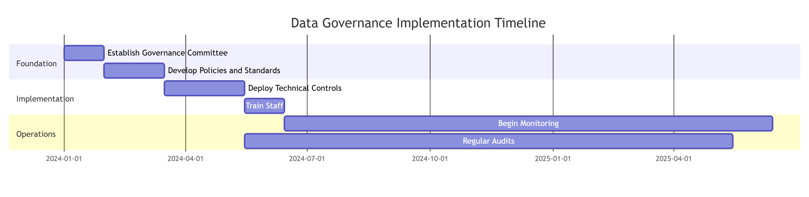

# Final Project: SecureHealth Inc. Data Management System

## Project Overview

### Case Study: SecureHealth Inc.

SecureHealth Inc. is a medium-sized healthcare provider that manages patient records, medical histories, and insurance information for thousands of patients across multiple locations. Over the past few years, SecureHealth has experienced significant growth, driven by its expansion into new regions and increased patient volume. However, this growth has exposed various vulnerabilities in the company's existing data management infrastructure, including security risks, inefficiencies in data handling, and compliance challenges.

The healthcare industry is highly regulated, with strict guidelines for data privacy and security imposed by laws such as **HIPAA** (Health Insurance Portability and Accountability Act) and **GDPR** (General Data Protection Regulation) for patient data protection. Failure to adhere to these regulations not only risks costly penalties but also threatens the company's reputation and trustworthiness in the eyes of patients.

SecureHealth is now at a crossroads, and it must modernize its data management system to remain compliant, efficient, and competitive. To do this effectively, they are looking to hire a Data Manager who can lead the effort to implement a new, secure, scalable data management system that aligns with modern standards of data privacy, security, governance, and risk management.

---

## Why SecureHealth Needs a Data Manager

Given the complexities of modern data management, SecureHealth requires the expertise of a Data Manager to lead the development and implementation of a secure, compliant, and efficient data system. The role of the Data Manager will be critical in addressing the company's current challenges and laying the foundation for future growth.

### Key Responsibilities of the Data Manager:

| Responsibility                                     | Description                                                                                                                                                                                                                       |
| -------------------------------------------------- | --------------------------------------------------------------------------------------------------------------------------------------------------------------------------------------------------------------------------------- |
| **Ensure Data Privacy and Security**         | Oversee the implementation of data encryption, RBAC, and other security measures. Work with IT and security teams to prevent data breaches and unauthorized access to sensitive information.                                      |
| **Drive Compliance with Regulations**        | Lead efforts to align the data management system with HIPAA and GDPR requirements. Implement tools and processes that ensure auditability, data retention, and patient control over their data.                                   |
| **Redesign Data Architecture**               | Rebuild the existing data architecture to support scalability, data integrity, and performance. Optimize data storage, retrieval, and processing to meet the demands of a growing healthcare provider.                            |
| **Implement Governance and Risk Management** | Develop and enforce data governance policies that ensure data quality, ownership, and security. Identify and mitigate data risks, ensuring that SecureHealth is prepared for potential cybersecurity threats and system failures. |
| **Facilitate Data-Driven Decision-Making**   | Help the organization leverage its data for analytics and insights, improving patient care and operational efficiency.                                                                                                            |

---

## Learning Outcomes

Upon completion of this project, you will be able to:

- Implement data privacy and encryption mechanisms in a relational database
- Design a scalable data architecture and develop data governance policies
- Apply principles of data risk management and compliance with regulations such as GDPR and HIPAA
- Apply role-based access control (RBAC) to ensure secure access to data
- Implement audit trails and compliance reporting to track and manage sensitive data

---

## Project Structure

The project is divided into three parts, which are to be submitted sequentially:

| Part             | Focus Area                                                 | Key Deliverables                                                            |
| ---------------- | ---------------------------------------------------------- | --------------------------------------------------------------------------- |
| **Part 1** | Data Privacy, Security, Encryption, and RBAC               | MySQL database implementation with encryption and role-based access control |
| **Part 2** | Data Architecture, Management, and Governance              | ERD design, data management plan, governance framework                      |
| **Part 3** | Data Risk Management, Compliance, and Regulatory Standards | Risk management document, compliance document, audit implementation         |

---

# Part 1: Implementing Data Privacy, Security, Encryption, and Role-Based Access using MySQL

## Objective

Design and implement a secure MySQL database for SecureHealth Inc. to store sensitive patient and employee data. Learners will apply data privacy measures such as encryption and implement role-based access control to protect this sensitive information.

## Database Schema Design

### Tables Structure

```sql
-- Create database
CREATE DATABASE IF NOT EXISTS securehealth_db;
USE securehealth_db;

-- 1. Roles table
CREATE TABLE roles (
    role_id INT PRIMARY KEY AUTO_INCREMENT,
    role_name VARCHAR(50) UNIQUE NOT NULL,
    role_description TEXT,
    created_at TIMESTAMP DEFAULT CURRENT_TIMESTAMP
);

-- 2. Employees table
CREATE TABLE employees (
    employee_id INT PRIMARY KEY AUTO_INCREMENT,
    first_name VARCHAR(50) NOT NULL,
    last_name VARCHAR(50) NOT NULL,
    email VARCHAR(100) UNIQUE NOT NULL,
    phone VARCHAR(20),
    hire_date DATE,
    username VARCHAR(50) UNIQUE NOT NULL,
    password_hash VARCHAR(255) NOT NULL,
    created_at TIMESTAMP DEFAULT CURRENT_TIMESTAMP
);

-- 3. Employee-Role junction table (many-to-many relationship)
CREATE TABLE employee_roles (
    employee_role_id INT PRIMARY KEY AUTO_INCREMENT,
    employee_id INT,
    role_id INT,
    assigned_date TIMESTAMP DEFAULT CURRENT_TIMESTAMP,
    FOREIGN KEY (employee_id) REFERENCES employees(employee_id) ON DELETE CASCADE,
    FOREIGN KEY (role_id) REFERENCES roles(role_id) ON DELETE CASCADE,
    UNIQUE KEY unique_employee_role (employee_id, role_id)
);

-- 4. Patients table with encrypted sensitive fields
CREATE TABLE patients (
    patient_id INT PRIMARY KEY AUTO_INCREMENT,
    first_name VARCHAR(50) NOT NULL,
    last_name VARCHAR(50) NOT NULL,
    date_of_birth DATE,
    email VARCHAR(100),
    phone VARCHAR(20),
    address TEXT,
    -- Encrypted sensitive fields (stored as binary)
    ssn_encrypted VARBINARY(255),
    medical_history_encrypted VARBINARY(255),
    insurance_info_encrypted VARBINARY(255),
    created_at TIMESTAMP DEFAULT CURRENT_TIMESTAMP,
    updated_at TIMESTAMP DEFAULT CURRENT_TIMESTAMP ON UPDATE CURRENT_TIMESTAMP,
    created_by INT,
    FOREIGN KEY (created_by) REFERENCES employees(employee_id)
);

-- 5. Audit log table for tracking access to sensitive data
CREATE TABLE audit_log (
    log_id INT PRIMARY KEY AUTO_INCREMENT,
    table_name VARCHAR(50),
    record_id INT,
    action VARCHAR(20),
    employee_id INT,
    access_time TIMESTAMP DEFAULT CURRENT_TIMESTAMP,
    ip_address VARCHAR(45),
    details TEXT,
    FOREIGN KEY (employee_id) REFERENCES employees(employee_id)
);
```

## Task 1: Insert Sample Data into the Roles Table

```sql
-- Insert roles: Doctor, Nurse, Admin
INSERT INTO roles (role_name, role_description) VALUES
('Doctor', 'Medical doctor with full access to patient medical records'),
('Nurse', 'Nursing staff with limited access to patient records'),
('Admin', 'Administrative staff with access to scheduling and billing information');

-- Verify roles
SELECT * FROM roles;
```

**Expected Output:**

| role_id | role_name | role_description                                                       | created_at          |
| ------- | --------- | ---------------------------------------------------------------------- | ------------------- |
| 1       | Doctor    | Medical doctor with full access to patient medical records             | 2024-01-15 10:30:00 |
| 2       | Nurse     | Nursing staff with limited access to patient records                   | 2024-01-15 10:30:00 |
| 3       | Admin     | Administrative staff with access to scheduling and billing information | 2024-01-15 10:30:00 |

---

## Task 2: Implement Data Encryption for Sensitive Fields

### Creating Encryption Functions

```sql
-- Set encryption key (in production, this would be stored securely)
SET @encryption_key = 'securehealth_encryption_key_2024';

-- Insert sample patients with encrypted sensitive data
INSERT INTO patients (
    first_name, 
    last_name, 
    date_of_birth, 
    email, 
    phone, 
    address,
    ssn_encrypted,
    medical_history_encrypted,
    insurance_info_encrypted
) VALUES 
(
    'John', 
    'Doe', 
    '1980-05-15', 
    'john.doe@email.com', 
    '555-123-4567',
    '123 Main St, Anytown, USA',
    AES_ENCRYPT('123-45-6789', @encryption_key),
    AES_ENCRYPT('Patient has history of hypertension, treated with medication', @encryption_key),
    AES_ENCRYPT('Insurance Provider: BlueCross, Policy #: BC123456789', @encryption_key)
),
(
    'Jane', 
    'Smith', 
    '1975-08-22', 
    'jane.smith@email.com', 
    '555-987-6543',
    '456 Oak Ave, Somewhere, USA',
    AES_ENCRYPT('987-65-4321', @encryption_key),
    AES_ENCRYPT('Patient has diabetes type 2, currently managing with insulin', @encryption_key),
    AES_ENCRYPT('Insurance Provider: Aetna, Policy #: AE987654321', @encryption_key),
    1
),
(
    'Robert', 
    'Johnson', 
    '1990-11-30', 
    'robert.j@email.com', 
    '555-456-7890',
    '789 Pine Rd, Elsewhere, USA',
    AES_ENCRYPT('456-78-9123', @encryption_key),
    AES_ENCRYPT('No significant medical history', @encryption_key),
    AES_ENCRYPT('Insurance Provider: Cigna, Policy #: CG456789123', @encryption_key),
    1
);
```

### Verifying Encrypted Data

```sql
-- View encrypted data (shows binary data)
SELECT patient_id, first_name, last_name, ssn_encrypted, medical_history_encrypted 
FROM patients;

-- Decrypt and view sensitive data (requires encryption key)
SELECT 
    patient_id,
    first_name,
    last_name,
    CAST(AES_DECRYPT(ssn_encrypted, @encryption_key) AS CHAR) as ssn,
    CAST(AES_DECRYPT(medical_history_encrypted, @encryption_key) AS CHAR) as medical_history,
    CAST(AES_DECRYPT(insurance_info_encrypted, @encryption_key) AS CHAR) as insurance_info
FROM patients;
```

**Expected Output (Decrypted View):**

| patient_id | first_name | last_name | ssn         | medical_history                                              | insurance_info                                       |
| ---------- | ---------- | --------- | ----------- | ------------------------------------------------------------ | ---------------------------------------------------- |
| 1          | John       | Doe       | 123-45-6789 | Patient has history of hypertension, treated with medication | Insurance Provider: BlueCross, Policy #: BC123456789 |
| 2          | Jane       | Smith     | 987-65-4321 | Patient has diabetes type 2, currently managing with insulin | Insurance Provider: Aetna, Policy #: AE987654321     |
| 3          | Robert     | Johnson   | 456-78-9123 | No significant medical history                               | Insurance Provider: Cigna, Policy #: CG456789123     |

---

## Task 3: Insert Employees and Assign Roles

```sql
-- Insert employees
INSERT INTO employees (first_name, last_name, email, phone, hire_date, username, password_hash) VALUES
('Sarah', 'Williams', 'sarah.williams@securehealth.com', '555-111-2222', '2020-01-15', 'dr_williams', SHA2('password123', 256)),
('Michael', 'Brown', 'michael.brown@securehealth.com', '555-222-3333', '2021-03-10', 'nurse_brown', SHA2('password123', 256)),
('Jennifer', 'Davis', 'jennifer.davis@securehealth.com', '555-333-4444', '2019-06-20', 'admin_davis', SHA2('password123', 256)),
('James', 'Miller', 'james.miller@securehealth.com', '555-444-5555', '2022-02-01', 'dr_miller', SHA2('password123', 256)),
('Patricia', 'Garcia', 'patricia.garcia@securehealth.com', '555-555-6666', '2021-11-15', 'nurse_garcia', SHA2('password123', 256));

-- Assign roles to employees
-- Sarah Williams - Doctor
INSERT INTO employee_roles (employee_id, role_id) VALUES (1, 1);
-- Michael Brown - Nurse
INSERT INTO employee_roles (employee_id, role_id) VALUES (2, 2);
-- Jennifer Davis - Admin
INSERT INTO employee_roles (employee_id, role_id) VALUES (3, 3);
-- James Miller - Doctor
INSERT INTO employee_roles (employee_id, role_id) VALUES (4, 1);
-- Patricia Garcia - Nurse
INSERT INTO employee_roles (employee_id, role_id) VALUES (5, 2);

-- Verify employee roles with details
SELECT 
    e.employee_id,
    e.first_name,
    e.last_name,
    e.username,
    r.role_name,
    r.role_description
FROM employees e
JOIN employee_roles er ON e.employee_id = er.employee_id
JOIN roles r ON er.role_id = r.role_id
ORDER BY e.employee_id;
```

**Expected Output:**

| employee_id | first_name | last_name | username     | role_name | role_description                                                       |
| ----------- | ---------- | --------- | ------------ | --------- | ---------------------------------------------------------------------- |
| 1           | Sarah      | Williams  | dr_williams  | Doctor    | Medical doctor with full access to patient medical records             |
| 2           | Michael    | Brown     | nurse_brown  | Nurse     | Nursing staff with limited access to patient records                   |
| 3           | Jennifer   | Davis     | admin_davis  | Admin     | Administrative staff with access to scheduling and billing information |
| 4           | James      | Miller    | dr_miller    | Doctor    | Medical doctor with full access to patient medical records             |
| 5           | Patricia   | Garcia    | nurse_garcia | Nurse     | Nursing staff with limited access to patient records                   |

---

## Task 4: Implement Role-Based Access Control (RBAC)

### Create Database Users for Each Role

```sql
-- Drop users if they exist (for clean setup)
DROP USER IF EXISTS 'doctor_user'@'localhost';
DROP USER IF EXISTS 'nurse_user'@'localhost';
DROP USER IF EXISTS 'admin_user'@'localhost';

-- Create users for each role
CREATE USER 'doctor_user'@'localhost' IDENTIFIED BY 'DoctorPass123!';
CREATE USER 'nurse_user'@'localhost' IDENTIFIED BY 'NursePass123!';
CREATE USER 'admin_user'@'localhost' IDENTIFIED BY 'AdminPass123!';

-- Grant privileges based on roles

-- Doctor: Full access to patient data, can read and update medical records
GRANT SELECT, INSERT, UPDATE ON securehealth_db.patients TO 'doctor_user'@'localhost';
GRANT SELECT ON securehealth_db.employees TO 'doctor_user'@'localhost';
GRANT SELECT ON securehealth_db.audit_log TO 'doctor_user'@'localhost';

-- Nurse: Limited access - can view patient demographics and basic info, but not SSN
-- Create a view for nurses with limited data access
CREATE OR REPLACE VIEW patient_nurse_view AS
SELECT 
    patient_id,
    first_name,
    last_name,
    date_of_birth,
    email,
    phone,
    address,
    -- Exclude encrypted sensitive fields
    'RESTRICTED' as ssn_status,
    'RESTRICTED' as medical_history_status,
    'RESTRICTED' as insurance_status
FROM patients;

GRANT SELECT ON securehealth_db.patient_nurse_view TO 'nurse_user'@'localhost';
GRANT SELECT, UPDATE ON securehealth_db.patients (first_name, last_name, date_of_birth, email, phone, address) TO 'nurse_user'@'localhost';
GRANT SELECT ON securehealth_db.audit_log TO 'nurse_user'@'localhost';

-- Admin: Access to administrative data, no access to clinical data
CREATE OR REPLACE VIEW patient_admin_view AS
SELECT 
    patient_id,
    first_name,
    last_name,
    -- Basic demographics only
    'RESTRICTED' as medical_data
FROM patients;

GRANT SELECT ON securehealth_db.patient_admin_view TO 'admin_user'@'localhost';
GRANT SELECT, INSERT, UPDATE ON securehealth_db.employees TO 'admin_user'@'localhost';
GRANT SELECT, INSERT, UPDATE ON securehealth_db.employee_roles TO 'admin_user'@'localhost';
GRANT SELECT ON securehealth_db.roles TO 'admin_user'@'localhost';

-- Apply privileges
FLUSH PRIVILEGES;
```

### Create Stored Procedure for Secure Data Access

```sql
DELIMITER //

-- Procedure for doctors to view decrypted patient data
CREATE PROCEDURE GetPatientFullRecord(IN p_patient_id INT)
BEGIN
    SELECT 
        patient_id,
        first_name,
        last_name,
        date_of_birth,
        email,
        phone,
        address,
        CAST(AES_DECRYPT(ssn_encrypted, @encryption_key) AS CHAR) as ssn,
        CAST(AES_DECRYPT(medical_history_encrypted, @encryption_key) AS CHAR) as medical_history,
        CAST(AES_DECRYPT(insurance_info_encrypted, @encryption_key) AS CHAR) as insurance_info
    FROM patients
    WHERE patient_id = p_patient_id;
  
    -- Log access
    INSERT INTO audit_log (table_name, record_id, action, employee_id, details)
    VALUES ('patients', p_patient_id, 'VIEW', @current_employee_id, 'Full patient record accessed');
END//

DELIMITER ;

-- Grant execute permission to doctor only
GRANT EXECUTE ON PROCEDURE securehealth_db.GetPatientFullRecord TO 'doctor_user'@'localhost';
```

---

## Task 5: Test and Validate Access Control

### Scenario 1: Doctor's Access

```sql
-- Login as doctor (in MySQL command line or new connection)
-- mysql -u doctor_user -p

-- Set encryption key (doctors have access to the key)
SET @encryption_key = 'securehealth_encryption_key_2024';
SET @current_employee_id = 1; -- Dr. Williams

-- Test: View all patients (should see all fields including encrypted ones as binary)
SELECT * FROM patients;

-- Test: View decrypted patient data
SELECT 
    patient_id,
    first_name,
    last_name,
    CAST(AES_DECRYPT(ssn_encrypted, @encryption_key) AS CHAR) as ssn,
    CAST(AES_DECRYPT(medical_history_encrypted, @encryption_key) AS CHAR) as medical_history
FROM patients;

-- Test: Use stored procedure for full record access
CALL GetPatientFullRecord(1);

-- Test: Update patient medical history
UPDATE patients 
SET medical_history_encrypted = AES_ENCRYPT('Updated: Patient now also has high cholesterol', @encryption_key)
WHERE patient_id = 1;

-- Verify update
SELECT patient_id, first_name, last_name, 
       CAST(AES_DECRYPT(medical_history_encrypted, @encryption_key) AS CHAR) as medical_history
FROM patients WHERE patient_id = 1;
```

**Expected Result for Doctor:**

- ✅ Can view all patient data including encrypted fields
- ✅ Can decrypt and read sensitive information
- ✅ Can update medical records
- ✅ Can access audit logs

### Scenario 2: Nurse's Access

```sql
-- Login as nurse
-- mysql -u nurse_user -p

SET @current_employee_id = 2; -- Nurse Brown

-- Test: View through restricted view
SELECT * FROM patient_nurse_view;

-- Expected: Shows patient demographics but SSN and medical history show as 'RESTRICTED'

-- Test: Try to access full patients table
SELECT * FROM patients;
-- Expected: ERROR 1142 (42000): SELECT command denied to user 'nurse_user'@'localhost'

-- Test: Try to update patient demographics (allowed)
UPDATE patients 
SET phone = '555-999-8888' 
WHERE patient_id = 1;
-- Expected: Should succeed (nurses can update basic demographics)

-- Test: Try to access encrypted data directly
SELECT ssn_encrypted FROM patients;
-- Expected: ERROR 1142 (42000): SELECT command denied

-- Test: Try to decrypt data
SELECT CAST(AES_DECRYPT(ssn_encrypted, @encryption_key) AS CHAR) FROM patients;
-- Expected: ERROR 1142 (42000) or NULL result (no access to encryption key)
```

**Expected Result for Nurse:**

- ✅ Can view patient demographics through the restricted view
- ✅ Can update basic patient information (name, phone, address)
- ✅ Cannot view or decrypt sensitive fields (SSN, medical history)
- ✅ Cannot access full patients table
- ✅ Cannot access encryption functions

### Scenario 3: Admin's Access

```sql
-- Login as admin
-- mysql -u admin_user -p

SET @current_employee_id = 3; -- Admin Davis

-- Test: View patient admin view
SELECT * FROM patient_admin_view;
-- Expected: Shows only patient ID and names, medical data shows as 'RESTRICTED'

-- Test: Access employees table (allowed)
SELECT * FROM employees;

-- Test: Manage employee roles
INSERT INTO employee_roles (employee_id, role_id) VALUES (5, 1);
-- Expected: Should succeed (admin manages roles)

-- Test: Try to access patient clinical data
SELECT * FROM patients;
-- Expected: ERROR 1142 (42000): SELECT command denied

-- Test: Try to access audit logs (allowed)
SELECT * FROM audit_log;

-- Test: Try to access encryption functions
SELECT CAST(AES_DECRYPT(ssn_encrypted, @encryption_key) AS CHAR) FROM patients;
-- Expected: ERROR 1142 (42000) or NULL result
```

**Expected Result for Admin:**

- ✅ Can view limited patient information through admin view
- ✅ Can manage employees and roles
- ✅ Can access audit logs
- ❌ Cannot view patient clinical data
- ❌ Cannot access encrypted fields
- ❌ Cannot use encryption functions

---

## Audit Trail Implementation

### Create Triggers for Logging Sensitive Data Access

```sql
DELIMITER //

-- Trigger to log INSERT operations on patients table
CREATE TRIGGER patients_insert_audit
AFTER INSERT ON patients
FOR EACH ROW
BEGIN
    INSERT INTO audit_log (table_name, record_id, action, employee_id, details)
    VALUES ('patients', NEW.patient_id, 'INSERT', @current_employee_id, 
            CONCAT('New patient added: ', NEW.first_name, ' ', NEW.last_name));
END//

-- Trigger to log UPDATE operations on patients table
CREATE TRIGGER patients_update_audit
AFTER UPDATE ON patients
FOR EACH ROW
BEGIN
    DECLARE changes TEXT;
    SET changes = '';
  
    IF OLD.first_name != NEW.first_name THEN
        SET changes = CONCAT(changes, 'first_name changed, ');
    END IF;
  
    IF OLD.last_name != NEW.last_name THEN
        SET changes = CONCAT(changes, 'last_name changed, ');
    END IF;
  
    IF OLD.ssn_encrypted != NEW.ssn_encrypted THEN
        SET changes = CONCAT(changes, 'SSN updated, ');
    END IF;
  
    IF OLD.medical_history_encrypted != NEW.medical_history_encrypted THEN
        SET changes = CONCAT(changes, 'medical history updated, ');
    END IF;
  
    IF changes != '' THEN
        INSERT INTO audit_log (table_name, record_id, action, employee_id, details)
        VALUES ('patients', NEW.patient_id, 'UPDATE', @current_employee_id, 
                CONCAT('Changes: ', LEFT(changes, LENGTH(changes)-2)));
    END IF;
END//

-- Trigger to log DELETE operations on patients table
CREATE TRIGGER patients_delete_audit
BEFORE DELETE ON patients
FOR EACH ROW
BEGIN
    INSERT INTO audit_log (table_name, record_id, action, employee_id, details)
    VALUES ('patients', OLD.patient_id, 'DELETE', @current_employee_id, 
            CONCAT('Patient deleted: ', OLD.first_name, ' ', OLD.last_name));
END//

DELIMITER ;
```

### View Audit Log

```sql
-- View all audit log entries
SELECT 
    log_id,
    table_name,
    record_id,
    action,
    e.first_name || ' ' || e.last_name as employee_name,
    access_time,
    details
FROM audit_log a
LEFT JOIN employees e ON a.employee_id = e.employee_id
ORDER BY access_time DESC;
```

**Expected Output Example:**

| log_id | table_name | record_id | action | employee_name  | access_time         | details                           |
| ------ | ---------- | --------- | ------ | -------------- | ------------------- | --------------------------------- |
| 5      | patients   | 1         | UPDATE | Sarah Williams | 2024-01-15 14:32:10 | Changes: medical history updated  |
| 4      | patients   | 2         | VIEW   | Sarah Williams | 2024-01-15 14:30:22 | Full patient record accessed      |
| 3      | patients   | 3         | INSERT | Jennifer Davis | 2024-01-15 11:15:05 | New patient added: Robert Johnson |
| 2      | patients   | 2         | INSERT | Jennifer Davis | 2024-01-15 11:14:52 | New patient added: Jane Smith     |
| 1      | patients   | 1         | INSERT | Jennifer Davis | 2024-01-15 11:14:38 | New patient added: John Doe       |

---

## Part 1 Summary Checklist

| Task                                                       | Completed |
| ---------------------------------------------------------- | --------- |
| ✅ Roles table created with Doctor, Nurse, Admin roles     |           |
| ✅ Sample data inserted into roles table                   |           |
| ✅ AES encryption implemented for sensitive patient fields |           |
| ✅ Encrypted data verified                                 |           |
| ✅ Employees inserted with role assignments                |           |
| ✅ Database users created for each role                    |           |
| ✅ Role-based privileges granted appropriately             |           |
| ✅ Doctor access tested and validated                      |           |
| ✅ Nurse access tested and validated                       |           |
| ✅ Admin access tested and validated                       |           |
| ✅ Audit triggers implemented                              |           |

---

## Part 1 Deliverables

Submit the following for Part 1:

1. **SQL Script File**: Complete SQL script containing all table creation, data insertion, encryption implementation, user creation, and privilege granting statements
2. **Screenshots/Output**: Evidence of successful execution showing:

   - Roles table with inserted data
   - Encrypted data in patients table
   - Decrypted view of patient data
   - Employee-role assignments
   - Successful login and access tests for each role scenario
   - Audit log entries showing tracked activities
3. **Explanation Document**: Brief explanation of:

   - How encryption protects sensitive patient data
   - How RBAC ensures least-privilege access
   - How the audit trail supports compliance requirements

---

# Part 2: Data Architecture, Management, and Governance

## Objective

Design the data architecture for SecureHealth Inc. and develop a data management plan with a governance framework to ensure data quality, security, and scalability.

---

## Task 1: Design the Data Architecture

### Entity-Relationship Diagram (ERD)

Below is the Entity-Relationship Diagram representing the relationships between patients, employees, and their roles:

.png)

### Alternative Text-Based ERD Representation

```
┌─────────────────┐         ┌───────────────────┐         ┌─────────────────┐
│     ROLES       │         │  EMPLOYEE_ROLES   │         │   EMPLOYEES     │
├─────────────────┤         ├───────────────────┤         ├─────────────────┤
│ role_id (PK)    │◄────┐   │ employee_role_id  │   ┌────►│ employee_id (PK)│
│ role_name       │     │   │   (PK)            │   │     │ first_name      │
│ role_description│     └───┤ employee_id (FK)  │───┘     │ last_name       │
│ created_at      │         │ role_id (FK)      │         │ email           │
└─────────────────┘         │ assigned_date     │         │ phone           │
                            └───────────────────┘         │ hire_date       │
                                                           │ username        │
┌─────────────────┐         ┌───────────────────┐         │ password_hash   │
│    PATIENTS     │         │    AUDIT_LOG      │         │ created_at      │
├─────────────────┤         ├───────────────────┤         └────────┬────────┘
│ patient_id (PK) │         │ log_id (PK)       │                  │
│ first_name      │         │ table_name        │                  │
│ last_name       │         │ record_id         │                  │
│ date_of_birth   │         │ action            │                  │
│ email           │         │ employee_id (FK)  │──────────────────┘
│ phone           │         │ access_time       │
│ address         │         │ ip_address        │
│ ssn_encrypted   │         │ details           │
│ medical_history_│         └───────────────────┘
│   encrypted     │
│ insurance_info_ │
│   encrypted     │
│ created_at      │
│ updated_at      │
│ created_by (FK) │◄─────────────────────────────────────────────────┘
└─────────────────┘
```

### Data Normalization

The database design follows **Third Normal Form (3NF)** principles:

| Normalization Level                        | Implementation                                            |
| ------------------------------------------ | --------------------------------------------------------- |
| **1NF (Atomic Values)**              | All columns contain atomic values (no repeating groups)   |
| **2NF (No Partial Dependencies)**    | All non-key attributes depend on the entire primary key   |
| **3NF (No Transitive Dependencies)** | No non-key attribute depends on another non-key attribute |

#### Normalization Analysis

| Table                    | Primary Key      | Normalization Status                                    |
| ------------------------ | ---------------- | ------------------------------------------------------- |
| **roles**          | role_id          | Fully normalized - all attributes depend on role_id     |
| **employees**      | employee_id      | Fully normalized - all attributes depend on employee_id |
| **employee_roles** | employee_role_id | Junction table resolving many-to-many relationship      |
| **patients**       | patient_id       | Fully normalized - all attributes depend on patient_id  |
| **audit_log**      | log_id           | Fully normalized - all attributes depend on log_id      |

---

## Task 2: Data Governance Policy

### Data Governance Core Principles

#### 1. **Data Accuracy and Quality**

| Principle              | Description                                       | Implementation                              |
| ---------------------- | ------------------------------------------------- | ------------------------------------------- |
| **Accuracy**     | Data must correctly represent real-world entities | Validation rules, data quality checks       |
| **Completeness** | All required data fields must be populated        | NOT NULL constraints, required fields       |
| **Consistency**  | Data should be uniform across the system          | Standardized formats, data type consistency |
| **Timeliness**   | Data should be current and up-to-date             | Regular updates, timestamp tracking         |

#### 2. **Data Security and Privacy**

| Principle                 | Description                                       | Implementation                            |
| ------------------------- | ------------------------------------------------- | ----------------------------------------- |
| **Confidentiality** | Sensitive data protected from unauthorized access | Encryption, RBAC, access controls         |
| **Integrity**       | Data remains accurate and unaltered               | Audit trails, checksums, validation       |
| **Availability**    | Data accessible when needed                       | Backups, redundancy, disaster recovery    |
| **Privacy**         | Personal data handled according to regulations    | HIPAA/GDPR compliance, consent management |

#### 3. **Data Compliance and Regulatory Adherence**

| Regulation               | Requirements                        | Implementation                          |
| ------------------------ | ----------------------------------- | --------------------------------------- |
| **HIPAA**          | Protect patient health information  | Encryption, access controls, audit logs |
| **GDPR**           | EU citizen data protection          | Consent management, right to erasure    |
| **Data Retention** | Keep data only as long as necessary | Retention policies, automated purging   |

#### 4. **Data Lifecycle Management**


| Stage             | Description                  | Controls                             |
| ----------------- | ---------------------------- | ------------------------------------ |
| **Create**  | Data entry and acquisition   | Validation, consent collection       |
| **Store**   | Secure data storage          | Encryption, access controls          |
| **Use**     | Data processing and analysis | RBAC, audit logging                  |
| **Archive** | Long-term retention          | Encryption, access restrictions      |
| **Purge**   | Secure deletion              | Irreversible deletion, certification |

### Roles and Responsibilities

#### Data Governance Committee

| Role                               | Responsibility                                  |
| ---------------------------------- | ----------------------------------------------- |
| **Chief Data Officer (CDO)** | Overall data strategy and governance            |
| **Data Governance Manager**  | Daily governance operations, policy enforcement |
| **Legal/Compliance Officer** | Regulatory compliance, privacy oversight        |
| **IT Security Lead**         | Technical security controls, access management  |
| **Clinical Director**        | Clinical data quality and usage                 |

#### Data Stewards

| Steward Type                    | Responsibilities                                          |
| ------------------------------- | --------------------------------------------------------- |
| **Patient Data Steward**  | Ensure patient data quality, oversee data entry standards |
| **Employee Data Steward** | Maintain employee records, role assignments               |
| **Security Data Steward** | Monitor access logs, investigate anomalies                |
| **Compliance Steward**    | Ensure regulatory compliance, prepare for audits          |

#### Data Custodians

| Custodian                        | Technical Responsibilities                        |
| -------------------------------- | ------------------------------------------------- |
| **Database Administrator** | Database maintenance, backups, performance        |
| **Security Administrator** | User access management, encryption key management |
| **System Administrator**   | Infrastructure security, system updates           |

#### Data Users

| User Role                | Access Level             | Accountability                  |
| ------------------------ | ------------------------ | ------------------------------- |
| **Doctors**        | Full clinical access     | Protect patient confidentiality |
| **Nurses**         | Limited clinical access  | Follow data handling protocols  |
| **Administrators** | Administrative data only | Maintain data accuracy          |
| **Analysts**       | Anonymized data only     | Use data responsibly            |

### Data Quality Standards

```sql
-- Example data quality checks implementation

-- 1. Check for NULL required fields
DELIMITER //
CREATE PROCEDURE check_patient_data_quality()
BEGIN
    -- Check for missing required fields
    SELECT 'Missing email addresses' as check_type, COUNT(*) as count
    FROM patients WHERE email IS NULL OR email = ''
    UNION ALL
    SELECT 'Missing phone numbers', COUNT(*)
    FROM patients WHERE phone IS NULL OR phone = ''
    UNION ALL
    SELECT 'Missing date of birth', COUNT(*)
    FROM patients WHERE date_of_birth IS NULL;
END//
DELIMITER ;

-- 2. Data validation triggers
CREATE TRIGGER validate_patient_email
BEFORE INSERT ON patients
FOR EACH ROW
BEGIN
    IF NEW.email IS NOT NULL AND NEW.email NOT LIKE '%_@__%.__%' THEN
        SIGNAL SQLSTATE '45000' 
        SET MESSAGE_TEXT = 'Invalid email format';
    END IF;
END//
```

### Data Retention Policy

| Data Type                          | Retention Period              | Action After Period    |
| ---------------------------------- | ----------------------------- | ---------------------- |
| **Active Patient Records**   | Duration of care + 7 years    | Archive                |
| **Archived Patient Records** | 7 years after last visit      | Anonymize for research |
| **Employee Records**         | Employment duration + 5 years | Secure deletion        |
| **Audit Logs**               | 7 years                       | Secure deletion        |
| **Backup Data**              | 30 days rotation              | Overwrite              |

### Data Classification Schema

| Classification Level            | Description                                  | Examples                                | Handling Requirements                               |
| ------------------------------- | -------------------------------------------- | --------------------------------------- | --------------------------------------------------- |
| **Level 4: Restricted**   | Highly sensitive, severe impact if disclosed | SSN, medical history, insurance info    | AES-256 encryption, strict RBAC, full audit logging |
| **Level 3: Confidential** | Sensitive, moderate impact if disclosed      | Patient demographics, employee records  | Encryption at rest, role-based access               |
| **Level 2: Internal**     | Internal use only, limited impact            | Department schedules, internal policies | Basic access controls                               |
| **Level 1: Public**       | Non-sensitive, no impact                     | Facility locations, general information | No special controls                                 |

### Data Governance Implementation Plan



---

## Part 2 Summary Checklist

| Task                                          | Completed |
| --------------------------------------------- | --------- |
| ✅ Entity-Relationship Diagram (ERD) created  |           |
| ✅ Data normalization principles applied      |           |
| ✅ Data Governance Core Principles documented |           |
| ✅ Roles and Responsibilities defined         |           |
| ✅ Data Quality Standards established         |           |
| ✅ Data Retention Policy created              |           |
| ✅ Data Classification Schema developed       |           |

---

## Part 2 Deliverables

Submit the following for Part 2:

1. **Entity-Relationship Diagram (ERD)**: Visual representation of the database schema showing all tables, relationships, and keys
2. **Data Governance Policy Document**: Comprehensive document covering:

   - Core governance principles
   - Roles and responsibilities matrix
   - Data quality standards
   - Data retention policy
   - Data classification schema
3. **Data Architecture Explanation**: Brief description of:

   - How the design supports scalability
   - How normalization ensures data integrity
   - How the architecture supports security requirements

---

# Part 3: Data Risk Management, Compliance, and Regulatory Standards

## Objective

Implement data risk management strategies and ensure compliance with regulations such as GDPR and HIPAA. This part will focus on managing data risk and ensuring regulatory compliance by incorporating secure data storage, audits, and logging.

---

## Task 1: Data Risk Management Document

### Comprehensive Risk Assessment Matrix

| Risk ID         | Risk Category        | Risk Description                             | Likelihood | Impact | Risk Level       | Mitigation Strategy                                                 |
| --------------- | -------------------- | -------------------------------------------- | ---------- | ------ | ---------------- | ------------------------------------------------------------------- |
| **R-001** | Data Breach          | Unauthorized access to patient records       | Medium     | Severe | **HIGH**   | Implement AES-256 encryption, RBAC, MFA, continuous monitoring      |
| **R-002** | Insider Threat       | Employee misuse of data access               | Low        | Severe | **HIGH**   | Principle of least privilege, audit logging, separation of duties   |
| **R-003** | Data Loss            | Accidental deletion or corruption            | Medium     | High   | **HIGH**   | Automated backups, 3-2-1 backup strategy, regular restoration tests |
| **R-004** | Compliance Violation | HIPAA/GDPR non-compliance                    | Medium     | Severe | **HIGH**   | Regular compliance audits, automated monitoring, staff training     |
| **R-005** | Ransomware           | Malware encrypting critical data             | Medium     | Severe | **HIGH**   | Offline backups, employee training, endpoint protection             |
| **R-006** | System Failure       | Database/server downtime                     | Low        | High   | **MEDIUM** | Redundant systems, failover clusters, disaster recovery plan        |
| **R-007** | Phishing Attack      | Employees tricked into revealing credentials | High       | Medium | **MEDIUM** | Security awareness training, email filtering, MFA                   |
| **R-008** | Third-Party Risk     | Vendor data handling vulnerabilities         | Medium     | Medium | **MEDIUM** | Vendor risk assessments, contractual security requirements          |
| **R-009** | Data Integrity       | Incorrect or corrupted data                  | Low        | Medium | **LOW**    | Validation rules, data quality checks, reconciliation processes     |
| **R-010** | Physical Security    | Unauthorized physical access to servers      | Low        | Medium | **LOW**    | Access controls, surveillance, data center security                 |

### Detailed Risk Mitigation Strategies

#### 1. Data Breach Prevention (R-001)

```sql
-- Implement comprehensive data breach prevention
-- 1.1 Encryption at rest and in transit
-- Already implemented in Part 1 with AES_ENCRYPT()

-- 1.2 Network-level security
-- Configure MySQL for TLS/SSL
-- In my.cnf or my.ini:
-- [mysqld]
-- require_secure_transport = ON
-- ssl-ca = ca.pem
-- ssl-cert = server-cert.pem
-- ssl-key = server-key.pem

-- 1.3 Implement connection IP restrictions
-- Create users with specific host restrictions
CREATE USER 'doctor_user'@'192.168.1.%' IDENTIFIED BY 'DoctorPass123!';
CREATE USER 'nurse_user'@'192.168.1.%' IDENTIFIED BY 'NursePass123!';
CREATE USER 'admin_user'@'192.168.1.%' IDENTIFIED BY 'AdminPass123!';
```

#### 2. Insider Threat Mitigation (R-002)

```sql
-- Implement separation of duties and monitoring

-- 2.1 Create a view that masks sensitive data for non-clinical staff
CREATE OR REPLACE VIEW patient_audit_view AS
SELECT 
    patient_id,
    CONCAT(LEFT(first_name, 1), '***') as first_name_initial,
    CONCAT(LEFT(last_name, 1), '***') as last_name_initial,
    'MASKED' as ssn,
    'MASKED' as medical_history
FROM patients;

-- 2.2 Grant access only to masked view for auditors
GRANT SELECT ON securehealth_db.patient_audit_view TO 'auditor'@'localhost';

-- 2.3 Implement alerts for unusual access patterns
-- Create a stored procedure to detect anomalies
DELIMITER //
CREATE PROCEDURE detect_access_anomalies()
BEGIN
    -- Detect excessive access attempts
    SELECT 
        employee_id,
        COUNT(*) as access_count,
        DATE(access_time) as access_date
    FROM audit_log
    WHERE access_time > NOW() - INTERVAL 1 DAY
    GROUP BY employee_id, DATE(access_time)
    HAVING COUNT(*) > 100; -- Threshold for unusual activity
  
    -- Detect after-hours access
    SELECT 
        employee_id,
        COUNT(*) as after_hours_access
    FROM audit_log
    WHERE HOUR(access_time) NOT BETWEEN 6 AND 20
    AND access_time > NOW() - INTERVAL 7 DAY
    GROUP BY employee_id;
END//
DELIMITER ;
```

#### 3. Data Loss Prevention (R-003)

```sql
-- Implement comprehensive backup strategy

-- 3.1 Create automated backup procedure
DELIMITER //
CREATE PROCEDURE perform_database_backup()
BEGIN
    -- This would be called by a scheduled event or cron job
    -- In production, use mysqldump command-line tool
  
    -- Log backup initiation
    INSERT INTO backup_log (backup_type, status, started_at)
    VALUES ('FULL', 'STARTED', NOW());
  
    -- Backup commands would be executed externally
    -- Example: mysqldump -u root -p securehealth_db > /backups/securehealth_$(date +%Y%m%d).sql
  
    -- Update backup log
    UPDATE backup_log 
    SET status = 'COMPLETED', completed_at = NOW()
    WHERE backup_id = LAST_INSERT_ID();
END//
DELIMITER ;

-- 3.2 Create backup log table
CREATE TABLE backup_log (
    backup_id INT PRIMARY KEY AUTO_INCREMENT,
    backup_type VARCHAR(20),
    status VARCHAR(20),
    started_at TIMESTAMP,
    completed_at TIMESTAMP,
    backup_location VARCHAR(255),
    backup_size BIGINT,
    verified BOOLEAN DEFAULT FALSE
);

-- 3.3 Schedule regular backups (using MySQL Event Scheduler)
SET GLOBAL event_scheduler = ON;

CREATE EVENT daily_backup
ON SCHEDULE EVERY 1 DAY
STARTS '2024-01-01 02:00:00'
DO
    CALL perform_database_backup();

-- 3.4 Implement backup verification
CREATE PROCEDURE verify_backup()
BEGIN
    -- Check if backup files exist and are not corrupted
    -- This would integrate with external backup verification tools
    UPDATE backup_log 
    SET verified = TRUE 
    WHERE backup_id = (SELECT MAX(backup_id) FROM backup_log);
END//
```

#### 4. Ransomware Protection (R-005)

```sql
-- Implement ransomware protection measures

-- 4.1 Create read-only snapshots
-- Create a user with read-only access for recovery purposes
CREATE USER 'recovery_user'@'localhost' IDENTIFIED BY 'RecoveryPass123!';
GRANT SELECT ON securehealth_db.* TO 'recovery_user'@'localhost';

-- 4.2 Implement file integrity monitoring
CREATE TABLE file_integrity_log (
    integrity_id INT PRIMARY KEY AUTO_INCREMENT,
    file_path VARCHAR(255),
    checksum VARCHAR(64),
    last_verified TIMESTAMP,
    status VARCHAR(20)
);

-- 4.3 Create procedure to detect unauthorized encryption
CREATE PROCEDURE detect_ransomware_activity()
BEGIN
    -- Detect rapid deletion or modification of data
    SELECT 
        employee_id,
        COUNT(*) as delete_count,
        MIN(access_time) as first_delete,
        MAX(access_time) as last_delete
    FROM audit_log
    WHERE action IN ('DELETE', 'DROP', 'TRUNCATE')
    AND access_time > NOW() - INTERVAL 1 HOUR
    GROUP BY employee_id
    HAVING COUNT(*) > 10; -- Threshold for suspicious activity
END//
```

---

## Task 2: Compliance Document

### HIPAA Compliance Matrix

| HIPAA Rule                         | Requirement                                          | Implementation in SecureHealth                                    |
| ---------------------------------- | ---------------------------------------------------- | ----------------------------------------------------------------- |
| **Privacy Rule**             | Protect individually identifiable health information | AES-256 encryption for all PHI fields, strict access controls     |
| **Security Rule**            | Administrative, physical, and technical safeguards   | RBAC, audit logging, encryption, access controls                  |
| **Breach Notification Rule** | Notify patients of breaches                          | Incident response plan, breach detection, notification procedures |
| **Enforcement Rule**         | Compliance investigations and penalties              | Regular compliance audits, documentation retention                |

### GDPR Compliance Matrix

| GDPR Principle                               | Requirement                             | Implementation in SecureHealth                 |
| -------------------------------------------- | --------------------------------------- | ---------------------------------------------- |
| **Lawfulness, Fairness, Transparency** | Process data lawfully and transparently | Consent management, privacy notices            |
| **Purpose Limitation**                 | Collect data for specified purposes     | Data classification, usage tracking            |
| **Data Minimization**                  | Collect only necessary data             | Limited fields, validation rules               |
| **Accuracy**                           | Keep data accurate and up-to-date       | Data quality checks, update procedures         |
| **Storage Limitation**                 | Keep data only as long as necessary     | Data retention policy, automated purging       |
| **Integrity and Confidentiality**      | Secure data processing                  | Encryption, access controls, security measures |
| **Accountability**                     | Demonstrate compliance                  | Audit trails, compliance documentation         |

### Compliance Implementation Details

#### 1. Access Control Documentation

```sql
-- Document all user access for compliance reporting

CREATE VIEW compliance_access_report AS
SELECT 
    e.employee_id,
    e.first_name,
    e.last_name,
    e.email,
    GROUP_CONCAT(DISTINCT r.role_name) as roles,
    GROUP_CONCAT(DISTINCT 
        CASE 
            WHEN r.role_name = 'Doctor' THEN 'Full patient access'
            WHEN r.role_name = 'Nurse' THEN 'Limited patient access'
            WHEN r.role_name = 'Admin' THEN 'Administrative access only'
        END) as access_levels
FROM employees e
JOIN employee_roles er ON e.employee_id = er.employee_id
JOIN roles r ON er.role_id = r.role_id
GROUP BY e.employee_id;

-- Create procedure for access review
DELIMITER //
CREATE PROCEDURE generate_access_review_report()
BEGIN
    SELECT 
        'Current Active Users' as section,
        COUNT(*) as user_count
    FROM employees;
  
    SELECT 
        'Users by Role' as section,
        r.role_name,
        COUNT(er.employee_id) as user_count
    FROM roles r
    LEFT JOIN employee_roles er ON r.role_id = er.role_id
    GROUP BY r.role_name;
  
    SELECT 
        'Users with Privileged Access' as section,
        e.first_name,
        e.last_name,
        e.email
    FROM employees e
    JOIN employee_roles er ON e.employee_id = er.employee_id
    JOIN roles r ON er.role_id = r.role_id
    WHERE r.role_name IN ('Doctor', 'Admin');
END//
DELIMITER ;
```

#### 2. Audit Logs for Compliance

```sql
-- Enhanced audit logging for compliance

-- Add compliance-specific fields to audit_log
ALTER TABLE audit_log 
ADD COLUMN compliance_category VARCHAR(50),
ADD COLUMN data_subject_id VARCHAR(100),
ADD COLUMN consent_reference VARCHAR(100);

-- Create compliance-specific audit views

-- 2.1 HIPAA access audit
CREATE VIEW hipaa_access_audit AS
SELECT 
    a.access_time,
    e.first_name || ' ' || e.last_name as employee_name,
    e.email,
    a.table_name,
    a.record_id,
    a.action,
    CASE 
        WHEN a.table_name = 'patients' AND a.action IN ('SELECT', 'UPDATE') 
        THEN 'PHI Access'
        ELSE 'Non-PHI Access'
    END as phi_indicator,
    a.details
FROM audit_log a
JOIN employees e ON a.employee_id = e.employee_id
WHERE a.table_name IN ('patients')
ORDER BY a.access_time DESC;

-- 2.2 GDPR data subject access request log
CREATE VIEW gdpr_access_requests AS
SELECT 
    a.access_time,
    a.data_subject_id,
    e.first_name || ' ' || e.last_name as requested_by,
    a.action,
    a.details
FROM audit_log a
JOIN employees e ON a.employee_id = e.employee_id
WHERE a.compliance_category = 'GDPR_DSAR'
ORDER BY a.access_time DESC;
```

#### 3. Data Retention Implementation

```sql
-- Implement data retention policies

-- 3.1 Create archived patients table for data that exceeds retention period
CREATE TABLE patients_archived LIKE patients;
ALTER TABLE patients_archived ADD COLUMN archived_date TIMESTAMP;

-- 3.2 Create procedure to archive old patient records
DELIMITER //
CREATE PROCEDURE archive_old_patients()
BEGIN
    -- Archive patients with no activity for 7 years
    INSERT INTO patients_archived
    SELECT *, NOW() as archived_date
    FROM patients
    WHERE updated_at < DATE_SUB(NOW(), INTERVAL 7 YEAR)
    AND patient_id NOT IN (
        SELECT DISTINCT record_id 
        FROM audit_log 
        WHERE table_name = 'patients' 
        AND access_time > DATE_SUB(NOW(), INTERVAL 7 YEAR)
    );
  
    -- Delete archived records from main table
    DELETE FROM patients
    WHERE updated_at < DATE_SUB(NOW(), INTERVAL 7 YEAR)
    AND patient_id NOT IN (
        SELECT DISTINCT record_id 
        FROM audit_log 
        WHERE table_name = 'patients' 
        AND access_time > DATE_SUB(NOW(), INTERVAL 7 YEAR)
    );
  
    -- Log the archiving activity
    INSERT INTO audit_log (table_name, action, details)
    VALUES ('patients_archived', 'ARCHIVE', 
            CONCAT('Archived ', ROW_COUNT(), ' patient records'));
END//

-- 3.3 Schedule monthly archiving
CREATE EVENT monthly_archive
ON SCHEDULE EVERY 1 MONTH
STARTS '2024-02-01 03:00:00'
DO
    CALL archive_old_patients();

-- 3.4 Create procedure for right to erasure (GDPR)
CREATE PROCEDURE gdpr_right_to_erasure(IN patient_id_param INT)
BEGIN
    DECLARE patient_name VARCHAR(100);
  
    -- Get patient name for logging
    SELECT CONCAT(first_name, ' ', last_name) INTO patient_name
    FROM patients WHERE patient_id = patient_id_param;
  
    -- Anonymize data instead of deletion for clinical continuity
    UPDATE patients 
    SET 
        first_name = 'GDPR_ERASED',
        last_name = 'GDPR_ERASED',
        email = NULL,
        phone = NULL,
        address = NULL,
        ssn_encrypted = NULL,
        medical_history_encrypted = NULL,
        insurance_info_encrypted = NULL
    WHERE patient_id = patient_id_param;
  
    -- Log the erasure request
    INSERT INTO audit_log (
        table_name, 
        record_id, 
        action, 
        details,
        compliance_category,
        data_subject_id
    ) VALUES (
        'patients', 
        patient_id_param, 
        'GDPR_ERASURE', 
        CONCAT('Right to erasure exercised for: ', patient_name),
        'GDPR_DSAR',
        patient_id_param
    );
END//
DELIMITER ;
```

#### 4. Consent Management (GDPR)

```sql
-- Create consent tracking table
CREATE TABLE patient_consent (
    consent_id INT PRIMARY KEY AUTO_INCREMENT,
    patient_id INT,
    consent_type VARCHAR(50),
    consent_given BOOLEAN,
    consent_date TIMESTAMP,
    consent_version VARCHAR(20),
    ip_address VARCHAR(45),
    consent_text TEXT,
    FOREIGN KEY (patient_id) REFERENCES patients(patient_id)
);

-- Create procedure to record consent
DELIMITER //
CREATE PROCEDURE record_patient_consent(
    IN p_patient_id INT,
    IN p_consent_type VARCHAR(50),
    IN p_consent_given BOOLEAN,
    IN p_ip_address VARCHAR(45)
)
BEGIN
    INSERT INTO patient_consent (
        patient_id, 
        consent_type, 
        consent_given, 
        consent_date, 
        consent_version,
        ip_address,
        consent_text
    ) VALUES (
        p_patient_id,
        p_consent_type,
        p_consent_given,
        NOW(),
        '1.0',
        p_ip_address,
        CASE 
            WHEN p_consent_type = 'MEDICAL_TREATMENT' 
                THEN 'Consent for medical treatment and record keeping'
            WHEN p_consent_type = 'DATA_PROCESSING' 
                THEN 'Consent for processing personal data per GDPR'
            WHEN p_consent_type = 'RESEARCH' 
                THEN 'Consent for anonymized data use in research'
        END
    );
  
    -- Log consent activity
    INSERT INTO audit_log (
        table_name,
        record_id,
        action,
        details,
        compliance_category,
        ip_address
    ) VALUES (
        'patient_consent',
        p_patient_id,
        'CONSENT_RECORDED',
        CONCAT('Consent type: ', p_consent_type, ', Given: ', p_consent_given),
        'GDPR_CONSENT',
        p_ip_address
    );
END//
DELIMITER ;
```

---

## Task 3: Enable MySQL Query Logging and Implement Triggers

### Enable General Query Log

```sql
-- Enable general query log for auditing
-- In MySQL configuration file (my.cnf or my.ini):
-- [mysqld]
-- general_log = ON
-- general_log_file = /var/log/mysql/securehealth_audit.log
-- log_output = TABLE

-- Alternatively, set dynamically:
SET GLOBAL general_log = 'ON';
SET GLOBAL log_output = 'TABLE';

-- View general log entries
SELECT * FROM mysql.general_log 
WHERE argument NOT LIKE '%general_log%'
ORDER BY event_time DESC
LIMIT 100;
```

### Implement Comprehensive Audit Triggers

```sql
-- Enhanced audit triggers for all sensitive tables

-- 1. Patient table comprehensive audit trigger
DELIMITER //
CREATE TRIGGER patient_full_audit
AFTER INSERT ON patients
FOR EACH ROW
BEGIN
    INSERT INTO audit_log (
        table_name, 
        record_id, 
        action, 
        employee_id, 
        ip_address,
        compliance_category,
        details
    ) VALUES (
        'patients',
        NEW.patient_id,
        'INSERT',
        @current_employee_id,
        @current_ip_address,
        'HIPAA_PHI',
        CONCAT('New patient created: ', NEW.first_name, ' ', NEW.last_name)
    );
END//

-- 2. Update audit trigger with before/after values
CREATE TRIGGER patient_update_audit
AFTER UPDATE ON patients
FOR EACH ROW
BEGIN
    DECLARE changes_detected TEXT DEFAULT '';
  
    -- Check each field for changes
    IF OLD.first_name != NEW.first_name THEN
        SET changes_detected = CONCAT(changes_detected, 
            'first_name: ', OLD.first_name, '->', NEW.first_name, '; ');
    END IF;
  
    IF OLD.last_name != NEW.last_name THEN
        SET changes_detected = CONCAT(changes_detected, 
            'last_name: ', OLD.last_name, '->', NEW.last_name, '; ');
    END IF;
  
    IF OLD.date_of_birth != NEW.date_of_birth THEN
        SET changes_detected = CONCAT(changes_detected, 'date_of_birth updated; ');
    END IF;
  
    -- For encrypted fields, check if they changed (without decrypting)
    IF OLD.ssn_encrypted != NEW.ssn_encrypted THEN
        SET changes_detected = CONCAT(changes_detected, 'SSN updated; ');
    END IF;
  
    IF OLD.medical_history_encrypted != NEW.medical_history_encrypted THEN
        SET changes_detected = CONCAT(changes_detected, 'medical history updated; ');
    END IF;
  
    IF OLD.insurance_info_encrypted != NEW.insurance_info_encrypted THEN
        SET changes_detected = CONCAT(changes_detected, 'insurance info updated; ');
    END IF;
  
    -- Log if any changes were detected
    IF changes_detected != '' THEN
        INSERT INTO audit_log (
            table_name, 
            record_id, 
            action, 
            employee_id, 
            ip_address,
            compliance_category,
            details
        ) VALUES (
            'patients',
            NEW.patient_id,
            'UPDATE',
            @current_employee_id,
            @current_ip_address,
            'HIPAA_PHI',
            CONCAT('Changes: ', LEFT(changes_detected, LENGTH(changes_detected)-2))
        );
    END IF;
END//

-- 3. Delete audit trigger
CREATE TRIGGER patient_delete_audit
BEFORE DELETE ON patients
FOR EACH ROW
BEGIN
    INSERT INTO audit_log (
        table_name, 
        record_id, 
        action, 
        employee_id, 
        ip_address,
        compliance_category,
        details
    ) VALUES (
        'patients',
        OLD.patient_id,
        'DELETE',
        @current_employee_id,
        @current_ip_address,
        'HIPAA_PHI',
        CONCAT('Patient deleted: ', OLD.first_name, ' ', OLD.last_name, 
               ' (SSN: ', CAST(AES_DECRYPT(OLD.ssn_encrypted, @encryption_key) AS CHAR), ')')
    );
END//

-- 4. Employee table audit triggers
CREATE TRIGGER employee_insert_audit
AFTER INSERT ON employees
FOR EACH ROW
BEGIN
    INSERT INTO audit_log (
        table_name, 
        record_id, 
        action, 
        employee_id, 
        compliance_category,
        details
    ) VALUES (
        'employees',
        NEW.employee_id,
        'INSERT',
        @current_employee_id,
        'ADMIN',
        CONCAT('New employee added: ', NEW.first_name, ' ', NEW.last_name, 
               ' (', NEW.email, ')')
    );
END//

CREATE TRIGGER employee_role_audit
AFTER INSERT ON employee_roles
FOR EACH ROW
BEGIN
    DECLARE role_name_var VARCHAR(50);
    DECLARE employee_name_var VARCHAR(100);
  
    SELECT role_name INTO role_name_var FROM roles WHERE role_id = NEW.role_id;
    SELECT CONCAT(first_name, ' ', last_name) INTO employee_name_var 
    FROM employees WHERE employee_id = NEW.employee_id;
  
    INSERT INTO audit_log (
        table_name, 
        record_id, 
        action, 
        employee_id, 
        compliance_category,
        details
    ) VALUES (
        'employee_roles',
        NEW.employee_role_id,
        'ASSIGN_ROLE',
        @current_employee_id,
        'ADMIN',
        CONCAT('Role ''', role_name_var, ''' assigned to ', employee_name_var)
    );
END//

DELIMITER ;
```

### Create Compliance Reporting Views

```sql
-- Create comprehensive compliance reporting views

-- 1. HIPAA compliance report
CREATE VIEW hipaa_compliance_report AS
SELECT 
    DATE(access_time) as access_date,
    COUNT(*) as total_accesses,
    SUM(CASE WHEN compliance_category = 'HIPAA_PHI' THEN 1 ELSE 0 END) as phi_accesses,
    COUNT(DISTINCT employee_id) as unique_users,
    COUNT(DISTINCT record_id) as unique_patients_accessed
FROM audit_log
WHERE access_time > DATE_SUB(NOW(), INTERVAL 30 DAY)
GROUP BY DATE(access_time)
ORDER BY access_date DESC;

-- 2. GDPR compliance report
CREATE VIEW gdpr_compliance_report AS
SELECT 
    compliance_category,
    COUNT(*) as total_events,
    MIN(access_time) as first_event,
    MAX(access_time) as last_event,
    COUNT(DISTINCT data_subject_id) as unique_data_subjects
FROM audit_log
WHERE compliance_category IN ('GDPR_DSAR', 'GDPR_CONSENT', 'GDPR_ERASURE')
GROUP BY compliance_category;

-- 3. User activity summary for compliance officers
CREATE VIEW user_activity_compliance AS
SELECT 
    e.employee_id,
    e.first_name || ' ' || e.last_name as employee_name,
    e.email,
    COUNT(a.log_id) as total_actions,
    SUM(CASE WHEN a.compliance_category = 'HIPAA_PHI' THEN 1 ELSE 0 END) as phi_accesses,
    MAX(a.access_time) as last_activity,
    GROUP_CONCAT(DISTINCT r.role_name) as roles
FROM employees e
LEFT JOIN audit_log a ON e.employee_id = a.employee_id
LEFT JOIN employee_roles er ON e.employee_id = er.employee_id
LEFT JOIN roles r ON er.role_id = r.role_id
GROUP BY e.employee_id;

-- 4. Data subject access request (DSAR) helper
CREATE PROCEDURE generate_dsar_report(IN patient_id_param INT)
BEGIN
    -- Gather all data for a specific patient (for GDPR Article 15)
  
    -- Patient demographics
    SELECT 'Patient Demographics' as section, 
           patient_id, first_name, last_name, date_of_birth, email, phone, address
    FROM patients WHERE patient_id = patient_id_param;
  
    -- Access history
    SELECT 'Access History' as section,
           a.access_time,
           e.first_name || ' ' || e.last_name as accessed_by,
           a.action,
           a.details
    FROM audit_log a
    JOIN employees e ON a.employee_id = e.employee_id
    WHERE a.record_id = patient_id_param AND a.table_name = 'patients'
    ORDER BY a.access_time DESC;
  
    -- Consent records
    SELECT 'Consent Records' as section,
           consent_type,
           consent_given,
           consent_date,
           ip_address
    FROM patient_consent
    WHERE patient_id = patient_id_param;
END//
```

---

## Part 3 Summary Checklist

| Task                                              | Completed |
| ------------------------------------------------- | --------- |
| ✅ Risk assessment matrix created with 10+ risks  |           |
| ✅ Mitigation strategies documented for each risk |           |
| ✅ HIPAA compliance matrix developed              |           |
| ✅ GDPR compliance matrix developed               |           |
| ✅ Data retention procedures implemented          |           |
| ✅ Consent management system created              |           |
| ✅ General query logging enabled                  |           |
| ✅ Comprehensive audit triggers implemented       |           |
| ✅ Compliance reporting views created             |           |
| ✅ DSAR procedure implemented                     |           |

---

## Part 3 Deliverables

Submit the following for Part 3:

1. **Data Risk Management Document**: Comprehensive risk matrix with:

   - Risk identification and categorization
   - Likelihood and impact assessment
   - Detailed mitigation strategies
   - SQL implementations for risk controls
2. **Compliance Document**: Detailed compliance documentation covering:

   - HIPAA requirements and implementations
   - GDPR requirements and implementations
   - Access control documentation
   - Data retention policies
   - Consent management procedures
3. **Audit Implementation**: SQL scripts for:

   - Enabling query logging
   - Comprehensive audit triggers
   - Compliance reporting views
   - DSAR procedures
4. **Screenshots/Output**: Evidence of:

   - Query log entries
   - Audit trigger firing
   - Compliance reports
   - DSAR execution

---

# Final Project Submission Summary

## Complete Project Deliverables Checklist

| Part             | Component                           | Status |
| ---------------- | ----------------------------------- | ------ |
| **Part 1** | Database schema creation script     | ⬜     |
|                  | Roles table with sample data        | ⬜     |
|                  | Encryption implementation           | ⬜     |
|                  | Employee and role assignments       | ⬜     |
|                  | RBAC user creation and privileges   | ⬜     |
|                  | Access test scenarios documentation | ⬜     |
|                  | Audit trail triggers                | ⬜     |
|                  | Screenshots of all operations       | ⬜     |
| **Part 2** | Entity-Relationship Diagram (ERD)   | ⬜     |
|                  | Data governance policy document     | ⬜     |
|                  | Roles and responsibilities matrix   | ⬜     |
|                  | Data quality standards              | ⬜     |
|                  | Data retention policy               | ⬜     |
|                  | Data classification schema          | ⬜     |
| **Part 3** | Risk assessment matrix              | ⬜     |
|                  | Mitigation strategies document      | ⬜     |
|                  | HIPAA compliance matrix             | ⬜     |
|                  | GDPR compliance matrix              | ⬜     |
|                  | Audit logging implementation        | ⬜     |
|                  | Compliance reporting views          | ⬜     |
|                  | DSAR procedures                     | ⬜     |
|                  | Screenshots of compliance reports   | ⬜     |

## Final Submission Package

Create a single ZIP file containing:

1. **/sql/**: All SQL scripts organized by part

   - part1_setup.sql
   - part1_rbac.sql
   - part2_governance.sql
   - part3_risk_compliance.sql
   - part3_audit_triggers.sql
2. **/documentation/**: All documentation files

   - part1_explanation.docx/pdf
   - part2_governance_policy.docx/pdf
   - part2_erd.png/pdf
   - part3_risk_matrix.xlsx/pdf
   - part3_compliance_matrix.xlsx/pdf
3. **/screenshots/**: Screenshots organized by scenario

   - part1_roles_table.png
   - part1_encryption_verification.png
   - part1_doctor_access.png
   - part1_nurse_access.png
   - part1_admin_access.png
   - part1_audit_log.png
   - part3_query_log.png
   - part3_compliance_reports.png
4. **README.md**: Project overview and execution instructions

---

## Conclusion

This comprehensive project for SecureHealth Inc. demonstrates the implementation of a secure, compliant, and well-governed healthcare data management system. By completing all three parts, you have shown proficiency in:

- **Part 1**: Implementing data privacy, encryption, and role-based access control in MySQL
- **Part 2**: Designing scalable data architecture and establishing data governance frameworks
- **Part 3**: Managing data risks and ensuring compliance with healthcare regulations

These skills are essential for any Data Manager working in regulated industries, particularly healthcare, where data protection and compliance are paramount. The implemented solution provides SecureHealth Inc. with a foundation for secure, scalable, and compliant data management that will serve the organization as it continues to grow.
