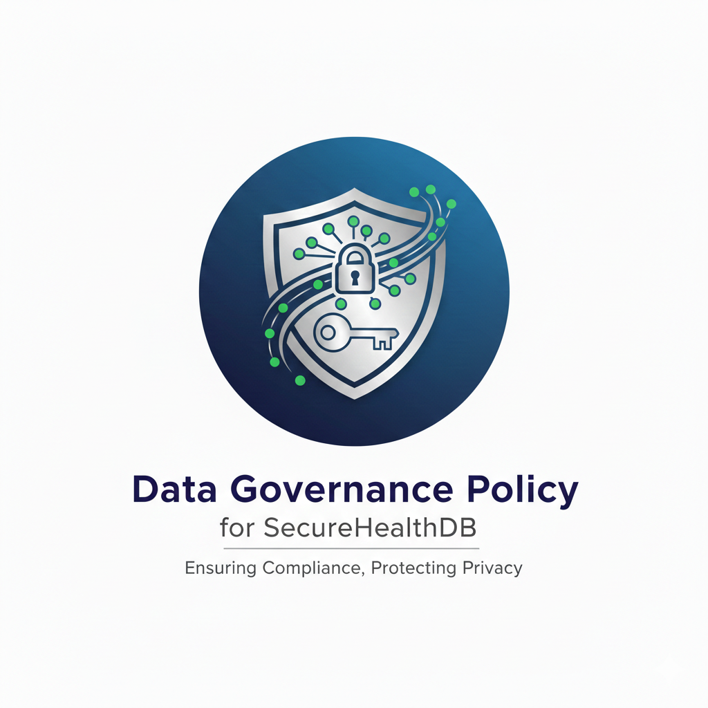
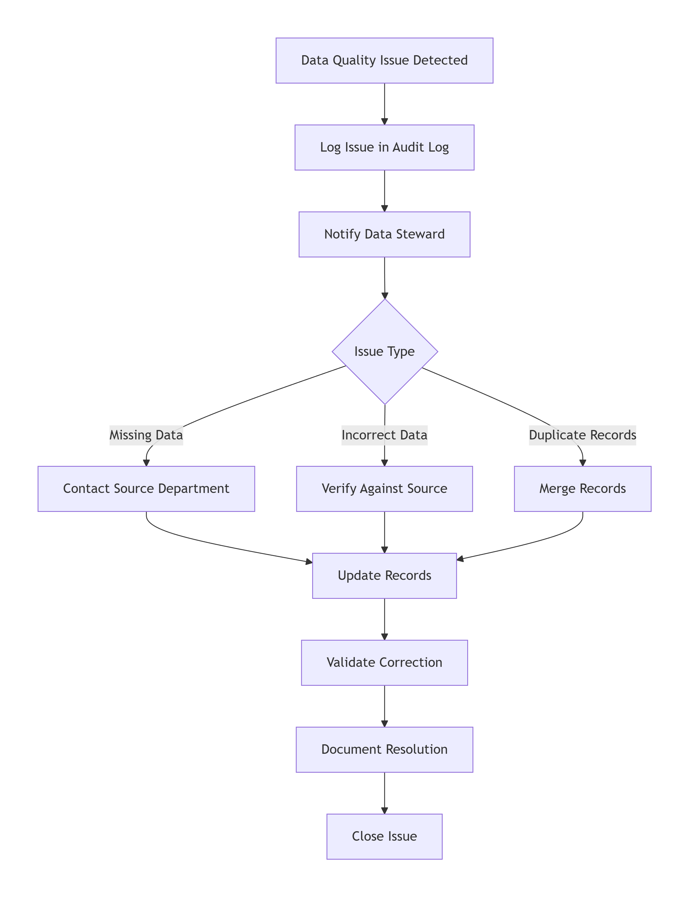
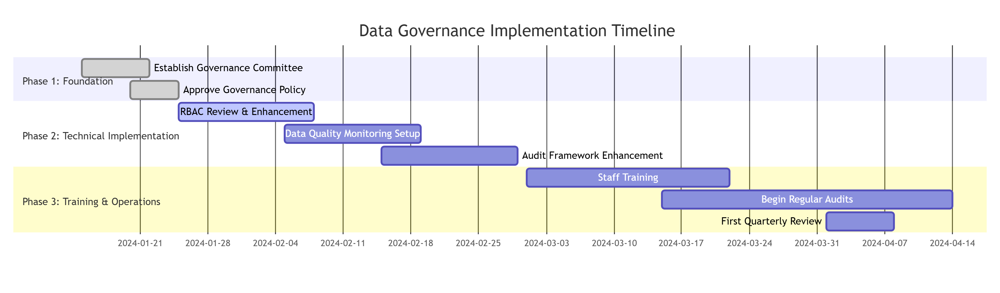

# Data Governance Policy for SecureHealthDB

## Document Control

| Document Property          | Details                                   |
| -------------------------- | ----------------------------------------- |
| **Document Title**   | Data Governance Policy for SecureHealthDB |
| **Version**          | 1.0                                       |
| **Effective Date**   | January 15, 2025                          |
| **Last Reviewed**    | January 15, 2026                          |
| **Next Review Date** | July 15, 2026                             |
| **Owner**            | Chief Data Officer (CDO)                  |
| **Classification**   | Internal - Confidential                   |

---

## 1. Introduction

Data governance is crucial for maintaining the **integrity, security, and accuracy** of hospital data. This document outlines the key principles of data ownership, data quality maintenance, and data access and security to ensure that the data in SecureHealthDB is managed properly and protected.

The SecureHealthDB database contains sensitive patient information, employee records, and role-based access data that must be governed according to healthcare regulations including **HIPAA** (Health Insurance Portability and Accountability Act) and **GDPR** (General Data Protection Regulation).

---

## 2. Core Principles

### 2.1 Data Ownership

Data ownership ensures **accountability** for data accuracy and security. The hospital administration owns all data related to patients, employees, and roles in the system. Ownership ensures that someone is responsible for the proper handling, maintenance, and security of data.

#### Policy Statement

> **"The hospital administration owns all data related to patients, employees, and roles. This includes responsibility for maintaining, securing, and ensuring the accuracy of the data."**

#### Data Ownership Matrix

| Data Domain                   | Data Owner            | Responsibilities                             | Steward                |
| ----------------------------- | --------------------- | -------------------------------------------- | ---------------------- |
| **Patient Data**        | Chief Medical Officer | Ensure clinical accuracy, privacy compliance | Patient Data Steward   |
| **Employee Data**       | HR Director           | Maintain employee records, role assignments  | HR Data Steward        |
| **Access Control Data** | IT Security Manager   | Manage permissions, RBAC implementation      | Security Administrator |
| **Audit Data**          | Compliance Officer    | Ensure audit trail integrity                 | Compliance Steward     |

#### Implementation in SecureHealthDB

```sql
-- Track data ownership in database
ALTER TABLE patients ADD COLUMN data_owner VARCHAR(100);
ALTER TABLE employees ADD COLUMN data_owner VARCHAR(100);

-- Example update to assign ownership
UPDATE patients SET data_owner = 'Chief Medical Officer' WHERE patient_id > 0;
UPDATE employees SET data_owner = 'HR Director' WHERE employee_id > 0;

-- Create ownership tracking view
CREATE VIEW data_ownership_report AS
SELECT 
    'Patients' as data_domain,
    COUNT(*) as record_count,
    data_owner,
    MIN(created_at) as oldest_record,
    MAX(updated_at) as newest_record
FROM patients
GROUP BY data_owner;
```

---

### 2.2 Data Quality Maintenance

Maintaining **high-quality data** is essential for providing effective patient care and operational efficiency. Regular audits, data validation, and updates are critical to ensure data accuracy and completeness.

#### Policy Statement

> **"Data will be reviewed on a monthly basis for accuracy and completeness. Any discrepancies will be flagged and corrected by the responsible department. The process will involve verifying data against verified sources and resolving any inconsistencies."**

#### Data Quality Dimensions

| Dimension              | Description                                   | Target                      | Measurement Method                           |
| ---------------------- | --------------------------------------------- | --------------------------- | -------------------------------------------- |
| **Accuracy**     | Data correctly represents real-world entities | 99.5%                       | Sample verification against source documents |
| **Completeness** | All required fields are populated             | 100% for required fields    | Automated NULL checks                        |
| **Consistency**  | Data follows defined formats and standards    | 98%                         | Format validation rules                      |
| **Timeliness**   | Data is current and up-to-date                | 95% updated within 24 hours | Timestamp analysis                           |
| **Uniqueness**   | No duplicate records                          | 99%                         | Duplicate detection algorithms               |

#### Implementation in SecureHealthDB

```sql
-- Create data quality monitoring procedures

DELIMITER //

-- Procedure to check data quality metrics
CREATE PROCEDURE check_data_quality()
BEGIN
    -- Create temporary table for results
    CREATE TEMPORARY TABLE quality_results (
        check_name VARCHAR(100),
        status VARCHAR(20),
        details TEXT,
        check_time TIMESTAMP DEFAULT NOW()
    );
  
    -- Check 1: Patient records completeness
    INSERT INTO quality_results (check_name, status, details)
    SELECT 
        'Patient Required Fields',
        CASE WHEN COUNT(*) = 0 THEN 'PASS' ELSE 'FAIL' END,
        CONCAT(COUNT(*), ' patients missing required fields')
    FROM patients
    WHERE first_name IS NULL OR last_name IS NULL OR date_of_birth IS NULL;
  
    -- Check 2: Email format validation
    INSERT INTO quality_results (check_name, status, details)
    SELECT 
        'Email Format',
        CASE WHEN COUNT(*) = 0 THEN 'PASS' ELSE 'FAIL' END,
        CONCAT(COUNT(*), ' invalid email formats')
    FROM patients
    WHERE email IS NOT NULL 
    AND email NOT LIKE '%_@__%.__%';
  
    -- Check 3: Duplicate patients
    INSERT INTO quality_results (check_name, status, details)
    SELECT 
        'Duplicate Patients',
        CASE WHEN COUNT(*) = 0 THEN 'PASS' ELSE 'FAIL' END,
        CONCAT(COUNT(*), ' potential duplicate patients')
    FROM (
        SELECT first_name, last_name, date_of_birth, COUNT(*)
        FROM patients
        GROUP BY first_name, last_name, date_of_birth
        HAVING COUNT(*) > 1
    ) as duplicates;
  
    -- Display results
    SELECT * FROM quality_results;
  
    -- Log quality check
    INSERT INTO audit_log (table_name, action, details)
    VALUES ('system', 'DATA_QUALITY_CHECK', 
            CONCAT('Quality check completed. See results.'));
        
    DROP TEMPORARY TABLE quality_results;
END//

-- Schedule monthly quality checks
CREATE EVENT monthly_data_quality_check
ON SCHEDULE EVERY 1 MONTH
STARTS '2024-02-01 09:00:00'
DO
    CALL check_data_quality();

DELIMITER ;

-- Create data validation triggers
CREATE TRIGGER validate_patient_data_before_insert
BEFORE INSERT ON patients
FOR EACH ROW
BEGIN
    -- Validate date of birth (not in future)
    IF NEW.date_of_birth > CURDATE() THEN
        SIGNAL SQLSTATE '45000' 
        SET MESSAGE_TEXT = 'Date of birth cannot be in the future';
    END IF;
  
    -- Validate email format
    IF NEW.email IS NOT NULL AND NEW.email NOT LIKE '%_@__%.__%' THEN
        SIGNAL SQLSTATE '45000' 
        SET MESSAGE_TEXT = 'Invalid email format';
    END IF;
  
    -- Ensure required fields
    IF NEW.first_name IS NULL OR NEW.first_name = '' THEN
        SIGNAL SQLSTATE '45000' 
        SET MESSAGE_TEXT = 'First name is required';
    END IF;
  
    IF NEW.last_name IS NULL OR NEW.last_name = '' THEN
        SIGNAL SQLSTATE '45000' 
        SET MESSAGE_TEXT = 'Last name is required';
    END IF;
END//
```

#### Data Quality Issue Resolution Workflow



---

### 2.3 Data Access and Security

Sensitive data must be protected to ensure the **privacy of patients and staff**. Role-based access control (RBAC) will be implemented to grant access to specific roles while ensuring security measures such as encryption.

#### Policy Statement

> **"Only authorized roles, including Doctors and Admins, will have access to sensitive patient information. All data will be encrypted both in transit and at rest to ensure security. Role-based access controls will be implemented to restrict unauthorized access."**

#### Access Control Matrix

| Data Type            | Sensitivity Level      | Doctor    | Nurse     | Admin     | Auditor   |
| -------------------- | ---------------------- | --------- | --------- | --------- | --------- |
| Patient Demographics | Level 2 (Confidential) | FULL      | FULL      | LIMITED   | VIEW ONLY |
| SSN (Encrypted)      | Level 4 (Restricted)   | FULL      | NO        | NO        | NO        |
| Medical History      | Level 4 (Restricted)   | FULL      | VIEW ONLY | NO        | VIEW ONLY |
| Insurance Info       | Level 3 (Confidential) | FULL      | VIEW ONLY | VIEW ONLY | VIEW ONLY |
| Employee Records     | Level 3 (Confidential) | NO        | NO        | FULL      | VIEW ONLY |
| Audit Logs           | Level 2 (Internal)     | VIEW ONLY | VIEW ONLY | VIEW ONLY | FULL      |

**Legend:**

- **FULL**: Can view, create, update, delete
- **VIEW ONLY**: Can only view (SELECT)
- **LIMITED**: Can view selected fields only
- **NO**: No access

#### Implementation in SecureHealthDB

```sql
-- Review existing RBAC implementation from Part 1

-- 1. Verify role-based views are in place
SHOW FULL TABLES WHERE Table_type = 'VIEW';

-- 2. Verify user privileges
SELECT 
    user,
    host,
    Select_priv,
    Insert_priv,
    Update_priv,
    Delete_priv
FROM mysql.user
WHERE user IN ('doctor_user', 'nurse_user', 'admin_user');

-- 3. Create additional security views as needed

-- Restricted patient view for administrative staff
CREATE OR REPLACE VIEW patient_admin_restricted AS
SELECT 
    patient_id,
    CONCAT(LEFT(first_name, 1), '***') as first_name_initial,
    CONCAT(LEFT(last_name, 1), '***') as last_name_initial,
    '***MASKED***' as ssn,
    '***MASKED***' as medical_history
FROM patients;

-- Grant appropriate access
GRANT SELECT ON securehealth_db.patient_admin_restricted TO 'admin_user'@'localhost';

-- 4. Implement additional security measures

-- Create login attempt tracking
CREATE TABLE login_attempts (
    attempt_id INT PRIMARY KEY AUTO_INCREMENT,
    username VARCHAR(50),
    ip_address VARCHAR(45),
    attempt_time TIMESTAMP,
    success BOOLEAN
);

-- Create procedure to monitor failed logins
DELIMITER //
CREATE PROCEDURE check_failed_logins()
BEGIN
    SELECT 
        username,
        ip_address,
        COUNT(*) as failed_attempts,
        MAX(attempt_time) as last_attempt
    FROM login_attempts
    WHERE success = FALSE
    AND attempt_time > NOW() - INTERVAL 1 HOUR
    GROUP BY username, ip_address
    HAVING COUNT(*) > 5; -- Threshold for brute force detection
END//
DELIMITER ;
```

#### Data Encryption Implementation

```sql
-- Review encryption implementation from Part 1

-- 1. Verify encrypted columns
DESCRIBE patients;

-- 2. Create encryption key management procedure
DELIMITER //
CREATE PROCEDURE rotate_encryption_keys()
BEGIN
    -- In production, this would securely rotate encryption keys
    -- and re-encrypt data with new keys
  
    -- Log key rotation
    INSERT INTO audit_log (table_name, action, details)
    VALUES ('system', 'KEY_ROTATION', 'Encryption keys rotated');
END//

-- 3. Create function to verify encryption
CREATE FUNCTION verify_encryption(patient_id_param INT) 
RETURNS VARCHAR(100)
DETERMINISTIC
BEGIN
    DECLARE result VARCHAR(100);
    DECLARE ssn_binary VARBINARY(255);
  
    SELECT ssn_encrypted INTO ssn_binary
    FROM patients WHERE patient_id = patient_id_param;
  
    IF ssn_binary IS NULL THEN
        SET result = 'No SSN stored';
    ELSEIF LENGTH(ssn_binary) > 0 THEN
        SET result = 'SSN is encrypted';
    ELSE
        SET result = 'Encryption issue detected';
    END IF;
  
    RETURN result;
END//
DELIMITER ;
```

---

## 3. Data Governance Roles and Responsibilities

### 3.1 Governance Committee

| Role                           | Position              | Responsibilities                        |
| ------------------------------ | --------------------- | --------------------------------------- |
| **Executive Sponsor**    | CEO/Hospital Director | Ultimate authority, resource allocation |
| **Data Governance Lead** | Chief Data Officer    | Policy development, committee chair     |
| **Clinical Lead**        | Chief Medical Officer | Clinical data quality oversight         |
| **Security Lead**        | IT Security Manager   | Security controls, access management    |
| **Compliance Lead**      | Compliance Officer    | Regulatory compliance oversight         |
| **Operational Lead**     | Operations Director   | Operational data usage                  |

### 3.2 Data Stewards

| Steward Role                    | Assigned To             | Responsibilities                             |
| ------------------------------- | ----------------------- | -------------------------------------------- |
| **Patient Data Steward**  | Patient Records Manager | Patient data quality, accuracy, completeness |
| **Employee Data Steward** | HR Manager              | Employee records accuracy, role assignments  |
| **Security Steward**      | Security Administrator  | Access control enforcement, audit monitoring |
| **Compliance Steward**    | Privacy Officer         | Regulatory compliance, consent management    |

### 3.3 Data Custodians

| Custodian Role                   | Assigned To       | Technical Responsibilities                 |
| -------------------------------- | ----------------- | ------------------------------------------ |
| **Database Administrator** | Senior DBA        | Database maintenance, backups, performance |
| **Security Administrator** | Security Engineer | User management, encryption key management |
| **System Administrator**   | IT Operations     | Infrastructure security, system updates    |

### 3.4 Data Users

| User Role                | Access Level             | Accountability                  |
| ------------------------ | ------------------------ | ------------------------------- |
| **Doctors**        | Full clinical access     | Protect patient confidentiality |
| **Nurses**         | Limited clinical access  | Follow data handling protocols  |
| **Administrators** | Administrative data only | Maintain data accuracy          |
| **Auditors**       | Read-only access to logs | Verify compliance               |

---

## 4. Data Governance Implementation Timeline



---

## 5. Compliance Mapping

### HIPAA Compliance Mapping

| HIPAA Requirement                   | Governance Policy Section              | Implementation              |
| ----------------------------------- | -------------------------------------- | --------------------------- |
| **Privacy Rule**              | Section 2.3 - Data Access and Security | RBAC, encryption            |
| **Security Rule**             | Section 2.3 - Data Access and Security | Access controls, audit logs |
| **Breach Notification**       | Section 2.3 - Login monitoring         | Failed login tracking       |
| **Administrative Safeguards** | Section 3 - Roles and Responsibilities | Clear ownership             |

### GDPR Compliance Mapping

| GDPR Principle                        | Governance Policy Section    | Implementation              |
| ------------------------------------- | ---------------------------- | --------------------------- |
| **Lawfulness, Fairness**        | Section 2.1 - Data Ownership | Clear accountability        |
| **Purpose Limitation**          | Section 2.3 - Access Control | Role-based restrictions     |
| **Data Minimization**           | Section 2.2 - Data Quality   | Required fields only        |
| **Accuracy**                    | Section 2.2 - Data Quality   | Regular audits              |
| **Storage Limitation**          | Section 2.2 - Retention      | Data retention policy       |
| **Integrity & Confidentiality** | Section 2.3 - Security       | Encryption, RBAC            |
| **Accountability**              | Section 3 - Roles            | Documented responsibilities |

---

## 6. Monitoring and Enforcement

### Regular Reviews

| Review Type                     | Frequency   | Responsible Party    |
| ------------------------------- | ----------- | -------------------- |
| **Data Quality Audit**    | Monthly     | Data Stewards        |
| **Access Control Review** | Quarterly   | Security Lead        |
| **Compliance Audit**      | Quarterly   | Compliance Lead      |
| **Policy Review**         | Bi-annually | Governance Committee |
| **Risk Assessment**       | Annually    | Risk Management Team |

### Enforcement Mechanisms

| Violation Type                      | Consequence                     | Reporting            |
| ----------------------------------- | ------------------------------- | -------------------- |
| **Policy Violation (Minor)**  | Warning, additional training    | HR Record            |
| **Policy Violation (Major)**  | Suspension of access privileges | Governance Committee |
| **Regulatory Non-Compliance** | Formal investigation            | Compliance Officer   |
| **Security Breach**           | Immediate access revocation     | Security Team, Legal |

---

## 7. Conclusion

By implementing these core principles, the hospital ensures that data remains **secure, accurate, and readily available** to those who need it. This governance framework is essential for the ongoing management and protection of hospital data.

The successful implementation of this Data Governance Policy will:

1. **Protect patient privacy** through robust security controls
2. **Ensure regulatory compliance** with HIPAA and GDPR
3. **Maintain data quality** for effective patient care
4. **Establish clear accountability** for data management
5. **Support operational efficiency** through reliable data

---

## 8. Approval

| Role                  | Name              | Signature         | Date  |
| --------------------- | ----------------- | ----------------- | ----- |
| Chief Data Officer    | _________________ | _________________ | _____ |
| Chief Medical Officer | _________________ | _________________ | _____ |
| IT Security Manager   | _________________ | _________________ | _____ |
| Compliance Officer    | _________________ | _________________ | _____ |
| Hospital Director     | _________________ | _________________ | _____ |

---

## Appendix A: Related Documents

| Document                     | Location             |
| ---------------------------- | -------------------- |
| Data Risk Management Policy  | Part 3 Documentation |
| Incident Response Plan       | Part 3 Documentation |
| Employee Training Manual     | HR Documentation     |
| Technical Security Standards | IT Documentation     |

## Appendix B: Glossary

| Term                     | Definition                                                        |
| ------------------------ | ----------------------------------------------------------------- |
| **RBAC**           | Role-Based Access Control - restricting access based on job roles |
| **HIPAA**          | Health Insurance Portability and Accountability Act               |
| **GDPR**           | General Data Protection Regulation                                |
| **Data Steward**   | Person responsible for data quality and governance                |
| **Data Custodian** | Person responsible for technical data management                  |
| **PHI**            | Protected Health Information                                      |

---

*This document is confidential and proprietary to SecureHealth Inc.*
*Version 1.0 - Last Updated: January 15, 2026*
