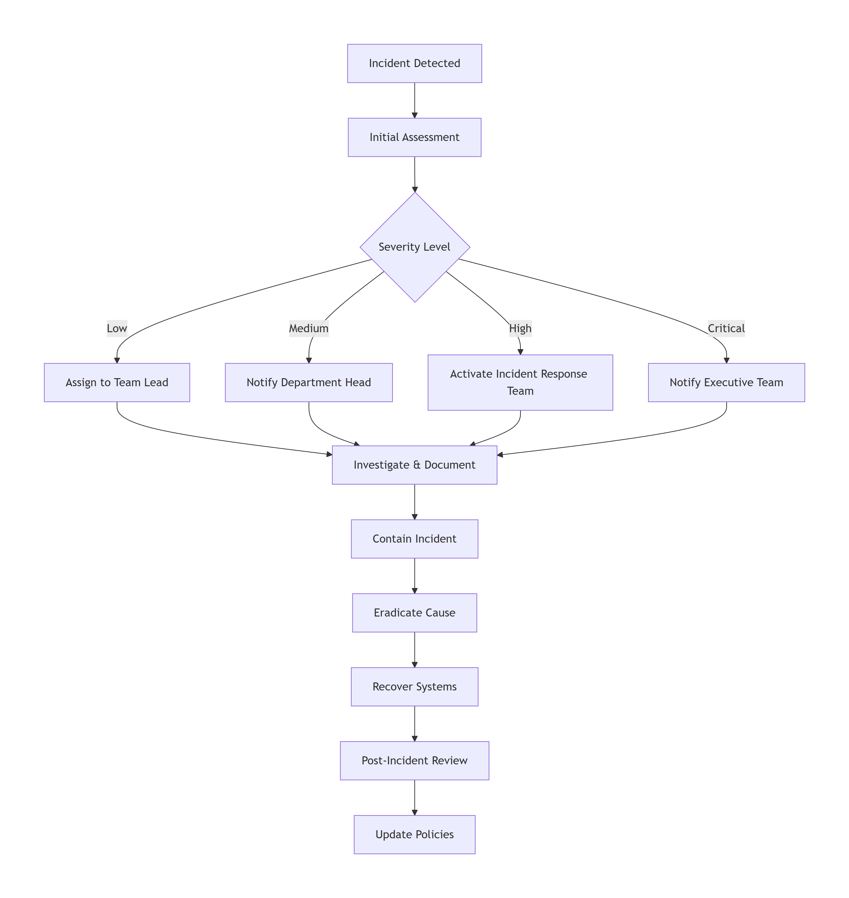

# Data Risk Management Document for SecureHealthDB

## Document Control

| Document Property          | Details                                          |
| -------------------------- | ------------------------------------------------ |
| **Document Title**   | Data Risk Management Strategy for SecureHealthDB |
| **Version**          | 1.0                                              |
| **Effective Date**   | January 15, 2025                                 |
| **Last Reviewed**    | January 15, 2026                                 |
| **Next Review Date** | April 15, 2026                                   |
| **Owner**            | Chief Risk Officer                               |
| **Classification**   | Confidential                                     |

---

## 1. Introduction

This document outlines the risks associated with the management of sensitive health data and the strategies for mitigating these risks. The objective is to ensure the **security, availability, and integrity** of the hospital's data systems.

SecureHealthDB contains Protected Health Information (PHI) that is subject to strict regulatory requirements under **HIPAA** and **GDPR**. Effective risk management is essential to protect patient privacy, maintain regulatory compliance, and ensure continuity of care.

### Risk Management Framework

## 2. Comprehensive Risk Assessment Matrix

| Risk ID         | Risk Category              | Risk Description                                                                   | Likelihood | Impact | Risk Level       | Regulatory Impact                   |
| --------------- | -------------------------- | ---------------------------------------------------------------------------------- | ---------- | ------ | ---------------- | ----------------------------------- |
| **R-001** | Unauthorized Access        | Employees or unauthorized individuals gain access to sensitive patient information | Medium     | Severe | **HIGH**   | HIPAA Privacy Rule violation        |
| **R-002** | Data Loss/Corruption       | Data lost or corrupted due to hardware failure or human error                      | Medium     | High   | **HIGH**   | Business continuity, patient safety |
| **R-003** | Data Breach                | Unauthorized external parties gain access to sensitive data                        | Medium     | Severe | **HIGH**   | HIPAA Breach Notification Rule      |
| **R-004** | Data Inaccuracy            | Incorrect or outdated data leads to improper treatment or decisions                | Low        | Severe | **HIGH**   | Patient safety, malpractice risk    |
| **R-005** | Insider Threat             | Malicious or negligent employee misuse of data access                              | Low        | Severe | **HIGH**   | HIPAA, GDPR violations              |
| **R-006** | Ransomware                 | Malware encrypts critical data, demanding payment                                  | Medium     | Severe | **HIGH**   | Business interruption               |
| **R-007** | System Failure             | Database/server downtime affecting patient care                                    | Medium     | High   | **MEDIUM** | Patient care disruption             |
| **R-008** | Inadequate Access Controls | Excessive permissions granted to users                                             | Medium     | High   | **MEDIUM** | HIPAA Security Rule                 |
| **R-009** | Audit Trail Gaps           | Incomplete logging of data access                                                  | Low        | Medium | **LOW**    | Compliance investigation issues     |
| **R-010** | Third-Party Risk           | Vendor data handling vulnerabilities                                               | Medium     | Medium | **MEDIUM** | Supply chain risk                   |

---

## 3. Detailed Risk Analysis and Mitigation Strategies

### 3.1 Risk R-001: Unauthorized Access to Sensitive Data

**Risk Description:** Employees or unauthorized individuals may gain access to sensitive patient information.

#### Technical Mitigation Strategies

| Strategy                                    | Implementation                                        | Verification Method    |
| ------------------------------------------- | ----------------------------------------------------- | ---------------------- |
| **Role-Based Access Control (RBAC)**  | Restrict access based on job functions                | Regular access reviews |
| **Multi-Factor Authentication (MFA)** | Require additional verification for sensitive systems | MFA logs               |
| **Encryption (At Rest)**              | AES-256 encryption for all sensitive fields           | Column verification    |
| **Encryption (In Transit)**           | TLS/SSL for all database connections                  | Connection audit       |
| **Principle of Least Privilege**      | Grant minimum necessary access                        | Permission audits      |

#### SQL Implementation

```sql
-- Implement comprehensive RBAC verification

DELIMITER //

-- Procedure to audit current access permissions
CREATE PROCEDURE audit_access_permissions()
BEGIN
    -- Check users with elevated privileges
    SELECT 'Users with SELECT on patients' as audit_item,
           user,
           host
    FROM mysql.tables_priv
    WHERE db = 'securehealth_db'
    AND table_name = 'patients'
    AND table_priv LIKE '%Select%';
  
    -- Check for users without MFA (in production, this would check MFA settings)
    SELECT 'Users without MFA configured' as audit_item,
           user,
           host
    FROM mysql.user
    WHERE user IN ('doctor_user', 'nurse_user', 'admin_user')
    AND plugin = 'mysql_native_password'; -- Basic auth only
  
    -- Review current role assignments
    SELECT 'Current role assignments' as audit_item,
           e.first_name,
           e.last_name,
           r.role_name
    FROM employees e
    JOIN employee_roles er ON e.employee_id = er.employee_id
    JOIN roles r ON er.role_id = r.role_id;
END//

-- Function to verify encryption for sensitive fields
CREATE PROCEDURE verify_field_encryption()
BEGIN
    SELECT 
        'SSN Field' as field_name,
        CASE 
            WHEN COUNT(*) > 0 AND 
                 SUM(CASE WHEN ssn_encrypted IS NOT NULL THEN 1 ELSE 0 END) = COUNT(*)
            THEN 'All records encrypted'
            ELSE CONCAT('Warning: ', 
                       COUNT(*) - SUM(CASE WHEN ssn_encrypted IS NOT NULL THEN 1 ELSE 0 END),
                       ' records missing encryption')
        END as encryption_status
    FROM patients
    UNION ALL
    SELECT 
        'Medical History Field' as field_name,
        CASE 
            WHEN COUNT(*) > 0 AND 
                 SUM(CASE WHEN medical_history_encrypted IS NOT NULL THEN 1 ELSE 0 END) = COUNT(*)
            THEN 'All records encrypted'
            ELSE CONCAT('Warning: ', 
                       COUNT(*) - SUM(CASE WHEN medical_history_encrypted IS NOT NULL THEN 1 ELSE 0 END),
                       ' records missing encryption')
        END as encryption_status
    FROM patients;
END//

DELIMITER ;
```

#### Administrative Mitigation Strategies

| Strategy                       | Description                                   | Frequency   |
| ------------------------------ | --------------------------------------------- | ----------- |
| **Access Reviews**       | Review user access permissions                | Monthly     |
| **Security Training**    | Train employees on access policies            | Quarterly   |
| **Background Checks**    | Verify employee backgrounds                   | Upon hiring |
| **Separation of Duties** | Ensure no single person has excessive control | Ongoing     |

### 3.2 Risk R-002: Data Loss or Corruption

**Risk Description:** Data could be lost or corrupted due to hardware failure or human error.

#### Technical Mitigation Strategies

| Strategy                    | Implementation                                     | Recovery Objective |
| --------------------------- | -------------------------------------------------- | ------------------ |
| **Regular Backups**   | Daily full backups, hourly incremental             | RPO: 1 hour        |
| **Off-Site Storage**  | Backups stored in geographically separate location | RTO: 4 hours       |
| **Backup Encryption** | Encrypt all backup data                            | AES-256            |
| **Backup Testing**    | Regular restoration tests                          | Monthly            |
| **Transaction Logs**  | Enable binary logging for point-in-time recovery   | Continuous         |

#### SQL Implementation

```sql
-- Comprehensive backup and recovery strategy

-- 1. Create backup tracking table
CREATE TABLE backup_history (
    backup_id INT PRIMARY KEY AUTO_INCREMENT,
    backup_type VARCHAR(20),
    backup_start TIMESTAMP,
    backup_end TIMESTAMP,
    backup_size BIGINT,
    backup_location VARCHAR(255),
    checksum VARCHAR(64),
    status VARCHAR(20),
    verified BOOLEAN DEFAULT FALSE
);

-- 2. Create backup procedure (called by external scheduler)
DELIMITER //

CREATE PROCEDURE perform_backup(IN backup_type_param VARCHAR(20))
BEGIN
    DECLARE v_backup_id INT;
    DECLARE v_backup_path VARCHAR(255);
  
    -- Record backup start
    INSERT INTO backup_history (backup_type, backup_start, status)
    VALUES (backup_type_param, NOW(), 'STARTED');
  
    SET v_backup_id = LAST_INSERT_ID();
    SET v_backup_path = CONCAT('/backups/securehealth_', 
                               DATE_FORMAT(NOW(), '%Y%m%d_%H%i%s'), 
                               '.sql');
  
    -- In production, this would execute mysqldump
    -- For documentation, we record the backup
    UPDATE backup_history 
    SET backup_end = NOW(),
        backup_location = v_backup_path,
        status = 'COMPLETED'
    WHERE backup_id = v_backup_id;
  
    -- Log backup activity
    INSERT INTO audit_log (table_name, action, details)
    VALUES ('system', 'BACKUP', 
            CONCAT(backup_type_param, ' backup completed: ', v_backup_path));
END//

-- 3. Create backup verification procedure
CREATE PROCEDURE verify_backup(IN backup_id_param INT)
BEGIN
    DECLARE v_backup_location VARCHAR(255);
    DECLARE v_checksum VARCHAR(64);
  
    SELECT backup_location INTO v_backup_location
    FROM backup_history
    WHERE backup_id = backup_id_param;
  
    -- In production, this would verify backup integrity
    -- For documentation, we mark as verified
    UPDATE backup_history 
    SET verified = TRUE,
        checksum = SHA2(v_backup_location, 256)
    WHERE backup_id = backup_id_param;
  
    -- Log verification
    INSERT INTO audit_log (table_name, action, details)
    VALUES ('system', 'BACKUP_VERIFICATION', 
            CONCAT('Backup ', backup_id_param, ' verified'));
END//

-- 4. Create point-in-time recovery simulation
CREATE PROCEDURE simulate_recovery(IN recovery_time TIMESTAMP)
BEGIN
    -- This would implement point-in-time recovery using binary logs
    -- For documentation, we log the simulation
  
    INSERT INTO audit_log (table_name, action, details)
    VALUES ('system', 'RECOVERY_SIMULATION', 
            CONCAT('Point-in-time recovery simulated for ', recovery_time));
END//

DELIMITER ;

-- 5. Enable binary logging for point-in-time recovery
-- In my.cnf:
-- server-id = 1
-- log_bin = /var/log/mysql/mysql-bin.log
-- binlog_format = ROW
-- expire_logs_days = 7
-- max_binlog_size = 100M
```

#### Backup Schedule

| Backup Type            | Frequency       | Retention | Storage Location    |
| ---------------------- | --------------- | --------- | ------------------- |
| **Full Backup**  | Daily at 2 AM   | 30 days   | Primary data center |
| **Incremental**  | Hourly          | 7 days    | Primary data center |
| **Weekly Full**  | Weekly (Sunday) | 3 months  | Off-site location   |
| **Monthly Full** | Monthly         | 1 year    | Archived storage    |

### 3.3 Risk R-003: Data Breaches

**Risk Description:** Unauthorized external parties may gain access to sensitive data.

#### Technical Mitigation Strategies

| Strategy                                     | Implementation               | Monitoring            |
| -------------------------------------------- | ---------------------------- | --------------------- |
| **Firewalls**                          | Network-level protection     | Continuous monitoring |
| **Intrusion Detection Systems (IDS)**  | Detect suspicious activity   | Real-time alerts      |
| **Intrusion Prevention Systems (IPS)** | Block detected threats       | Automated response    |
| **Database Activity Monitoring**       | Track all database access    | Audit logs            |
| **Vulnerability Scanning**             | Regular security assessments | Weekly scans          |
| **Penetration Testing**                | Simulated attacks            | Quarterly             |

#### SQL Implementation

```sql
-- Implement breach detection and prevention

-- 1. Create intrusion detection table
CREATE TABLE intrusion_alerts (
    alert_id INT PRIMARY KEY AUTO_INCREMENT,
    alert_time TIMESTAMP DEFAULT CURRENT_TIMESTAMP,
    source_ip VARCHAR(45),
    alert_type VARCHAR(50),
    severity VARCHAR(20),
    description TEXT,
    resolved BOOLEAN DEFAULT FALSE,
    resolved_by INT,
    resolution_time TIMESTAMP,
    FOREIGN KEY (resolved_by) REFERENCES employees(employee_id)
);

-- 2. Create procedure to detect suspicious activity
DELIMITER //

CREATE PROCEDURE detect_suspicious_activity()
BEGIN
    -- Detect multiple failed login attempts
    INSERT INTO intrusion_alerts (source_ip, alert_type, severity, description)
    SELECT 
        ip_address,
        'BRUTE_FORCE_ATTEMPT',
        'HIGH',
        CONCAT(COUNT(*), ' failed login attempts in last 15 minutes')
    FROM login_attempts
    WHERE success = FALSE
    AND attempt_time > NOW() - INTERVAL 15 MINUTE
    GROUP BY ip_address
    HAVING COUNT(*) > 10;
  
    -- Detect unusual access patterns (after hours)
    INSERT INTO intrusion_alerts (source_ip, alert_type, severity, description)
    SELECT 
        'INTERNAL',
        'AFTER_HOURS_ACCESS',
        'MEDIUM',
        CONCAT(e.first_name, ' ', e.last_name, ' accessed system at ', 
               DATE_FORMAT(NOW(), '%H:%i'))
    FROM audit_log a
    JOIN employees e ON a.employee_id = e.employee_id
    WHERE HOUR(a.access_time) NOT BETWEEN 6 AND 20
    AND a.access_time > NOW() - INTERVAL 1 HOUR
    GROUP BY a.employee_id;
  
    -- Detect bulk data extraction
    INSERT INTO intrusion_alerts (source_ip, alert_type, severity, description)
    SELECT 
        'INTERNAL',
        'BULK_DATA_ACCESS',
        'HIGH',
        CONCAT('Employee ', employee_id, ' accessed ', COUNT(*), ' records')
    FROM audit_log
    WHERE access_time > NOW() - INTERVAL 1 HOUR
    AND table_name = 'patients'
    AND action = 'VIEW'
    GROUP BY employee_id
    HAVING COUNT(*) > 100;
END//

-- 3. Create alert response procedure
CREATE PROCEDURE respond_to_intrusion(IN alert_id_param INT)
BEGIN
    DECLARE v_alert_type VARCHAR(50);
    DECLARE v_source_ip VARCHAR(45);
  
    SELECT alert_type, source_ip INTO v_alert_type, v_source_ip
    FROM intrusion_alerts
    WHERE alert_id = alert_id_param;
  
    -- Automated response based on alert type
    CASE v_alert_type
        WHEN 'BRUTE_FORCE_ATTEMPT' THEN
            -- Block IP address temporarily
            -- In production, this would update firewall rules
            INSERT INTO audit_log (table_name, action, details)
            VALUES ('security', 'IP_BLOCKED', 
                    CONCAT('Blocked IP ', v_source_ip, ' for 1 hour'));
    
        WHEN 'BULK_DATA_ACCESS' THEN
            -- Notify security team
            INSERT INTO audit_log (table_name, action, details)
            VALUES ('security', 'SECURITY_ALERT', 
                    CONCAT('Bulk data access detected from ', v_source_ip));
    END CASE;
  
    -- Mark alert as resolved
    UPDATE intrusion_alerts 
    SET resolved = TRUE,
        resolved_by = @current_employee_id,
        resolution_time = NOW()
    WHERE alert_id = alert_id_param;
END//

DELIMITER ;

-- Schedule intrusion detection to run every 15 minutes
CREATE EVENT intrusion_detection_event
ON SCHEDULE EVERY 15 MINUTE
DO
    CALL detect_suspicious_activity();
```

### 3.4 Risk R-004: Data Inaccuracy or Outdated Data

**Risk Description:** Incorrect or outdated data can lead to improper treatment or decisions.

#### Technical Mitigation Strategies

| Strategy                        | Implementation                  | Verification         |
| ------------------------------- | ------------------------------- | -------------------- |
| **Data Validation Rules** | Check data at entry             | Real-time validation |
| **Regular Data Audits**   | Review data accuracy            | Monthly              |
| **Automated Flagging**    | Flag potential discrepancies    | Continuous           |
| **Data Freshness Checks** | Ensure timely updates           | Daily                |
| **Source Verification**   | Verify against original sources | Per encounter        |

#### SQL Implementation

```sql
-- Implement data quality monitoring

-- 1. Create data quality metrics table
CREATE TABLE data_quality_metrics (
    metric_id INT PRIMARY KEY AUTO_INCREMENT,
    check_date DATE,
    table_name VARCHAR(50),
    metric_name VARCHAR(100),
    metric_value DECIMAL(5,2),
    details TEXT
);

-- 2. Create comprehensive data quality procedure
DELIMITER //

CREATE PROCEDURE perform_data_quality_check()
BEGIN
    DECLARE v_total_patients INT;
    DECLARE v_complete_records INT;
    DECLARE v_recent_updates INT;
  
    -- Get total patients
    SELECT COUNT(*) INTO v_total_patients FROM patients;
  
    -- Check completeness
    SELECT COUNT(*) INTO v_complete_records
    FROM patients
    WHERE first_name IS NOT NULL 
      AND last_name IS NOT NULL
      AND date_of_birth IS NOT NULL
      AND email IS NOT NULL
      AND phone IS NOT NULL;
  
    -- Record completeness metric
    INSERT INTO data_quality_metrics 
    VALUES (NULL, CURDATE(), 'patients', 'Completeness',
            (v_complete_records / v_total_patients) * 100,
            CONCAT(v_complete_records, ' of ', v_total_patients, ' records complete'));
  
    -- Check data freshness (updated in last 30 days)
    SELECT COUNT(*) INTO v_recent_updates
    FROM patients
    WHERE updated_at > NOW() - INTERVAL 30 DAY;
  
    INSERT INTO data_quality_metrics 
    VALUES (NULL, CURDATE(), 'patients', 'Freshness',
            (v_recent_updates / v_total_patients) * 100,
            CONCAT(v_recent_updates, ' of ', v_total_patients, ' records updated in last 30 days'));
  
    -- Check for potential duplicates
    INSERT INTO data_quality_metrics 
    SELECT 
        NULL,
        CURDATE(),
        'patients',
        'Duplicate Detection',
        (COUNT(*) * 100.0 / v_total_patients),
        CONCAT(COUNT(*), ' potential duplicate records found')
    FROM (
        SELECT first_name, last_name, date_of_birth, COUNT(*)
        FROM patients
        GROUP BY first_name, last_name, date_of_birth
        HAVING COUNT(*) > 1
    ) as duplicates;
  
    -- Flag records needing review
    CREATE TEMPORARY TABLE records_needing_review AS
    SELECT 
        patient_id,
        first_name,
        last_name,
        'Missing contact information' as reason
    FROM patients
    WHERE email IS NULL OR phone IS NULL
  
    UNION ALL
  
    SELECT 
        patient_id,
        first_name,
        last_name,
        'No recent activity' as reason
    FROM patients
    WHERE updated_at < NOW() - INTERVAL 2 YEAR;
  
    -- Log data quality check
    INSERT INTO audit_log (table_name, action, details)
    VALUES ('system', 'DATA_QUALITY_CHECK', 
            CONCAT('Data quality check completed at ', NOW()));
END//

-- 3. Create trigger to validate data on insert/update
CREATE TRIGGER validate_patient_data
BEFORE INSERT ON patients
FOR EACH ROW
BEGIN
    -- Validate date of birth
    IF NEW.date_of_birth > CURDATE() THEN
        SIGNAL SQLSTATE '45000' 
        SET MESSAGE_TEXT = 'Date of birth cannot be in the future';
    END IF;
  
    -- Validate email format
    IF NEW.email IS NOT NULL AND NEW.email NOT LIKE '%_@__%.__%' THEN
        SIGNAL SQLSTATE '45000' 
        SET MESSAGE_TEXT = 'Invalid email format';
    END IF;
  
    -- Validate phone number format (simple check)
    IF NEW.phone IS NOT NULL AND NEW.phone NOT REGEXP '^[0-9]{3}-[0-9]{3}-[0-9]{4}$' THEN
        SIGNAL SQLSTATE '45000' 
        SET MESSAGE_TEXT = 'Phone must be in format XXX-XXX-XXXX';
    END IF;
  
    -- Set updated_at timestamp
    SET NEW.updated_at = NOW();
END//

-- 4. Create procedure to flag and correct discrepancies
CREATE PROCEDURE flag_data_discrepancies()
BEGIN
    -- Create temporary table for flagged records
    CREATE TEMPORARY TABLE flagged_records AS
    SELECT 
        patient_id,
        first_name,
        last_name,
        'Email format issue' as issue,
        email as current_value
    FROM patients
    WHERE email IS NOT NULL AND email NOT LIKE '%_@__%.__%'
  
    UNION ALL
  
    SELECT 
        patient_id,
        first_name,
        last_name,
        'Phone format issue' as issue,
        phone as current_value
    FROM patients
    WHERE phone IS NOT NULL AND phone NOT REGEXP '^[0-9]{3}-[0-9]{3}-[0-9]{4}$';
  
    -- Insert into data issues table
    INSERT INTO data_issues (reported_by, issue_type, description, severity, status)
    SELECT 
        1, -- System user
        'DATA_VALIDATION',
        CONCAT('Patient ', patient_id, ': ', issue, ' - Current: ', current_value),
        'MEDIUM',
        'FLAGGED'
    FROM flagged_records;
  
    DROP TEMPORARY TABLE flagged_records;
END//

DELIMITER ;

-- Schedule weekly data quality checks
CREATE EVENT weekly_data_quality
ON SCHEDULE EVERY 1 WEEK
STARTS '2024-01-21 03:00:00'
DO
    CALL perform_data_quality_check();
```

### 3.5 Risk R-005: Insider Threat

**Risk Description:** Malicious or negligent employee misuse of data access.

#### Technical Mitigation Strategies

| Strategy                               | Implementation                         | Monitoring        |
| -------------------------------------- | -------------------------------------- | ----------------- |
| **Principle of Least Privilege** | Minimal necessary access               | Quarterly reviews |
| **Separation of Duties**         | No single person has excessive control | Role design       |
| **Behavioral Analytics**         | Detect unusual access patterns         | Continuous        |
| **Data Loss Prevention (DLP)**   | Prevent unauthorized data export       | Real-time         |
| **Audit Trails**                 | Comprehensive logging                  | Immutable logs    |

#### SQL Implementation

```sql
-- Implement insider threat detection

-- 1. Create user behavior analytics table
CREATE TABLE user_behavior_analytics (
    analytics_id INT PRIMARY KEY AUTO_INCREMENT,
    employee_id INT,
    analysis_date DATE,
    normal_access_pattern TEXT,
    anomalies_detected TEXT,
    risk_score DECIMAL(3,2),
    FOREIGN KEY (employee_id) REFERENCES employees(employee_id)
);

-- 2. Create procedure to analyze user behavior
DELIMITER //

CREATE PROCEDURE analyze_user_behavior()
BEGIN
    DECLARE done INT DEFAULT FALSE;
    DECLARE v_employee_id INT;
    DECLARE v_avg_access INT;
    DECLARE v_today_access INT;
    DECLARE v_anomalies TEXT DEFAULT '';
  
    -- Cursor for employees
    DECLARE emp_cursor CURSOR FOR 
        SELECT employee_id FROM employees;
    DECLARE CONTINUE HANDLER FOR NOT FOUND SET done = TRUE;
  
    OPEN emp_cursor;
  
    read_loop: LOOP
        FETCH emp_cursor INTO v_employee_id;
        IF done THEN
            LEAVE read_loop;
        END IF;
    
        -- Calculate average daily access (last 30 days)
        SELECT AVG(daily_count) INTO v_avg_access
        FROM (
            SELECT DATE(access_time) as access_date, COUNT(*) as daily_count
            FROM audit_log
            WHERE employee_id = v_employee_id
            AND access_time > NOW() - INTERVAL 30 DAY
            GROUP BY DATE(access_time)
        ) as daily_stats;
    
        -- Calculate today's access count
        SELECT COUNT(*) INTO v_today_access
        FROM audit_log
        WHERE employee_id = v_employee_id
        AND DATE(access_time) = CURDATE();
    
        -- Check for anomalies
        SET v_anomalies = '';
    
        IF v_today_access > v_avg_access * 3 THEN
            SET v_anomalies = CONCAT(v_anomalies, 'Unusual access volume; ');
        END IF;
    
        -- Check for after-hours access
        IF EXISTS (
            SELECT 1 FROM audit_log
            WHERE employee_id = v_employee_id
            AND DATE(access_time) = CURDATE()
            AND HOUR(access_time) NOT BETWEEN 6 AND 20
        ) THEN
            SET v_anomalies = CONCAT(v_anomalies, 'After-hours access; ');
        END IF;
    
        -- Check for access to sensitive tables not normally accessed
        IF EXISTS (
            SELECT 1 FROM audit_log
            WHERE employee_id = v_employee_id
            AND DATE(access_time) = CURDATE()
            AND table_name = 'patients'
            AND employee_id NOT IN (
                SELECT employee_id FROM employee_roles WHERE role_id = 1 -- Doctor role
            )
        ) THEN
            SET v_anomalies = CONCAT(v_anomalies, 'Unauthorized table access; ');
        END IF;
    
        -- Calculate risk score
        INSERT INTO user_behavior_analytics 
        VALUES (
            NULL,
            v_employee_id,
            CURDATE(),
            CONCAT('Average daily: ', v_avg_access),
            v_anomalies,
            CASE 
                WHEN v_anomalies != '' THEN 
                    (LENGTH(v_anomalies) - LENGTH(REPLACE(v_anomalies, ';', ''))) * 0.33
                ELSE 0
            END
        );
    
        -- Alert on high risk
        IF (LENGTH(v_anomalies) - LENGTH(REPLACE(v_anomalies, ';', ''))) >= 2 THEN
            INSERT INTO intrusion_alerts (source_ip, alert_type, severity, description)
            VALUES ('INTERNAL', 'INSIDER_THREAT', 'HIGH',
                    CONCAT('Employee ', v_employee_id, ' shows multiple anomalies: ', v_anomalies));
        END IF;
    
    END LOOP;
  
    CLOSE emp_cursor;
END//

DELIMITER ;
```

### 3.6 Risk R-006: Ransomware

**Risk Description:** Malware encrypts critical data, demanding payment.

#### Technical Mitigation Strategies

| Strategy                       | Implementation               | Verification           |
| ------------------------------ | ---------------------------- | ---------------------- |
| **Offline Backups**      | Air-gapped backup storage    | Regular testing        |
| **Immutable Backups**    | Write-once-read-many storage | Quarterly verification |
| **Endpoint Protection**  | Anti-malware on all systems  | Daily updates          |
| **Network Segmentation** | Isolate critical systems     | Continuous monitoring  |
| **User Training**        | Phishing awareness           | Quarterly training     |

#### SQL Implementation

```sql
-- Implement ransomware protection

-- 1. Create read-only snapshot capability
CREATE USER 'snapshot_user'@'localhost' IDENTIFIED BY 'SnapshotPass123!';
GRANT SELECT ON securehealth_db.* TO 'snapshot_user'@'localhost';

-- 2. Create file integrity monitoring
CREATE TABLE file_integrity (
    integrity_id INT PRIMARY KEY AUTO_INCREMENT,
    file_path VARCHAR(255),
    expected_checksum VARCHAR(64),
    last_verified TIMESTAMP,
    status VARCHAR(20)
);

-- 3. Create ransomware detection procedure
DELIMITER //

CREATE PROCEDURE detect_ransomware_activity()
BEGIN
    -- Detect rapid file modifications
    INSERT INTO intrusion_alerts (source_ip, alert_type, severity, description)
    SELECT 
        'INTERNAL',
        'RAPID_MODIFICATION',
        'HIGH',
        CONCAT('Rapid modifications detected on ', COUNT(*), ' records')
    FROM audit_log
    WHERE action IN ('UPDATE', 'DELETE')
    AND access_time > NOW() - INTERVAL 5 MINUTE
    GROUP BY employee_id
    HAVING COUNT(*) > 50;
  
    -- Detect encryption patterns (files being renamed with suspicious extensions)
    -- In production, this would integrate with file system monitoring
  
    -- Check for backup deletion attempts
    INSERT INTO intrusion_alerts (source_ip, alert_type, severity, description)
    SELECT 
        'INTERNAL',
        'BACKUP_DELETION_ATTEMPT',
        'CRITICAL',
        'Attempt to delete backups detected'
    FROM audit_log
    WHERE action = 'DELETE'
    AND table_name = 'backup_history'
    AND access_time > NOW() - INTERVAL 1 HOUR;
END//

DELIMITER ;
```

---

## 4. Risk Response Procedures

### 4.1 Incident Response Levels

| Level                       | Description                       | Response Time   | Escalation             |
| --------------------------- | --------------------------------- | --------------- | ---------------------- |
| **Level 1: Low**      | Minor issue, no data exposure     | Within 24 hours | Team lead              |
| **Level 2: Medium**   | Potential data exposure           | Within 4 hours  | Department head        |
| **Level 3: High**     | Confirmed breach or data loss     | Within 1 hour   | Executive team         |
| **Level 4: Critical** | Major breach, patient safety risk | Immediate       | CEO, legal, regulators |

### 4.2 Incident Response Workflow



### 4.3 Incident Response Team

| Role                          | Responsibility                   | Contact          |
| ----------------------------- | -------------------------------- | ---------------- |
| **Incident Commander**  | Overall coordination             | On-call rotation |
| **Technical Lead**      | Technical investigation          | IT Security      |
| **Legal Counsel**       | Regulatory compliance            | Legal department |
| **Communications Lead** | Internal/external communications | PR department    |
| **HR Representative**   | Personnel issues                 | HR department    |

---

## 5. Risk Monitoring and Review

### 5.1 Regular Monitoring Activities

| Activity                         | Frequency | Responsible Party   |
| -------------------------------- | --------- | ------------------- |
| **Access Log Review**      | Daily     | Security Team       |
| **Intrusion Alert Review** | Real-time | Security Operations |
| **Backup Verification**    | Weekly    | Database Admin      |
| **Data Quality Checks**    | Weekly    | Data Steward        |
| **User Behavior Analysis** | Daily     | Security Analyst    |
| **Vulnerability Scanning** | Weekly    | Security Team       |

### 5.2 Periodic Reviews

| Review Type                      | Frequency     | Deliverable         |
| -------------------------------- | ------------- | ------------------- |
| **Risk Assessment Update** | Quarterly     | Updated risk matrix |
| **Penetration Testing**    | Quarterly     | Test report         |
| **Compliance Audit**       | Quarterly     | Audit findings      |
| **Policy Review**          | Semi-annually | Policy updates      |
| **Disaster Recovery Test** | Annually      | Test results        |

---

## 6. Key Risk Indicators (KRIs)

| KRI                                    | Target         | Warning Threshold | Critical Threshold |
| -------------------------------------- | -------------- | ----------------- | ------------------ |
| **Unauthorized Access Attempts** | 0 per day      | >5 per day        | >20 per day        |
| **Failed Logins**                | <10 per day    | >50 per day       | >100 per day       |
| **Data Quality Issues**          | <1% of records | >2% of records    | >5% of records     |
| **Backup Failures**              | 0 per week     | 1 per week        | 2 per week         |
| **Security Incidents**           | 0 per month    | 1 per month       | 2 per month        |
| **Access Review Completion**     | 100%           | <95%              | <90%               |

---

## 7. Conclusion

By identifying potential risks and implementing the recommended mitigation strategies, SecureHealthDB aims to **minimize risks** and ensure the **security and integrity** of its data.

### Summary of Key Controls

| Risk Area                     | Primary Control   | Secondary Control       |
| ----------------------------- | ----------------- | ----------------------- |
| **Unauthorized Access** | RBAC + Encryption | MFA + Auditing          |
| **Data Loss**           | Regular Backups   | Off-site Storage        |
| **Data Breach**         | Firewalls + IDS   | Encryption + Monitoring |
| **Data Inaccuracy**     | Validation Rules  | Regular Audits          |
| **Insider Threat**      | Least Privilege   | Behavior Analytics      |
| **Ransomware**          | Offline Backups   | User Training           |

### Continuous Improvement

The risk management strategy will be reviewed and updated:

- **Quarterly**: Risk assessment and control effectiveness
- **After incidents**: Lessons learned and process improvements
- **Annually**: Comprehensive review and strategy update

---

## 8. Approval

| Role                  | Name              | Signature         | Date  |
| --------------------- | ----------------- | ----------------- | ----- |
| Chief Risk Officer    | _________________ | _________________ | _____ |
| IT Security Manager   | _________________ | _________________ | _____ |
| Compliance Officer    | _________________ | _________________ | _____ |
| Chief Medical Officer | _________________ | _________________ | _____ |
| Hospital Director     | _________________ | _________________ | _____ |

---

## Appendix A: Risk Register

| Risk ID | Risk Description    | Owner            | Mitigation Status     | Review Date |
| ------- | ------------------- | ---------------- | --------------------- | ----------- |
| R-001   | Unauthorized Access | Security Manager | Implemented           | 2024-01-15  |
| R-002   | Data Loss           | DBA              | Implemented           | 2024-01-15  |
| R-003   | Data Breach         | Security Manager | Implemented           | 2024-01-15  |
| R-004   | Data Inaccuracy     | Data Steward     | Implemented           | 2024-01-15  |
| R-005   | Insider Threat      | Security Manager | Partially Implemented | 2024-01-15  |
| R-006   | Ransomware          | Security Manager | Implemented           | 2024-01-15  |

## Appendix B: Acronyms

| Acronym        | Definition                   |
| -------------- | ---------------------------- |
| **RBAC** | Role-Based Access Control    |
| **MFA**  | Multi-Factor Authentication  |
| **IDS**  | Intrusion Detection System   |
| **IPS**  | Intrusion Prevention System  |
| **DLP**  | Data Loss Prevention         |
| **RPO**  | Recovery Point Objective     |
| **RTO**  | Recovery Time Objective      |
| **KRI**  | Key Risk Indicator           |
| **PHI**  | Protected Health Information |

---

*This document is confidential and proprietary to SecureHealth Inc.*
*Version 1.0 - Last Updated: January 15, 2026*
