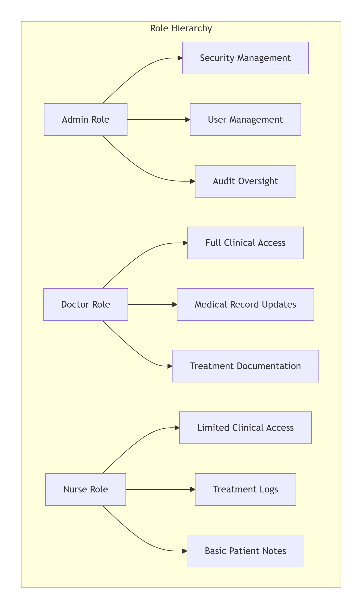

# Roles and Responsibilities for Data Management in SecureHealthDB

## Document Control

| Document Property          | Details                                                          |
| -------------------------- | ---------------------------------------------------------------- |
| **Document Title**   | Roles and Responsibilities for Data Management in SecureHealthDB |
| **Version**          | 1.0                                                              |
| **Effective Date**   | January 15, 2025                                                 |
| **Last Reviewed**    | January 15, 2026                                                 |
| **Next Review Date** | July 15, 2026                                                    |
| **Owner**            | Chief Data Officer                                               |
| **Classification**   | Internal - Confidential                                          |

---

## 1. Introduction

Effective data governance requires **clearly defined roles and responsibilities**. This document outlines the responsibilities of the Admin, Doctor, and Nurse roles in managing, securing, and accessing data within the SecureHealthDB system.

The SecureHealthDB database contains sensitive patient information that must be protected according to healthcare regulations including **HIPAA** (Health Insurance Portability and Accountability Act) and **GDPR** (General Data Protection Regulation). Each role has specific duties that contribute to the overall security and integrity of the hospital's data.

---

## 2. Role-Based Access Overview



### Access Level Summary

| Role             | Patient Demographics | Medical History | SSN  | Treatment Logs | Employee Data | Audit Logs |
| ---------------- | -------------------- | --------------- | ---- | -------------- | ------------- | ---------- |
| **Admin**  | LIMITED              | NO              | NO   | NO             | FULL          | VIEW ONLY  |
| **Doctor** | FULL                 | FULL            | FULL | FULL           | NO            | NO         |
| **Nurse**  | FULL                 | VIEW ONLY       | NO   | FULL           | NO            | NO         |

---

## 3. Admin Role

### 3.1 Role Description

The **Admin** is responsible for overseeing the overall data security and managing access control to sensitive information. Admins ensure that all security policies are followed and that data is regularly reviewed for accuracy.

> **"Admins are the guardians of the data management system, responsible for configuring security, managing user access, and ensuring the overall integrity of the database."**

### 3.2 Key Responsibilities

#### A. Security Policy Configuration and Management

Configure and manage security policies for data access.

| Responsibility                  | Description                                 | Implementation in SecureHealthDB                     |
| ------------------------------- | ------------------------------------------- | ---------------------------------------------------- |
| **Security Policy Setup** | Define and implement data security policies | Configure encryption requirements, password policies |
| **Policy Enforcement**    | Ensure policies are followed                | Monitor user activity, enforce access controls       |
| **Policy Updates**        | Review and update policies as needed        | Quarterly policy reviews                             |

**SQL Implementation:**

```sql
-- Admin responsibilities in database

-- 1. Create admin user with appropriate privileges
CREATE USER IF NOT EXISTS 'admin_user'@'localhost' IDENTIFIED BY 'AdminPass123!';

-- Grant admin privileges
GRANT ALL PRIVILEGES ON securehealth_db.* TO 'admin_user'@'localhost' 
WITH GRANT OPTION;

-- 2. Admin functions for security management
DELIMITER //

-- Function to review current security settings
CREATE PROCEDURE review_security_settings()
BEGIN
    -- Check encryption status
    SELECT 'Encryption Check' as check_type,
           COUNT(*) as encrypted_fields
    FROM information_schema.columns
    WHERE table_schema = 'securehealth_db'
    AND column_name LIKE '%encrypted%';
  
    -- Check user privileges
    SELECT 'User Privileges' as check_type,
           user,
           host,
           Select_priv,
           Insert_priv,
           Update_priv,
           Delete_priv
    FROM mysql.user
    WHERE user IN ('doctor_user', 'nurse_user', 'admin_user');
  
    -- Check for users with excessive privileges
    SELECT 'Users with Admin Privileges' as check_type,
           user,
           host
    FROM mysql.user
    WHERE (Select_priv = 'Y' OR Insert_priv = 'Y' 
           OR Update_priv = 'Y' OR Delete_priv = 'Y')
    AND user NOT IN ('root', 'mysql.sys', 'admin_user');
END//

DELIMITER ;
```

#### B. Permission Management

Set permissions for employees based on their roles.

| Responsibility              | Description                           | Frequency            |
| --------------------------- | ------------------------------------- | -------------------- |
| **Role Assignment**   | Assign appropriate roles to employees | On hire, role change |
| **Permission Review** | Review and update permissions         | Quarterly            |
| **Access Revocation** | Remove access when employees leave    | Immediate            |

**SQL Implementation:**

```sql
-- Admin functions for permission management

DELIMITER //

-- Procedure to assign role to employee
CREATE PROCEDURE assign_employee_role(
    IN p_employee_id INT,
    IN p_role_name VARCHAR(50)
)
BEGIN
    DECLARE v_role_id INT;
  
    -- Get role ID
    SELECT role_id INTO v_role_id
    FROM roles
    WHERE role_name = p_role_name;
  
    -- Assign role
    INSERT INTO employee_roles (employee_id, role_id)
    VALUES (p_employee_id, v_role_id);
  
    -- Log the assignment
    INSERT INTO audit_log (table_name, action, employee_id, details)
    VALUES ('employee_roles', 'ROLE_ASSIGNMENT', @current_employee_id,
            CONCAT('Assigned role ', p_role_name, ' to employee ', p_employee_id));
END//

-- Procedure to revoke employee access
CREATE PROCEDURE revoke_employee_access(
    IN p_employee_id INT
)
BEGIN
    -- Remove all role assignments
    DELETE FROM employee_roles WHERE employee_id = p_employee_id;
  
    -- Disable user account if exists
    -- Note: In production, you would disable rather than delete
  
    -- Log revocation
    INSERT INTO audit_log (table_name, action, employee_id, details)
    VALUES ('employees', 'ACCESS_REVOKED', @current_employee_id,
            CONCAT('All access revoked for employee ', p_employee_id));
END//

DELIMITER ;
```

#### C. Encryption Oversight

Ensure that data is encrypted both in transit and at rest.

| Responsibility                    | Description                         | Verification Method     |
| --------------------------------- | ----------------------------------- | ----------------------- |
| **Encryption Verification** | Confirm sensitive data is encrypted | Regular column checks   |
| **Key Management**          | Oversee encryption key rotation     | Quarterly key rotation  |
| **Transit Security**        | Ensure SSL/TLS is enabled           | Connection verification |

**SQL Implementation:**

```sql
-- Admin encryption verification

DELIMITER //

CREATE PROCEDURE verify_encryption_compliance()
BEGIN
    -- Check if sensitive columns are encrypted
    SELECT 
        table_name,
        column_name,
        data_type,
        CASE 
            WHEN column_name LIKE '%encrypted%' AND data_type = 'varbinary' 
            THEN 'ENCRYPTED'
            WHEN column_name LIKE '%encrypted%' AND data_type != 'varbinary' 
            THEN 'WARNING: Not properly encrypted'
            ELSE 'Not applicable'
        END as encryption_status
    FROM information_schema.columns
    WHERE table_schema = 'securehealth_db'
    AND (column_name LIKE '%ssn%' 
         OR column_name LIKE '%medical%' 
         OR column_name LIKE '%insurance%'
         OR column_name LIKE '%encrypted%');
  
    -- Check SSL status
    SHOW VARIABLES LIKE '%ssl%';
END//

DELIMITER ;
```

#### D. Data Audit Oversight

Oversee regular data audits to maintain data integrity and accuracy.

| Responsibility                | Description                               | Schedule  |
| ----------------------------- | ----------------------------------------- | --------- |
| **Audit Review**        | Review audit logs for suspicious activity | Daily     |
| **Data Quality Audits** | Ensure data accuracy and completeness     | Monthly   |
| **Compliance Audits**   | Verify regulatory compliance              | Quarterly |

**SQL Implementation:**

```sql
-- Admin audit functions

DELIMITER //

CREATE PROCEDURE review_daily_audit()
BEGIN
    -- Review unusual access patterns
    SELECT 
        employee_id,
        COUNT(*) as access_count,
        MIN(access_time) as first_access,
        MAX(access_time) as last_access
    FROM audit_log
    WHERE access_time > NOW() - INTERVAL 1 DAY
    GROUP BY employee_id
    ORDER BY access_count DESC;
  
    -- Review after-hours access
    SELECT 
        a.employee_id,
        e.first_name,
        e.last_name,
        COUNT(*) as after_hours_access
    FROM audit_log a
    JOIN employees e ON a.employee_id = e.employee_id
    WHERE HOUR(a.access_time) NOT BETWEEN 6 AND 20
    AND a.access_time > NOW() - INTERVAL 7 DAY
    GROUP BY a.employee_id;
  
    -- Review failed login attempts
    SELECT 
        username,
        ip_address,
        COUNT(*) as attempts
    FROM login_attempts
    WHERE success = FALSE
    AND attempt_time > NOW() - INTERVAL 1 DAY
    GROUP BY username, ip_address;
END//

DELIMITER ;
```

---

## 4. Doctor Role

### 4.1 Role Description

**Doctors** have access to patient records and are responsible for ensuring the accuracy of medical data, such as diagnoses, treatment plans, and medical histories. They also update patient records when necessary.

> **"Doctors are the primary custodians of clinical data, responsible for documenting patient care accurately and protecting patient confidentiality."**

### 4.2 Key Responsibilities

#### A. Patient Record Management

Access and update patient medical records, including diagnosis, treatment, and medical history.

| Responsibility                    | Description                            | Data Elements                         |
| --------------------------------- | -------------------------------------- | ------------------------------------- |
| **Diagnosis Documentation** | Record and update patient diagnoses    | Diagnosis codes, descriptions         |
| **Treatment Planning**      | Document treatment plans               | Medications, procedures, follow-up    |
| **Medical History Updates** | Maintain comprehensive medical history | Past conditions, surgeries, allergies |

**SQL Implementation:**

```sql
-- Doctor access and functions

-- Create doctor user with appropriate privileges
CREATE USER IF NOT EXISTS 'doctor_user'@'localhost' IDENTIFIED BY 'DoctorPass123!';

GRANT SELECT, INSERT, UPDATE ON securehealth_db.patients TO 'doctor_user'@'localhost';
GRANT SELECT ON securehealth_db.audit_log TO 'doctor_user'@'localhost';
GRANT EXECUTE ON PROCEDURE securehealth_db.GetPatientFullRecord TO 'doctor_user'@'localhost';

DELIMITER //

-- Doctor function to update patient diagnosis
CREATE PROCEDURE update_patient_diagnosis(
    IN p_patient_id INT,
    IN p_new_diagnosis TEXT
)
BEGIN
    DECLARE v_current_history TEXT;
  
    -- Get current medical history
    SELECT CAST(AES_DECRYPT(medical_history_encrypted, @encryption_key) AS CHAR)
    INTO v_current_history
    FROM patients
    WHERE patient_id = p_patient_id;
  
    -- Append new diagnosis
    UPDATE patients
    SET medical_history_encrypted = AES_ENCRYPT(
        CONCAT(IFNULL(v_current_history, ''), 
               '\n', 
               DATE_FORMAT(NOW(), '%Y-%m-%d'), 
               ' - Diagnosis: ', 
               p_new_diagnosis),
        @encryption_key
    )
    WHERE patient_id = p_patient_id;
  
    -- Log the update
    INSERT INTO audit_log (table_name, record_id, action, employee_id, details)
    VALUES ('patients', p_patient_id, 'UPDATE', @current_employee_id,
            CONCAT('Diagnosis added for patient ', p_patient_id));
END//

-- Doctor function to view complete patient record
CREATE PROCEDURE view_complete_patient_record(IN p_patient_id INT)
BEGIN
    SELECT 
        patient_id,
        first_name,
        last_name,
        date_of_birth,
        email,
        phone,
        address,
        CAST(AES_DECRYPT(ssn_encrypted, @encryption_key) AS CHAR) as ssn,
        CAST(AES_DECRYPT(medical_history_encrypted, @encryption_key) AS CHAR) as medical_history,
        CAST(AES_DECRYPT(insurance_info_encrypted, @encryption_key) AS CHAR) as insurance_info
    FROM patients
    WHERE patient_id = p_patient_id;
  
    -- Log access
    INSERT INTO audit_log (table_name, record_id, action, employee_id, details)
    VALUES ('patients', p_patient_id, 'VIEW', @current_employee_id,
            'Complete patient record viewed by doctor');
END//

DELIMITER ;
```

#### B. Data Accuracy Assurance

Ensure the accuracy and completeness of patient-related data.

| Responsibility               | Description                                     | Verification Method          |
| ---------------------------- | ----------------------------------------------- | ---------------------------- |
| **Data Verification**  | Verify patient information during consultations | Cross-reference with patient |
| **Completeness Check** | Ensure all required fields are populated        | Review during visit          |
| **Error Correction**   | Report and correct data discrepancies           | Immediate correction         |

**SQL Implementation:**

```sql
-- Doctor data quality functions

DELIMITER //

CREATE PROCEDURE verify_patient_data_accuracy(IN p_patient_id INT)
BEGIN
    DECLARE issues_found INT DEFAULT 0;
  
    -- Check for missing critical information
    SELECT COUNT(*) INTO issues_found
    FROM patients
    WHERE patient_id = p_patient_id
    AND (date_of_birth IS NULL OR email IS NULL);
  
    IF issues_found > 0 THEN
        INSERT INTO audit_log (table_name, record_id, action, employee_id, details)
        VALUES ('patients', p_patient_id, 'QUALITY_ISSUE', @current_employee_id,
                'Patient record missing critical information');
    
        SELECT 'Warning: Patient record is missing required information' as message;
    ELSE
        SELECT 'Patient record appears complete' as message;
    END IF;
END//

DELIMITER ;
```

#### C. Patient Confidentiality Protection

Protect patient confidentiality by adhering to data security policies.

| Responsibility                | Description                                       | Best Practices         |
| ----------------------------- | ------------------------------------------------- | ---------------------- |
| **Secure Access**       | Only access records for patients under care       | Log out when finished  |
| **Information Sharing** | Share patient data only with authorized personnel | Verify recipient role  |
| **Physical Security**   | Protect devices with patient data                 | Lock screens when away |

#### D. Collaboration with Medical Staff

Collaborate with other medical staff to maintain accurate patient data.

| Responsibility                   | Description                                    | Communication Channel |
| -------------------------------- | ---------------------------------------------- | --------------------- |
| **Treatment Coordination** | Share relevant patient information with nurses | Secure messaging      |
| **Care Team Updates**      | Update care team on patient status             | Daily rounds, notes   |
| **Discharge Planning**     | Document discharge instructions                | Patient records       |

---

## 5. Nurse Role

### 5.1 Role Description

**Nurses** have access to patient records but with limited permissions. They are responsible for updating non-sensitive data, such as treatment logs and general patient notes.

> **"Nurses are the front-line caregivers who document day-to-day patient care while respecting the boundaries of sensitive medical information."**

### 5.2 Key Responsibilities

#### A. Patient Record Updates (Non-Sensitive)

Access and update non-sensitive patient records (e.g., treatment logs and basic medical notes).

| Responsibility            | Description                      | Data Elements                           |
| ------------------------- | -------------------------------- | --------------------------------------- |
| **Vital Signs**     | Record patient vitals            | Blood pressure, temperature, heart rate |
| **Treatment Logs**  | Document administered treatments | Medications given, procedures performed |
| **Daily Notes**     | Record patient observations      | General condition, concerns             |
| **Care Activities** | Document nursing care            | Bathing, mobility assistance            |

**SQL Implementation:**

```sql
-- Create nurse user with appropriate privileges
CREATE USER IF NOT EXISTS 'nurse_user'@'localhost' IDENTIFIED BY 'NursePass123!';

-- Grant limited access to patients table
GRANT SELECT ON securehealth_db.patients TO 'nurse_user'@'localhost';
GRANT UPDATE ON securehealth_db.patients (first_name, last_name, date_of_birth, email, phone, address) 
    TO 'nurse_user'@'localhost';
GRANT SELECT ON securehealth_db.patient_nurse_view TO 'nurse_user'@'localhost';

-- Create table for nursing-specific data
CREATE TABLE IF NOT EXISTS nursing_notes (
    note_id INT PRIMARY KEY AUTO_INCREMENT,
    patient_id INT,
    nurse_id INT,
    note_date TIMESTAMP DEFAULT CURRENT_TIMESTAMP,
    vital_signs TEXT,
    treatments TEXT,
    observations TEXT,
    FOREIGN KEY (patient_id) REFERENCES patients(patient_id),
    FOREIGN KEY (nurse_id) REFERENCES employees(employee_id)
);

GRANT SELECT, INSERT, UPDATE ON securehealth_db.nursing_notes TO 'nurse_user'@'localhost';

DELIMITER //

-- Nurse function to add nursing notes
CREATE PROCEDURE add_nursing_notes(
    IN p_patient_id INT,
    IN p_vital_signs TEXT,
    IN p_treatments TEXT,
    IN p_observations TEXT
)
BEGIN
    INSERT INTO nursing_notes (
        patient_id, 
        nurse_id, 
        vital_signs, 
        treatments, 
        observations
    ) VALUES (
        p_patient_id,
        @current_employee_id,
        p_vital_signs,
        p_treatments,
        p_observations
    );
  
    -- Log the activity
    INSERT INTO audit_log (table_name, record_id, action, employee_id, details)
    VALUES ('nursing_notes', LAST_INSERT_ID(), 'INSERT', @current_employee_id,
            CONCAT('Nursing notes added for patient ', p_patient_id));
END//

-- Create restricted patient view for nurses
CREATE OR REPLACE VIEW patient_nurse_view AS
SELECT 
    patient_id,
    first_name,
    last_name,
    date_of_birth,
    '*** RESTRICTED ***' as ssn,
    '*** RESTRICTED ***' as medical_history
FROM patients;

DELIMITER ;
```

#### B. Data Accuracy and Timeliness

Ensure that patient data is entered accurately and updated regularly.

| Responsibility                  | Description                      | Frequency  |
| ------------------------------- | -------------------------------- | ---------- |
| **Timely Documentation**  | Record observations during shift | Real-time  |
| **Accuracy Verification** | Double-check entered data        | Each entry |
| **Regular Updates**       | Update patient status            | Each shift |

**SQL Implementation:**

```sql
-- Nurse data entry verification

DELIMITER //

CREATE TRIGGER validate_nursing_notes
BEFORE INSERT ON nursing_notes
FOR EACH ROW
BEGIN
    -- Ensure notes are not empty
    IF NEW.vital_signs IS NULL AND NEW.treatments IS NULL 
       AND NEW.observations IS NULL THEN
        SIGNAL SQLSTATE '45000' 
        SET MESSAGE_TEXT = 'Nursing notes must contain at least one observation';
    END IF;
  
    -- Auto-set nurse_id if not provided
    IF NEW.nurse_id IS NULL THEN
        SET NEW.nurse_id = @current_employee_id;
    END IF;
END//

DELIMITER ;
```

#### C. Issue Reporting

Report discrepancies or issues in data to the Admin or Doctor.

| Issue Type                     | Report To | Urgency          |
| ------------------------------ | --------- | ---------------- |
| **Data Discrepancy**     | Doctor    | High if clinical |
| **Missing Information**  | Admin     | Medium           |
| **System Access Issues** | Admin     | High             |
| **Security Concerns**    | Admin     | Critical         |

**SQL Implementation:**

```sql
-- Create issue reporting table
CREATE TABLE data_issues (
    issue_id INT PRIMARY KEY AUTO_INCREMENT,
    reported_by INT,
    issue_type VARCHAR(50),
    description TEXT,
    severity VARCHAR(20),
    status VARCHAR(20),
    reported_date TIMESTAMP DEFAULT CURRENT_TIMESTAMP,
    resolved_date TIMESTAMP,
    resolution_notes TEXT,
    FOREIGN KEY (reported_by) REFERENCES employees(employee_id)
);

-- Grant nurses ability to report issues
GRANT INSERT ON securehealth_db.data_issues TO 'nurse_user'@'localhost';

DELIMITER //

CREATE PROCEDURE report_data_issue(
    IN p_issue_type VARCHAR(50),
    IN p_description TEXT,
    IN p_severity VARCHAR(20)
)
BEGIN
    INSERT INTO data_issues (
        reported_by,
        issue_type,
        description,
        severity,
        status
    ) VALUES (
        @current_employee_id,
        p_issue_type,
        p_description,
        p_severity,
        'REPORTED'
    );
  
    -- Notify admin (in production, this would trigger an email)
    INSERT INTO audit_log (table_name, action, employee_id, details)
    VALUES ('data_issues', 'ISSUE_REPORTED', @current_employee_id,
            CONCAT('Issue reported: ', p_issue_type, ' - ', p_severity));
END//

DELIMITER ;
```

#### D. Patient Confidentiality

Maintain patient confidentiality and adhere to security protocols for data protection.

| Responsibility              | Description                                     | Best Practices              |
| --------------------------- | ----------------------------------------------- | --------------------------- |
| **Confidentiality**   | Never share patient information inappropriately | Discuss only with care team |
| **Secure Access**     | Access only assigned patients                   | Log out after use           |
| **Privacy Awareness** | Be aware of surroundings when accessing data    | Use privacy screens         |

---

## 6. Role Comparison Matrix

| Responsibility Area               | Admin       | Doctor      | Nurse         |
| --------------------------------- | ----------- | ----------- | ------------- |
| **Patient Demographics**    | View Only   | Full Access | Full Access   |
| **Medical History**         | No Access   | Full Access | View Only     |
| **SSN/Insurance**           | No Access   | Full Access | No Access     |
| **Treatment Documentation** | No Access   | Full Access | Full Access   |
| **Employee Management**     | Full Access | No Access   | No Access     |
| **Role Assignment**         | Full Access | No Access   | No Access     |
| **Audit Log Review**        | Full Access | View Own    | View Own      |
| **Security Configuration**  | Full Access | No Access   | No Access     |
| **Data Quality Monitoring** | Full Access | View Only   | Report Issues |
| **Compliance Reporting**    | Full Access | No Access   | No Access     |

---

## 7. Training Requirements

### Admin Training

| Training Area              | Frequency | Provider      |
| -------------------------- | --------- | ------------- |
| Security Policy Management | Annually  | IT Security   |
| User Access Management     | Annually  | HR/IT         |
| Audit Procedures           | Quarterly | Compliance    |
| Incident Response          | Annually  | Security Team |

### Doctor Training

| Training Area               | Frequency | Provider      |
| --------------------------- | --------- | ------------- |
| Patient Record Management   | Annually  | Clinical IT   |
| HIPAA Compliance            | Annually  | Compliance    |
| Secure Data Practices       | Annually  | Security Team |
| Emergency Access Procedures | Annually  | IT Security   |

### Nurse Training

| Training Area         | Frequency     | Provider           |
| --------------------- | ------------- | ------------------ |
| Nursing Documentation | Annually      | Clinical IT        |
| Data Entry Standards  | Annually      | Nursing Leadership |
| Privacy Awareness     | Annually      | Compliance         |
| Issue Reporting       | Semi-annually | IT Support         |

---

## 8. Conclusion

Each role within the hospital has **specific duties and responsibilities** to ensure that data is properly managed, secured, and accessed. By clearly defining these roles, we ensure that the hospital's data governance framework remains effective and secure.

### Key Takeaways

| Role             | Primary Focus            | Key Accountability    |
| ---------------- | ------------------------ | --------------------- |
| **Admin**  | Security & Governance    | System integrity      |
| **Doctor** | Clinical Accuracy        | Patient care quality  |
| **Nurse**  | Daily Care Documentation | Accurate observations |

### Success Metrics

| Metric                                   | Target                   | Measurement         |
| ---------------------------------------- | ------------------------ | ------------------- |
| **Admin Audit Completion**         | 100% of scheduled audits | Audit log           |
| **Doctor Data Accuracy**           | >99% accuracy            | Data quality checks |
| **Nurse Documentation Timeliness** | <4 hours from care       | Timestamp analysis  |
| **Security Incidents**             | Zero                     | Incident log        |

---

## 9. Approval

| Role                  | Name              | Signature         | Date  |
| --------------------- | ----------------- | ----------------- | ----- |
| Chief Data Officer    | _________________ | _________________ | _____ |
| Chief Medical Officer | _________________ | _________________ | _____ |
| Chief Nursing Officer | _________________ | _________________ | _____ |
| IT Security Manager   | _________________ | _________________ | _____ |
| Compliance Officer    | _________________ | _________________ | _____ |

---

## Appendix A: Role-Specific SQL Privileges

### Admin Privileges

```sql
GRANT ALL PRIVILEGES ON securehealth_db.* TO 'admin_user'@'localhost';
GRANT SELECT ON mysql.* TO 'admin_user'@'localhost';
```

### Doctor Privileges

```sql
GRANT SELECT, INSERT, UPDATE ON securehealth_db.patients TO 'doctor_user'@'localhost';
GRANT SELECT ON securehealth_db.audit_log TO 'doctor_user'@'localhost';
```

### Nurse Privileges

```sql
GRANT SELECT ON securehealth_db.patient_nurse_view TO 'nurse_user'@'localhost';
GRANT SELECT, INSERT, UPDATE ON securehealth_db.nursing_notes TO 'nurse_user'@'localhost';
GRANT INSERT ON securehealth_db.data_issues TO 'nurse_user'@'localhost';
```

## Appendix B: Role Transition Procedures

### When Role Changes

1. **Notification**: HR notifies IT of role change
2. **Access Review**: Admin reviews current permissions
3. **Permission Update**: New role permissions granted
4. **Old Permissions Removed**: Previous access revoked
5. **Documentation**: Change logged in audit trail

---

*This document is confidential and proprietary to SecureHealth Inc.*
*Version 1.0 - Last Updated: January 15, 2026*
