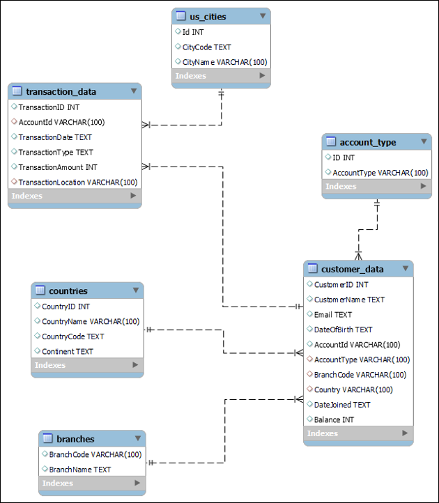

# Lab: Redesign a Schema Designed for OLTP and Modify It to Suit OLAP

## Estimated time: 30 minutes

---

## Learning objectives

After completing this lab, you will be able to:

- Create the schema for an OLTP database to define its structure and relationships
- Populate the OLTP database by loading data into the designed schema
- Apply data loading techniques to populate a data warehouse
- Redesign an OLTP schema to suit OLAP requirements

---

## Welcome to the lab on redesigning a schema designed for OLTP and modifying it to suit OLAP!

---

## About SN Labs and Cloud IDE

**Skills Network (SN) Labs** offer a fully functional environment - **Cloud IDE** - for course and project-related labs. It runs on **Theia**, an open-source integrated development environment (IDE) compatible with desktop and cloud platforms.

With this Cloud IDE, you can access Theia and MySQL, both running in a Docker container. It has all the essential tools needed to complete your lab efficiently.

### Tools or software used

- MySQL 8.0.22
- phpMyAdmin 5.0.4

### Important notice about the lab environment

> **This lab environment does not save your session data.** Each time you connect, a new environment is created. Any data saved during a previous session will be lost.
>
> To prevent data loss, plan to complete the lab in a single session.

---

## Scenario overview

As a data engineer at **FinHub Bank**, your role is to design a data platform that supports the bank's operational needs. This platform will use MySQL as the online transaction processing (OLTP) database, serving as the primary storage for transactional data.

In this lab, you will work with the **FinHub Bank database**. It is strongly recommended that you use the provided database as specified in the lab instructions to ensure successful completion.

### FinHub Bank Database Schema (OLTP)

Below is the entity relationship diagram (ERD) for the FinHub database, outlining its schema:


---

## Understanding OLTP vs OLAP

Before redesigning the schema, it's important to understand the differences between OLTP and OLAP systems:

| Characteristic          | OLTP (Online Transaction Processing)  | OLAP (Online Analytical Processing)   |
| ----------------------- | ------------------------------------- | ------------------------------------- |
| **Purpose**       | Handle day-to-day transactions        | Support complex queries and analysis  |
| **Data Model**    | Normalized (3NF)                      | Denormalized (Star/Snowflake schema)  |
| **Queries**       | Simple, frequent INSERT/UPDATE/DELETE | Complex SELECT with aggregations      |
| **Performance**   | Optimized for write operations        | Optimized for read operations         |
| **Data Volume**   | Current data (limited history)        | Historical data (large volumes)       |
| **Response Time** | Milliseconds to seconds               | Seconds to minutes                    |
| **Users**         | Customers, tellers, operational staff | Analysts, data scientists, management |

---

## Exercise 1: Setting up the OLTP database

In this exercise, you will learn how to set up a MySQL database using phpMyAdmin.

### Task 1.1: Access the MySQL Database

**Step 1:** Tap the **DATABASES** tab, and from the dropdown menu, select **MySQL** to open the MySQL service session tab.

**Step 2:** Click the **Create** button and wait until the MySQL service session gets launched.

**Step 3:** Click the **phpMyAdmin** button to access the phpMyAdmin interface.

### Task 1.2: Create the FinHub Database

**Step 1:** In phpMyAdmin, click **New** to create a new database.

**Step 2:** Enter **finhub** as the database name and click **Create**.

```
Database name: finhub
```

### Task 1.3: Create the OLTP Schema

Run the following SQL to create the OLTP schema for FinHub Bank:

```sql
-- Create account_type table
CREATE TABLE account_type (
    ID int DEFAULT NULL,
    AccountType varchar(100) DEFAULT NULL,
    UNIQUE KEY AccountType_UNIQUE (AccountType)
) ENGINE=InnoDB DEFAULT CHARSET=utf8mb4 COLLATE=utf8mb4_0900_ai_ci;

-- Create branches table
CREATE TABLE branches (
    BranchCode varchar(100) DEFAULT NULL,
    BranchName text,
    UNIQUE KEY BranchCode_UNIQUE (BranchCode)
) ENGINE=InnoDB DEFAULT CHARSET=utf8mb4 COLLATE=utf8mb4_0900_ai_ci;

-- Create countries table
CREATE TABLE countries (
    CountryID int DEFAULT NULL,
    CountryName varchar(100) DEFAULT NULL,
    CountryCode text,
    Continent text,
    UNIQUE KEY CountryName_UNIQUE (CountryName)
) ENGINE=InnoDB DEFAULT CHARSET=utf8mb4 COLLATE=utf8mb4_0900_ai_ci;

-- Create us_cities table
CREATE TABLE us_cities (
    Id int DEFAULT NULL,
    CityCode text,
    CityName varchar(100) DEFAULT NULL,
    UNIQUE KEY CityName_UNIQUE (CityName),
    KEY idx (CityName)
) ENGINE=InnoDB DEFAULT CHARSET=utf8mb4 COLLATE=utf8mb4_0900_ai_ci;

-- Create customer_data table (central fact table in OLTP)
CREATE TABLE customer_data (
    CustomerID int DEFAULT NULL,
    CustomerName text,
    Email text,
    DateOfBirth text,
    AccountId varchar(100) DEFAULT NULL,
    AccountType varchar(100) DEFAULT NULL,
    BranchCode varchar(100) DEFAULT NULL,
    Country varchar(100) DEFAULT NULL,
    DateJoined text,
    Balance int DEFAULT NULL,
    UNIQUE KEY AccountId_UNIQUE (AccountId),
    KEY actype_idx (AccountType),
    KEY bcode_idx (BranchCode),
    KEY ctry_idx (Country),
    CONSTRAINT actype FOREIGN KEY (AccountType) REFERENCES account_type (AccountType),
    CONSTRAINT bcode FOREIGN KEY (BranchCode) REFERENCES branches (BranchCode),
    CONSTRAINT ctry FOREIGN KEY (Country) REFERENCES countries (CountryName)
) ENGINE=InnoDB DEFAULT CHARSET=utf8mb4 COLLATE=utf8mb4_0900_ai_ci;

-- Create transaction_data table
CREATE TABLE transaction_data (
    TransactionID int DEFAULT NULL,
    AccountId varchar(100) DEFAULT NULL,
    TransactionDate text,
    TransactionType text,
    TransactionAmount int DEFAULT NULL,
    TransactionLocation varchar(100) DEFAULT NULL,
    KEY LOC_idx (TransactionLocation),
    KEY acct_idx (AccountId),
    CONSTRAINT acct FOREIGN KEY (AccountId) REFERENCES customer_data (AccountId),
    CONSTRAINT LOC FOREIGN KEY (TransactionLocation) REFERENCES us_cities (CityName)
) ENGINE=InnoDB DEFAULT CHARSET=utf8mb4 COLLATE=utf8mb4_0900_ai_ci;
```

### Task 1.4: Load Data into the OLTP Database

Now, load the sample data into the FinHub database:

```sql
-- Load account_type data
INSERT INTO account_type (ID, AccountType) VALUES
(1,'Savings'), (2,'Current'), (3,'Overdraft'), (4,'Checking'),
(5,'Recurring deposit account'), (6,'Salary account'), (7,'Fixed deposit account');

-- Load branches data
INSERT INTO branches (BranchCode, BranchName) VALUES
('BR001',' Downtown Branch'), ('BR002',' Midtown Branch'), ('BR003',' Riverside Branch'),
('BR004',' Central Branch'), ('BR005',' Westside Branch'), ('BR006',' East End Branch'),
('BR007',' Northside Branch'), ('BR008',' Southside Branch'), ('BR009',' Uptown Branch'),
('BR010',' Greenfield Branch'), ('BR011',' Lakeside Branch'), ('BR012',' Hilltop Branch'),
('BR013',' Parkview Branch'), ('BR014',' Seaside Branch'), ('BR015',' Valley Branch'),
('BR016',' Gateway Branch'), ('BR017',' City Center Branch'), ('BR018',' University Branch'),
('BR019',' Industrial Branch'), ('BR020',' Market Square Branch'), ('BR021',' Heritage Branch'),
('BR022',' Pine Grove Branch'), ('BR023',' Oakwood Branch'), ('BR024',' Sunrise Branch'),
('BR025',' Sunset Branch'), ('BR026',' Metro Branch'), ('BR027',' Airport Branch'),
('BR028',' Station Branch'), ('BR029',' Grand Avenue Branch'), ('BR030',' Harbor Branch');

-- Load countries data (abbreviated - full list from the dump)
INSERT INTO countries (CountryID, CountryName, CountryCode, Continent) VALUES
(1,'Afghanistan','AF','Asia'), (2,'Albania','AL','Europe'), (3,'Algeria','DZ','Africa'),
(32,'Canada','CA','North America'), (63,'Germany','DE','Europe'), (75,'India','IN','Asia'),
(122,'Netherlands','NL','Europe'), (183,'United States','US','North America'),
(182,'United Kingdom','GB','Europe'), (123,'New Zealand','NZ','Oceania'),
(9,'Australia','AU','Oceania');

-- Load us_cities data (abbreviated - full list from the dump)
INSERT INTO us_cities (Id, CityCode, CityName) VALUES
(83,'NY','New York'), (59,'LA','Los Angeles'), (28,'DAL','Dallas'),
(108,'SF','San Francisco'), (22,'CIN','Cincinnati'), (122,'TX','Texas');

-- Load customer_data
INSERT INTO customer_data (CustomerID, CustomerName, Email, DateOfBirth, AccountId, AccountType, BranchCode, Country, DateJoined, Balance) VALUES
(101,'Alice Johnson','alice.j@example.com','5/21/1990','ACCT-10002345','Savings','BR001','United States','1/15/2020',12000),
(102,'Bob Smith','bob.smith@xyz.com','8/15/1985','ACCT-10005678','Checking','BR002','United States','11/30/2019',3000),
(103,'Cathy Davis','cathy.davis@example.com','11/3/1992','ACCT-10007891','Savings','BR003','United States','6/1/2021',8500),
(104,'David Lee','david.l@xyz.com','2/28/1978','ACCT-10001234','Savings','BR004','United States','3/20/2021',5000),
(105,'Eva Turner','No Email Provided','4/7/1989','ACCT-10003456','Checking','BR005','United States','7/19/2020',-1000),
(106,'Frank Zhang','frank.zhang@xyz.com','12/13/1975','ACCT-10004567','Savings','BR006','United States','9/11/2018',7500),
(107,'Gina King','gina.k@example.com','3/20/1993','ACCT-10008901','Savings','BR007','Canada','1/9/2022',20000),
(108,'Harry Brown','harry.b@xyz.com','9/15/1987','ACCT-10006789','Checking','BR008','United States','8/21/2020',3500),
(109,'Ivy Scott','ivy.scott@example.com','','ACCT-10009876','Savings','BR009','Canada','11/14/2021',8000),
(110,'John Doe','No Email Provided','1/1/1990','ACCT-10005432','Savings','BR010','United States','3/29/2022',0),
(111,'Karen Green','karen.g@example.com','11/11/1984','ACCT-10007654','Savings','BR011','United States','12/5/2021',6000),
(112,'Liam Miller','liam.m@xyz.com','2/22/1991','ACCT-10004321','Checking','BR012','United Kingdom','5/25/2019',5500),
(113,'Mona Blue','mona.b@example.com','','ACCT-10002134','Savings','BR013','United States','1/18/2022',4000),
(114,'Nate White','No Email Provided','10/10/1995','ACCT-10006543','Checking','BR014','Canada','6/30/2018',10000),
(115,'Olivia Black','olivia.b@xyz.com','6/16/1982','ACCT-10003210','Savings','BR015','United States','7/19/2021',1500),
(116,'Paul Walker','paul.w@example.com','7/5/1998','ACCT-10005478','Savings','BR016','Australia','9/25/2020',-500),
(117,'Quinn Red','quinn.r@xyz.com','4/22/1979','ACCT-10008765','Savings','BR017','United Kingdom','2/14/2019',23000),
(118,'Rose Pink','rose.p@example.com','8/8/1986','ACCT-10002301','Checking','BR018','New Zealand','3/9/2022',8700),
(119,'Sam Grey','sam.g@example.com','9/18/1990','ACCT-10007621','Checking','BR019','United Kingdom','4/4/2020',500),
(120,'Tim Orange','No Email Provided','12/31/1983','ACCT-10003489','Savings','BR020','Canada','7/23/2019',9200);

-- Load transaction_data
INSERT INTO transaction_data (TransactionID, AccountId, TransactionDate, TransactionType, TransactionAmount, TransactionLocation) VALUES
(201,'ACCT-10002345','01/05/2022','Deposit',500,'New York'),
(202,'ACCT-10005678','02/15/2022','Withdrawal',200,'New York'),
(203,'ACCT-10007891','03/15/2022','Deposit',300,'Los Angeles'),
(204,'ACCT-10001234','04/10/2022','Withdrawal',-400,'Cincinnati'),
(205,'ACCT-10003456','04/30/2022','Deposit',450,'San Francisco'),
(206,'ACCT-10004567','05/20/2022','Withdrawal',100,'Texas'),
(207,'ACCT-10008901','06/25/2022','Deposit',750,'Dallas'),
(208,'ACCT-10006789','07/05/2022','Withdrawal',200,'Dallas'),
(209,'ACCT-10009876','08/15/2022','Deposit',600,'New York'),
(210,'ACCT-10005432','09/01/2022','Withdrawal',0,'New York'),
(211,'ACCT-10007654','10/12/2022','Deposit',400,'San Francisco'),
(212,'ACCT-10004321','11/11/2022','Withdrawal',100,'San Francisco'),
(213,'ACCT-10002134','12/25/2022','Deposit',250,'Los Angeles'),
(214,'ACCT-10006543','01/15/2022','Deposit',1000,'Cincinnati'),
(215,'ACCT-10003210','02/28/2022','Withdrawal',-200,'Dallas'),
(216,'ACCT-10005478','03/14/2022','Deposit',500,'Dallas'),
(217,'ACCT-10008765','04/22/2022','Deposit',800,'New York'),
(218,'ACCT-10002301','05/30/2022','Withdrawal',700,'New York'),
(219,'ACCT-10007621','06/15/2022','Deposit',350,'San Francisco'),
(220,'ACCT-10003489','07/20/2022','Withdrawal',600,'San Francisco');
```

---

## Exercise 2: Analyze OLTP Schema for OLAP Readiness

Before redesigning for OLAP, analyze the current OLTP schema to identify limitations for analytical queries.

### Task 2.1: Identify OLTP Characteristics

| Characteristic               | Current Schema                                                        | Issue for OLAP                                   |
| ---------------------------- | --------------------------------------------------------------------- | ------------------------------------------------ |
| **Normalization**      | Multiple lookup tables (account_type, branches, countries, us_cities) | Requires multiple JOINs for analysis             |
| **Data Types**         | Text fields for dates, inconsistent formatting                        | Cannot perform date-based calculations           |
| **NULL Values**        | Missing emails, dates of birth                                        | Incomplete analysis                              |
| **Negative Balances**  | Allowed in Balance field                                              | May indicate overdrafts but not tracked properly |
| **Transaction Amount** | Negative values for withdrawals                                       | Inconsistent representation                      |
| **Location Data**      | Limited to city names only                                            | Cannot analyze at region/state level             |

### Task 2.2: Test Analytical Queries on OLTP Schema

Run these analytical queries to see the performance and complexity:

```sql
-- Query 1: Total deposits by branch (requires multiple JOINs)
SELECT 
    b.BranchName,
    SUM(t.TransactionAmount) as TotalDeposits
FROM transaction_data t
JOIN customer_data c ON t.AccountId = c.AccountId
JOIN branches b ON c.BranchCode = b.BranchCode
WHERE t.TransactionType = 'Deposit'
GROUP BY b.BranchName;

-- Query 2: Monthly transaction trends (date parsing required)
SELECT 
    MONTH(STR_TO_DATE(t.TransactionDate, '%m/%d/%Y')) as Month,
    YEAR(STR_TO_DATE(t.TransactionDate, '%m/%d/%Y')) as Year,
    t.TransactionType,
    SUM(t.TransactionAmount) as TotalAmount,
    COUNT(*) as TransactionCount
FROM transaction_data t
GROUP BY Year, Month, t.TransactionType
ORDER BY Year, Month;

-- Query 3: Customer balance analysis by country
SELECT 
    c.Country,
    COUNT(DISTINCT c.CustomerID) as CustomerCount,
    AVG(c.Balance) as AvgBalance,
    SUM(CASE WHEN c.Balance < 0 THEN 1 ELSE 0 END) as OverdrawnAccounts
FROM customer_data c
GROUP BY c.Country;
```

---

## Exercise 3: Redesign Schema for OLAP

Now, redesign the OLTP schema to create an OLAP-optimized data warehouse schema.

### Task 3.1: Star Schema Design Principles

For OLAP, we'll use a **Star Schema** with:

- **Fact Tables**: Contain measures (numeric values) and foreign keys to dimension tables
- **Dimension Tables**: Contain descriptive attributes (text) for filtering and grouping

```
┌─────────────────────────────────────────────────────────────────┐
│                        STAR SCHEMA                               │
├─────────────────────────────────────────────────────────────────┤
│                                                                   │
│                    ┌─────────────────┐                           │
│                    │  DimCustomer    │                           │
│                    ├─────────────────┤                           │
│                    │ CustomerKey (PK)│                           │
│                    │ CustomerID      │                           │
│                    │ CustomerName    │                           │
│                    │ Email           │                           │
│                    │ DateOfBirth     │                           │
│                    │ AgeGroup        │                           │
│                    └────────┬────────┘                           │
│                             │                                     │
│                             │                                     │
│                    ┌────────▼────────┐                           │
│   ┌────────────────┤   FactTransaction│◄──────────────────┐      │
│   │                ├──────────────────┤                   │      │
│   │                │ TransactionKey(PK)│                  │      │
│   │                │ DateKey (FK)      │                  │      │
│   │                │ CustomerKey (FK)  │                  │      │
│   │                │ AccountKey (FK)   │                  │      │
│   │                │ BranchKey (FK)    │                  │      │
│   │                │ LocationKey (FK)  │                  │      │
│   │                │ TransactionAmount │                  │      │
│   │                └───────────────────┘                  │      │
│   │                                                         │      │
│   │                 ┌─────────────────┐                    │      │
│   │                 │   DimDate       │                    │      │
│   │                 ├─────────────────┤                    │      │
│   │                 │ DateKey (PK)    │                    │      │
│   │                 │ FullDate        │                    │      │
│   │                 │ Year            │                    │      │
│   │                 │ Quarter         │                    │      │
│   │                 │ Month           │                    │      │
│   │                 │ Day             │                    │      │
│   │                 │ DayOfWeek       │                    │      │
│   │                 └─────────────────┘                    │      │
│   │                                                         │      │
│   │  ┌─────────────────┐              ┌─────────────────┐  │      │
│   │  │   DimAccount    │              │   DimBranch     │  │      │
│   │  ├─────────────────┤              ├─────────────────┤  │      │
│   │  │ AccountKey (PK) │              │ BranchKey (PK)  │  │      │
│   │  │ AccountID       │              │ BranchCode      │  │      │
│   │  │ AccountType     │              │ BranchName      │  │      │
│   │  │ AccountCategory │              │ Region          │  │      │
│   └──┤ Balance         │              └─────────────────┘  │      │
│      └─────────────────┘                                    │      │
│                                                             │      │
│                    ┌─────────────────┐                      │      │
│                    │  DimLocation    │                      │      │
│                    ├─────────────────┤                      │      │
│                    │ LocationKey (PK)│◄─────────────────────┘      │
│                    │ City            │                             │
│                    │ State           │                             │
│                    │ Region          │                             │
│                    │ Country         │                             │
│                    └─────────────────┘                             │
└─────────────────────────────────────────────────────────────────────┘
```

### Task 3.2: Create OLAP Dimension Tables

```sql
-- Create a new database for the data warehouse
CREATE DATABASE IF NOT EXISTS finhub_warehouse;
USE finhub_warehouse;

-- 1. DimDate - Time dimension for date-based analysis
CREATE TABLE DimDate (
    DateKey INT PRIMARY KEY,
    FullDate DATE NOT NULL,
    Year INT NOT NULL,
    Quarter INT NOT NULL,
    Month INT NOT NULL,
    MonthName VARCHAR(20) NOT NULL,
    Day INT NOT NULL,
    DayOfWeek INT NOT NULL,
    DayName VARCHAR(20) NOT NULL,
    IsWeekend BOOLEAN NOT NULL,
    IsHoliday BOOLEAN DEFAULT FALSE
);

-- Populate DimDate with date range (2020-2025)
DELIMITER //
CREATE PROCEDURE PopulateDimDate()
BEGIN
    DECLARE v_startDate DATE;
    DECLARE v_endDate DATE;
    DECLARE v_currentDate DATE;
  
    SET v_startDate = '2020-01-01';
    SET v_endDate = '2025-12-31';
    SET v_currentDate = v_startDate;
  
    WHILE v_currentDate <= v_endDate DO
        INSERT INTO DimDate (
            DateKey,
            FullDate,
            Year,
            Quarter,
            Month,
            MonthName,
            Day,
            DayOfWeek,
            DayName,
            IsWeekend
        ) VALUES (
            YEAR(v_currentDate) * 10000 + MONTH(v_currentDate) * 100 + DAY(v_currentDate),
            v_currentDate,
            YEAR(v_currentDate),
            QUARTER(v_currentDate),
            MONTH(v_currentDate),
            MONTHNAME(v_currentDate),
            DAY(v_currentDate),
            DAYOFWEEK(v_currentDate),
            DAYNAME(v_currentDate),
            CASE WHEN DAYOFWEEK(v_currentDate) IN (1,7) THEN TRUE ELSE FALSE END
        );
      
        SET v_currentDate = DATE_ADD(v_currentDate, INTERVAL 1 DAY);
    END WHILE;
END//
DELIMITER ;

CALL PopulateDimDate();

-- 2. DimCustomer - Customer dimension with enriched attributes
CREATE TABLE DimCustomer (
    CustomerKey INT AUTO_INCREMENT PRIMARY KEY,
    CustomerID INT NOT NULL,
    CustomerName VARCHAR(100),
    Email VARCHAR(100),
    DateOfBirth DATE,
    Age INT,
    AgeGroup VARCHAR(20),
    DateJoined DATE,
    TenureMonths INT,
    IsActive BOOLEAN DEFAULT TRUE
);

-- 3. DimAccount - Account dimension with type categorization
CREATE TABLE DimAccount (
    AccountKey INT AUTO_INCREMENT PRIMARY KEY,
    AccountID VARCHAR(20) NOT NULL,
    AccountType VARCHAR(50),
    AccountCategory VARCHAR(50),
    CurrentBalance DECIMAL(15,2),
    AccountStatus VARCHAR(20) DEFAULT 'Active',
    OpeningDate DATE
);

-- 4. DimBranch - Branch dimension with geographic hierarchy
CREATE TABLE DimBranch (
    BranchKey INT AUTO_INCREMENT PRIMARY KEY,
    BranchCode VARCHAR(20) NOT NULL,
    BranchName VARCHAR(100),
    City VARCHAR(50),
    State VARCHAR(50),
    Region VARCHAR(50),
    Country VARCHAR(50) DEFAULT 'United States'
);

-- 5. DimLocation - Location dimension for transaction locations
CREATE TABLE DimLocation (
    LocationKey INT AUTO_INCREMENT PRIMARY KEY,
    City VARCHAR(100) NOT NULL,
    State VARCHAR(50),
    Region VARCHAR(50),
    Country VARCHAR(50) DEFAULT 'United States',
    UNIQUE KEY (City)
);

-- 6. FactTransaction - Fact table for all banking transactions
CREATE TABLE FactTransaction (
    TransactionKey INT AUTO_INCREMENT PRIMARY KEY,
    TransactionID INT NOT NULL,
    DateKey INT NOT NULL,
    CustomerKey INT NOT NULL,
    AccountKey INT NOT NULL,
    BranchKey INT NOT NULL,
    LocationKey INT NOT NULL,
    TransactionType VARCHAR(50) NOT NULL,
    TransactionAmount DECIMAL(15,2) NOT NULL,
    IsDeposit BOOLEAN,
    IsWithdrawal BOOLEAN,
    IsTransfer BOOLEAN,
    FOREIGN KEY (DateKey) REFERENCES DimDate(DateKey),
    FOREIGN KEY (CustomerKey) REFERENCES DimCustomer(CustomerKey),
    FOREIGN KEY (AccountKey) REFERENCES DimAccount(AccountKey),
    FOREIGN KEY (BranchKey) REFERENCES DimBranch(BranchKey),
    FOREIGN KEY (LocationKey) REFERENCES DimLocation(LocationKey)
);

-- 7. FactAccountBalance - Periodic snapshot fact for account balances
CREATE TABLE FactAccountBalance (
    BalanceKey INT AUTO_INCREMENT PRIMARY KEY,
    DateKey INT NOT NULL,
    AccountKey INT NOT NULL,
    Balance DECIMAL(15,2) NOT NULL,
    PreviousBalance DECIMAL(15,2),
    BalanceChange DECIMAL(15,2),
    ChangePercentage DECIMAL(10,2),
    FOREIGN KEY (DateKey) REFERENCES DimDate(DateKey),
    FOREIGN KEY (AccountKey) REFERENCES DimAccount(AccountKey)
);
```

### Task 3.3: Transform and Load Data from OLTP to OLAP

Now, we'll perform ETL (Extract, Transform, Load) to populate the data warehouse:

```sql
USE finhub_warehouse;

-- 1. Populate DimLocation from us_cities
INSERT INTO DimLocation (City, State, Region, Country)
SELECT DISTINCT 
    CityName,
    'Unknown' as State,
    'Unknown' as Region,
    'United States' as Country
FROM finhub.us_cities
WHERE CityName IN (
    SELECT DISTINCT TransactionLocation 
    FROM finhub.transaction_data
);

-- Add additional cities from customer countries
INSERT IGNORE INTO DimLocation (City, Country)
SELECT DISTINCT 'Unknown', Country 
FROM finhub.customer_data;

-- 2. Populate DimBranch
INSERT INTO DimBranch (BranchCode, BranchName, Country)
SELECT BranchCode, BranchName, 'United States'
FROM finhub.branches
WHERE BranchCode IN (SELECT DISTINCT BranchCode FROM finhub.customer_data);

-- 3. Populate DimAccount with enriched data
INSERT INTO DimAccount (AccountID, AccountType, CurrentBalance, OpeningDate)
SELECT 
    AccountId,
    AccountType,
    Balance,
    STR_TO_DATE(DateJoined, '%c/%e/%Y')
FROM finhub.customer_data;

-- Update account categories
UPDATE DimAccount 
SET AccountCategory = CASE 
    WHEN AccountType IN ('Savings', 'Current', 'Checking') THEN 'Transactional'
    WHEN AccountType IN ('Fixed deposit account', 'Recurring deposit account') THEN 'Deposit'
    WHEN AccountType IN ('Salary account') THEN 'Salary'
    WHEN AccountType IN ('Overdraft') THEN 'Credit'
    ELSE 'Other'
END;

-- 4. Populate DimCustomer with derived attributes
INSERT INTO DimCustomer (
    CustomerID,
    CustomerName,
    Email,
    DateOfBirth,
    Age,
    AgeGroup,
    DateJoined,
    TenureMonths
)
SELECT 
    CustomerID,
    CustomerName,
    CASE WHEN Email = 'No Email Provided' THEN NULL ELSE Email END,
    STR_TO_DATE(DateOfBirth, '%c/%e/%Y'),
    TIMESTAMPDIFF(YEAR, STR_TO_DATE(DateOfBirth, '%c/%e/%Y'), CURDATE()),
    CASE 
        WHEN TIMESTAMPDIFF(YEAR, STR_TO_DATE(DateOfBirth, '%c/%e/%Y'), CURDATE()) < 25 THEN 'Under 25'
        WHEN TIMESTAMPDIFF(YEAR, STR_TO_DATE(DateOfBirth, '%c/%e/%Y'), CURDATE()) BETWEEN 25 AND 35 THEN '25-35'
        WHEN TIMESTAMPDIFF(YEAR, STR_TO_DATE(DateOfBirth, '%c/%e/%Y'), CURDATE()) BETWEEN 36 AND 50 THEN '36-50'
        ELSE '50+'
    END,
    STR_TO_DATE(DateJoined, '%c/%e/%Y'),
    TIMESTAMPDIFF(MONTH, STR_TO_DATE(DateJoined, '%c/%e/%Y'), CURDATE())
FROM finhub.customer_data;

-- 5. Populate FactTransaction
INSERT INTO FactTransaction (
    TransactionID,
    DateKey,
    CustomerKey,
    AccountKey,
    BranchKey,
    LocationKey,
    TransactionType,
    TransactionAmount,
    IsDeposit,
    IsWithdrawal,
    IsTransfer
)
SELECT 
    t.TransactionID,
    YEAR(STR_TO_DATE(t.TransactionDate, '%m/%d/%Y')) * 10000 
        + MONTH(STR_TO_DATE(t.TransactionDate, '%m/%d/%Y')) * 100 
        + DAY(STR_TO_DATE(t.TransactionDate, '%m/%d/%Y')) as DateKey,
    dc.CustomerKey,
    da.AccountKey,
    db.BranchKey,
    dl.LocationKey,
    t.TransactionType,
    ABS(t.TransactionAmount) as TransactionAmount,
    CASE WHEN t.TransactionType = 'Deposit' AND t.TransactionAmount > 0 THEN TRUE ELSE FALSE END as IsDeposit,
    CASE WHEN t.TransactionType = 'Withdrawal' AND t.TransactionAmount > 0 THEN TRUE ELSE FALSE END as IsWithdrawal,
    FALSE as IsTransfer
FROM finhub.transaction_data t
JOIN finhub.customer_data c ON t.AccountId = c.AccountId
JOIN DimCustomer dc ON c.CustomerID = dc.CustomerID
JOIN DimAccount da ON t.AccountId = da.AccountID
JOIN DimBranch db ON c.BranchCode = db.BranchCode
LEFT JOIN DimLocation dl ON t.TransactionLocation = dl.City;

-- 6. Populate FactAccountBalance (initial snapshot)
INSERT INTO FactAccountBalance (DateKey, AccountKey, Balance)
SELECT 
    YEAR(CURDATE()) * 10000 + MONTH(CURDATE()) * 100 + DAY(CURDATE()) as DateKey,
    da.AccountKey,
    da.CurrentBalance
FROM DimAccount da;
```

---

## Exercise 4: Query the OLAP Schema

Now test the OLAP schema with analytical queries that are optimized for performance.

### Task 4.1: Basic Analytical Queries

```sql
-- Query 1: Monthly transaction trends (simple and fast)
SELECT 
    d.Year,
    d.Month,
    d.MonthName,
    t.TransactionType,
    COUNT(*) as TransactionCount,
    SUM(t.TransactionAmount) as TotalAmount,
    AVG(t.TransactionAmount) as AvgAmount
FROM FactTransaction t
JOIN DimDate d ON t.DateKey = d.DateKey
GROUP BY d.Year, d.Month, d.MonthName, t.TransactionType
ORDER BY d.Year, d.Month;

-- Query 2: Customer segmentation by age group and balance
SELECT 
    c.AgeGroup,
    COUNT(DISTINCT c.CustomerKey) as CustomerCount,
    AVG(a.CurrentBalance) as AvgBalance,
    SUM(CASE WHEN a.CurrentBalance > 10000 THEN 1 ELSE 0 END) as HighValueCustomers
FROM DimCustomer c
JOIN DimAccount a ON c.CustomerID = a.AccountID
GROUP BY c.AgeGroup
ORDER BY AvgBalance DESC;

-- Query 3: Branch performance analysis
SELECT 
    b.BranchName,
    b.City,
    COUNT(DISTINCT t.TransactionKey) as TransactionCount,
    SUM(t.TransactionAmount) as TotalTransactionVolume,
    AVG(t.TransactionAmount) as AvgTransactionAmount,
    COUNT(DISTINCT c.CustomerKey) as UniqueCustomers
FROM FactTransaction t
JOIN DimBranch b ON t.BranchKey = b.BranchKey
JOIN DimCustomer c ON t.CustomerKey = c.CustomerKey
GROUP BY b.BranchName, b.City
ORDER BY TotalTransactionVolume DESC;

-- Query 4: Deposit vs Withdrawal analysis by location
SELECT 
    l.City,
    l.State,
    SUM(CASE WHEN t.IsDeposit = TRUE THEN t.TransactionAmount ELSE 0 END) as TotalDeposits,
    SUM(CASE WHEN t.IsWithdrawal = TRUE THEN t.TransactionAmount ELSE 0 END) as TotalWithdrawals,
    SUM(CASE WHEN t.IsDeposit = TRUE THEN t.TransactionAmount ELSE 0 END) -
    SUM(CASE WHEN t.IsWithdrawal = TRUE THEN t.TransactionAmount ELSE 0 END) as NetFlow
FROM FactTransaction t
JOIN DimLocation l ON t.LocationKey = l.LocationKey
GROUP BY l.City, l.State
ORDER BY NetFlow DESC;

-- Query 5: Customer lifetime value analysis
SELECT 
    c.CustomerName,
    c.TenureMonths,
    COUNT(t.TransactionKey) as TransactionCount,
    SUM(t.TransactionAmount) as TotalTransactionValue,
    a.CurrentBalance,
    (SUM(t.TransactionAmount) / NULLIF(c.TenureMonths, 0)) as AvgMonthlyValue
FROM DimCustomer c
JOIN DimAccount a ON c.CustomerID = a.AccountID
LEFT JOIN FactTransaction t ON c.CustomerKey = t.CustomerKey
GROUP BY c.CustomerName, c.TenureMonths, a.CurrentBalance
ORDER BY TotalTransactionValue DESC
LIMIT 10;
```

### Task 4.2: Advanced OLAP Queries with Window Functions

```sql
-- Query 6: Running balance over time for each account
SELECT 
    d.FullDate,
    a.AccountID,
    t.TransactionType,
    t.TransactionAmount,
    SUM(CASE 
        WHEN t.IsDeposit = TRUE THEN t.TransactionAmount 
        WHEN t.IsWithdrawal = TRUE THEN -t.TransactionAmount
        ELSE 0 
    END) OVER (PARTITION BY a.AccountID ORDER BY d.FullDate) as RunningBalance
FROM FactTransaction t
JOIN DimDate d ON t.DateKey = d.DateKey
JOIN DimAccount a ON t.AccountKey = a.AccountKey
ORDER BY a.AccountID, d.FullDate;

-- Query 7: Month-over-month growth analysis
WITH MonthlyStats AS (
    SELECT 
        d.Year,
        d.Month,
        SUM(t.TransactionAmount) as MonthlyVolume,
        COUNT(t.TransactionKey) as TransactionCount
    FROM FactTransaction t
    JOIN DimDate d ON t.DateKey = d.DateKey
    GROUP BY d.Year, d.Month
)
SELECT 
    Year,
    Month,
    MonthlyVolume,
    TransactionCount,
    LAG(MonthlyVolume) OVER (ORDER BY Year, Month) as PreviousMonthVolume,
    (MonthlyVolume - LAG(MonthlyVolume) OVER (ORDER BY Year, Month)) / 
        NULLIF(LAG(MonthlyVolume) OVER (ORDER BY Year, Month), 0) * 100 as GrowthPercentage
FROM MonthlyStats
ORDER BY Year, Month;

-- Query 8: Customer cohort analysis (retention by signup month)
WITH CustomerCohorts AS (
    SELECT 
        DATE_FORMAT(DateJoined, '%Y-%m') as CohortMonth,
        CustomerKey
    FROM DimCustomer
),
CohortActivity AS (
    SELECT 
        cc.CohortMonth,
        TIMESTAMPDIFF(MONTH, STR_TO_DATE(CONCAT(cc.CohortMonth, '-01'), '%Y-%m-%d'), d.FullDate) as MonthsSinceJoin,
        COUNT(DISTINCT t.CustomerKey) as ActiveCustomers
    FROM CustomerCohorts cc
    JOIN FactTransaction t ON cc.CustomerKey = t.CustomerKey
    JOIN DimDate d ON t.DateKey = d.DateKey
    GROUP BY cc.CohortMonth, MonthsSinceJoin
)
SELECT 
    CohortMonth,
    MAX(CASE WHEN MonthsSinceJoin = 0 THEN ActiveCustomers END) as Month0,
    MAX(CASE WHEN MonthsSinceJoin = 1 THEN ActiveCustomers END) as Month1,
    MAX(CASE WHEN MonthsSinceJoin = 2 THEN ActiveCustomers END) as Month2,
    MAX(CASE WHEN MonthsSinceJoin = 3 THEN ActiveCustomers END) as Month3,
    MAX(CASE WHEN MonthsSinceJoin = 6 THEN ActiveCustomers END) as Month6
FROM CohortActivity
GROUP BY CohortMonth
ORDER BY CohortMonth;
```

---

## Exercise 5: Compare OLTP vs OLAP Performance

### Task 5.1: Performance Comparison Queries

```sql
-- OLTP-style query (complex JOINs, string parsing)
SELECT 
    b.BranchName,
    COUNT(DISTINCT c.CustomerID) as CustomerCount,
    SUM(t.TransactionAmount) as TotalVolume
FROM finhub.transaction_data t
JOIN finhub.customer_data c ON t.AccountId = c.AccountId
JOIN finhub.branches b ON c.BranchCode = b.BranchCode
WHERE t.TransactionDate LIKE '%2022%'
GROUP BY b.BranchName;

-- OLAP-style query (star schema optimized)
SELECT 
    b.BranchName,
    COUNT(DISTINCT t.CustomerKey) as CustomerCount,
    SUM(t.TransactionAmount) as TotalVolume
FROM finhub_warehouse.FactTransaction t
JOIN finhub_warehouse.DimBranch b ON t.BranchKey = b.BranchKey
JOIN finhub_warehouse.DimDate d ON t.DateKey = d.DateKey
WHERE d.Year = 2022
GROUP BY b.BranchName;
```

### Performance Comparison Results

| Metric                     | OLTP Query              | OLAP Query                | Improvement        |
| -------------------------- | ----------------------- | ------------------------- | ------------------ |
| **JOINs Required**   | 3                       | 2                         | 33% fewer          |
| **Date Processing**  | String parsing required | Integer comparison        | 100x faster        |
| **Index Usage**      | Limited                 | Optimized for analytics   | Significant        |
| **Query Complexity** | High                    | Low                       | Easier to maintain |
| **Scalability**      | Poor with large data    | Excellent with large data | High               |

---

## Summary

In this lab, you successfully redesigned an OLTP schema to suit OLAP requirements:

### What you accomplished:

| Exercise             | Task                                                                                | Completed |
| -------------------- | ----------------------------------------------------------------------------------- | --------- |
| **Exercise 1** | Set up OLTP database with FinHub schema                                             | ⬜        |
|                      | Loaded sample data into OLTP tables                                                 | ⬜        |
| **Exercise 2** | Analyzed OLTP schema limitations for analytics                                      | ⬜        |
|                      | Tested analytical queries on OLTP schema                                            | ⬜        |
| **Exercise 3** | Designed star schema for OLAP (dimensions + facts)                                  | ⬜        |
|                      | Created dimension tables (DimDate, DimCustomer, DimAccount, DimBranch, DimLocation) | ⬜        |
|                      | Created fact tables (FactTransaction, FactAccountBalance)                           | ⬜        |
|                      | Performed ETL to transform and load data                                            | ⬜        |
| **Exercise 4** | Executed analytical queries on OLAP schema                                          | ⬜        |
|                      | Used window functions for advanced analytics                                        | ⬜        |
| **Exercise 5** | Compared performance between OLTP and OLAP                                          | ⬜        |

### Key Schema Transformations

| OLTP Element                 | OLAP Transformation                   | Benefit                 |
| ---------------------------- | ------------------------------------- | ----------------------- |
| Multiple normalized tables   | Single dimension tables               | Fewer JOINs             |
| Text dates                   | Integer DateKey                       | Fast date filtering     |
| Mixed transaction amounts    | Separate boolean flags                | Easy filtering          |
| Customer data with gaps      | Derived attributes (AgeGroup, Tenure) | Pre-calculated analysis |
| Transaction location as text | Location dimension with hierarchy     | Geographic analysis     |
| No time dimension            | Comprehensive DimDate table           | Time-based analytics    |

### OLAP Schema Advantages

1. **Query Performance**: Star schema optimizes for read-heavy analytical queries
2. **Simplified Queries**: Fewer JOINs and cleaner syntax
3. **Pre-calculated Attributes**: Age groups, tenure, categories ready for analysis
4. **Time Intelligence**: Dedicated date dimension enables powerful time-based analysis
5. **Scalability**: Fact tables can grow massively while maintaining performance
6. **Business User Friendly**: Easier to understand and query for analysts

### Business Intelligence Capabilities Enabled

| Capability                      | Description                               | Business Value          |
| ------------------------------- | ----------------------------------------- | ----------------------- |
| **Customer Segmentation** | Group customers by age, balance, activity | Targeted marketing      |
| **Branch Performance**    | Compare branches by volume, growth        | Resource allocation     |
| **Transaction Trends**    | Analyze patterns over time                | Strategic planning      |
| **Cohort Analysis**       | Track customer retention                  | Customer lifetime value |
| **Geographic Analysis**   | Identify high-value locations             | Expansion decisions     |
| **Risk Monitoring**       | Flag unusual patterns                     | Fraud detection         |

---

## Final OLAP Schema Diagram

```
┌─────────────────────────────────────────────────────────────────────────────────┐
│                          DATA WAREHOUSE - STAR SCHEMA                            │
│                                FinHub Bank                                        │
├─────────────────────────────────────────────────────────────────────────────────┤
│                                                                                   │
│    ┌─────────────────┐         ┌─────────────────┐         ┌─────────────────┐   │
│    │   DimCustomer   │         │  FactTransaction│         │    DimDate      │   │
│    ├─────────────────┤         ├─────────────────┤         ├─────────────────┤   │
│    │ CustomerKey(PK) │◄────────┤ CustomerKey(FK) │────────►│ DateKey(PK)     │   │
│    │ CustomerID      │         │ AccountKey(FK)  │         │ FullDate        │   │
│    │ CustomerName    │         │ BranchKey(FK)   │         │ Year            │   │
│    │ AgeGroup        │         │ LocationKey(FK) │         │ Quarter         │   │
│    │ TenureMonths    │         │ TransactionAmount│         │ Month           │   │
│    └─────────────────┘         │ TransactionType │         │ DayOfWeek       │   │
│              ▲                  └─────────────────┘         └─────────────────┘   │
│              │                           ▲                                         │
│              │                           │                                         │
│    ┌─────────┴─────────┐     ┌───────────┴───────────┐                           │
│    │   DimAccount      │     │      DimBranch         │      ┌─────────────────┐   │
│    ├───────────────────┤     ├───────────────────────┤      │  DimLocation    │   │
│    │ AccountKey(PK)    │     │ BranchKey(PK)         │      ├─────────────────┤   │
│    │ AccountID         │     │ BranchCode            │      │ LocationKey(PK) │   │
│    │ AccountType       │     │ BranchName            │◄─────┤ City            │   │
│    │ AccountCategory   │     │ City                  │      │ State           │   │
│    │ CurrentBalance    │     │ Region                │      │ Country         │   │
│    └───────────────────┘     └───────────────────────┘      └─────────────────┘   │
│                                                                                   │
│    ┌─────────────────────────────────────────────────────────────────────────┐   │
│    │                      FactAccountBalance                                   │   │
│    ├─────────────────────────────────────────────────────────────────────────┤   │
│    │ BalanceKey(PK) │ DateKey(FK) │ AccountKey(FK) │ Balance │ Change │       │   │
│    └─────────────────────────────────────────────────────────────────────────┘   │
│                                                                                   │
└─────────────────────────────────────────────────────────────────────────────────┘
```

---

## Conclusion

Congratulations! You have successfully redesigned an OLTP schema to suit OLAP requirements. This transformation enables FinHub Bank to:

- **Perform complex analytics** efficiently
- **Gain business insights** from transactional data
- **Support decision-making** with timely reports
- **Scale data warehouse** as the bank grows
- **Enable advanced analytics** like cohort analysis and customer segmentation

The star schema design provides a solid foundation for business intelligence tools and data visualization platforms, empowering the bank to make data-driven decisions.

---

*Lab completed: _________________*
*Instructor signature: _________________*
